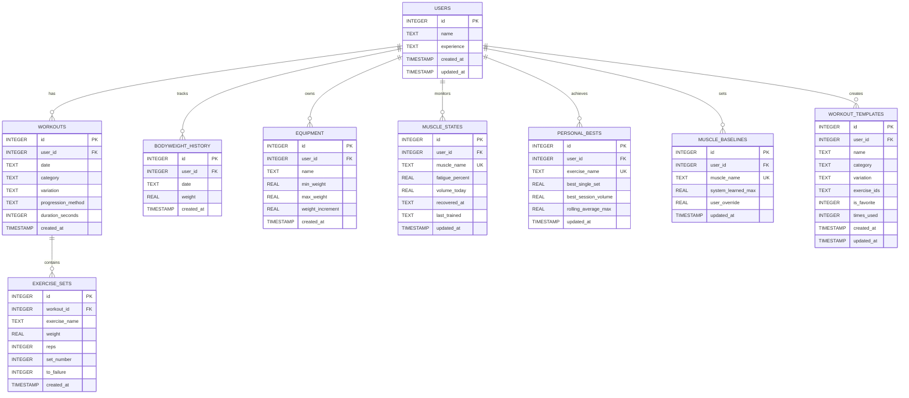
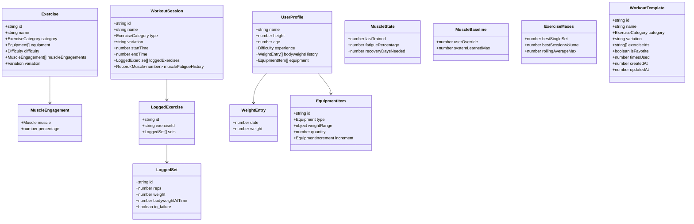
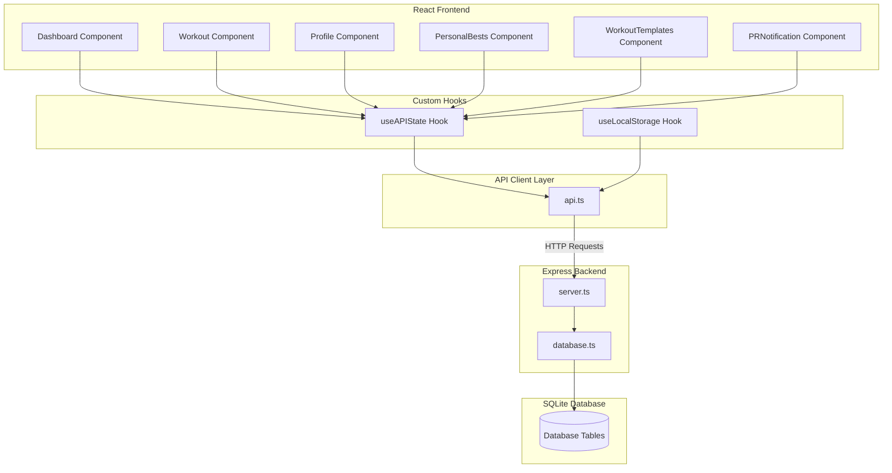
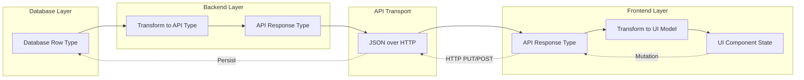
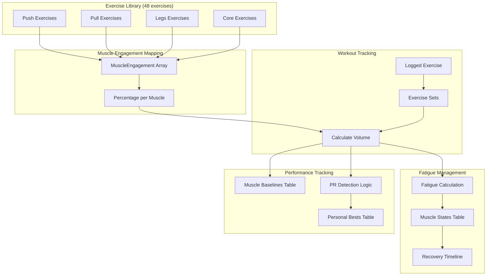
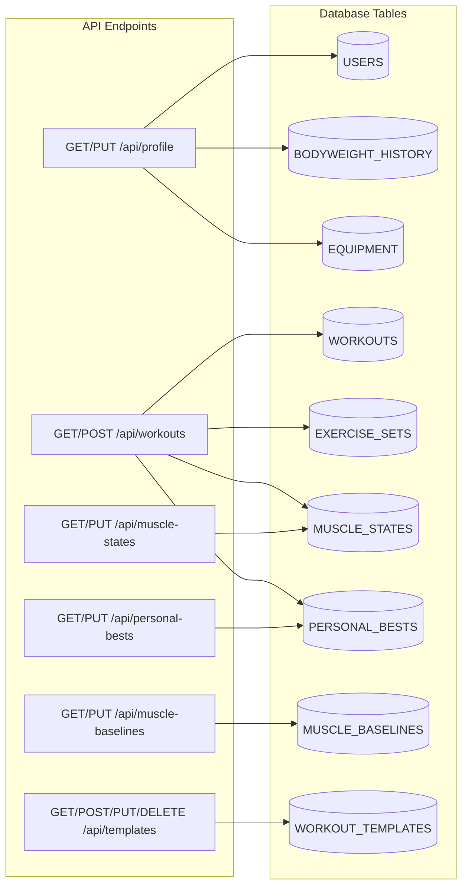
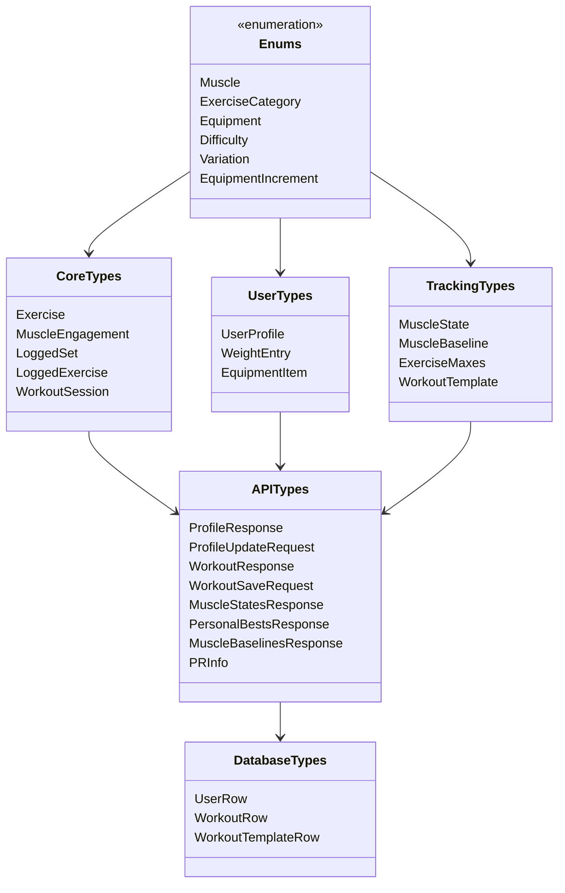
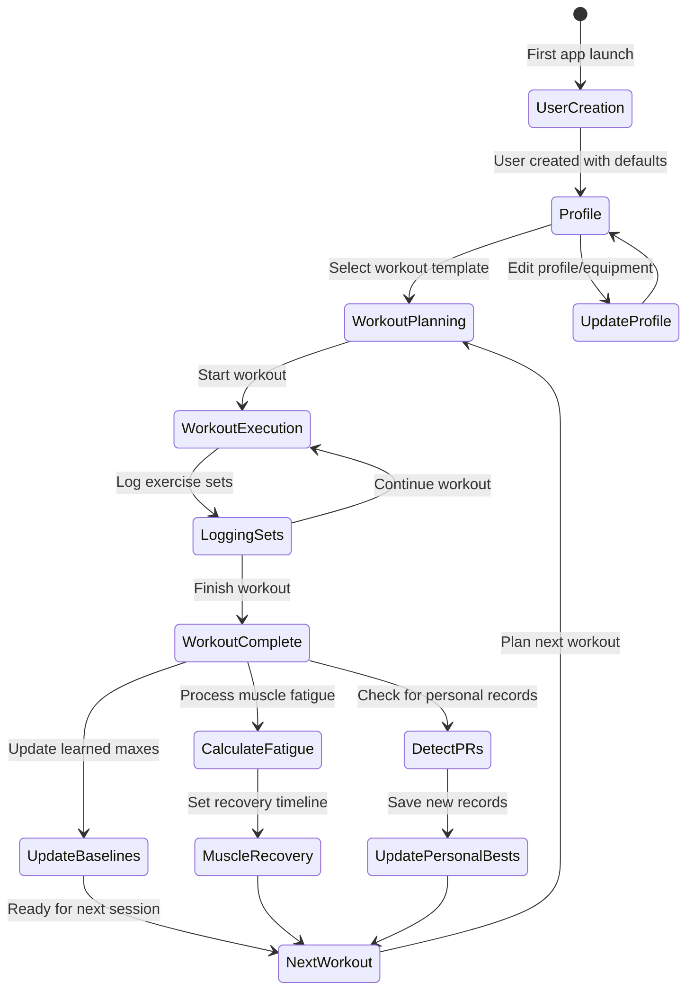

# FitForge Local - Entity Relationship Diagram

## Database Schema ERD

## Service Layer Models

## UI Data Flow

## Data Transformation Pipeline

## Muscle Tracking System

## API Endpoint Data Model Map

## Type Hierarchy

## Data Lifecycle

## Key Data Relationships Summary

### One-to-Many Relationships
- **USERS → WORKOUTS**: One user has many workouts
- **USERS → BODYWEIGHT_HISTORY**: One user has many weight entries
- **USERS → EQUIPMENT**: One user owns many equipment items
- **USERS → MUSCLE_STATES**: One user has 13 muscle state records
- **USERS → PERSONAL_BESTS**: One user has many exercise PRs
- **USERS → MUSCLE_BASELINES**: One user has 13 muscle baseline records
- **USERS → WORKOUT_TEMPLATES**: One user creates many templates
- **WORKOUTS → EXERCISE_SETS**: One workout contains many exercise sets

### Unique Constraints
- **MUSCLE_STATES**: (user_id, muscle_name) - one state per muscle per user
- **PERSONAL_BESTS**: (user_id, exercise_name) - one PR record per exercise per user
- **MUSCLE_BASELINES**: (user_id, muscle_name) - one baseline per muscle per user

### Cascade Deletions
All child tables use `ON DELETE CASCADE` to automatically clean up related records when a user is deleted.

## Performance Indexes

- `idx_workouts_user_date`: Fast workout queries by user and date
- `idx_exercise_sets_workout`: Fast set queries by workout
- `idx_exercise_sets_to_failure`: Optimize failure set queries
- `idx_muscle_states_user`: Fast muscle state lookups
- `idx_personal_bests_user`: Fast PR lookups
- `idx_muscle_baselines_user`: Fast baseline lookups
- `idx_workout_templates_user`: Fast template queries

## Reference Data

### Predefined Muscles (13 total)
1. Pectoralis
2. Triceps
3. Deltoids
4. Lats
5. Biceps
6. Rhomboids
7. Trapezius
8. Forearms
9. Quadriceps
10. Glutes
11. Hamstrings
12. Calves
13. Core

### Exercise Categories
- Push (chest, shoulders, triceps)
- Pull (back, biceps)
- Legs (quads, hamstrings, glutes, calves)
- Core (abdominals, obliques)

### Equipment Types
- Bodyweight
- Dumbbells
- Kettlebell
- Pull-up Bar
- TRX
- Dip Station
- Plyo Box
- Grip Strengthener
- Bench

### Difficulty Levels
- Beginner
- Intermediate
- Advanced

### Workout Variations
- A (Variation A)
- B (Variation B)
- Both (Exercise appears in both variations)

## File Locations

| Component | File Path |
|-----------|-----------|
| Database Schema | `backend/database/schema.sql` |
| Database Operations | `backend/database/database.ts` |
| Shared Types | `types.ts` |
| Backend Types | `backend/types.ts` |
| Exercise Library | `constants.ts` |
| API Client | `api.ts` |
| Server Routes | `backend/server.ts` |
| React Components | `components/` |
| Custom Hooks | `hooks/` |

---

**Document Version**: 1.0
**Last Updated**: 2025-10-24
**Total Tables**: 9
**Total Exercises**: 48
**Total Muscle Groups**: 13
**Total Default Templates**: 8
