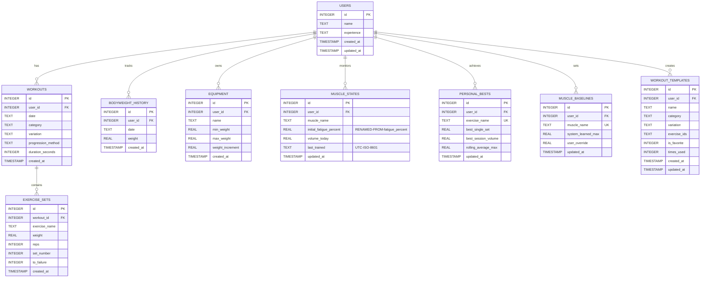
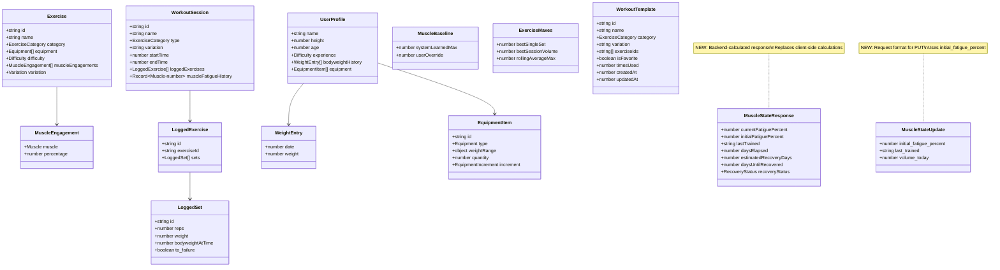
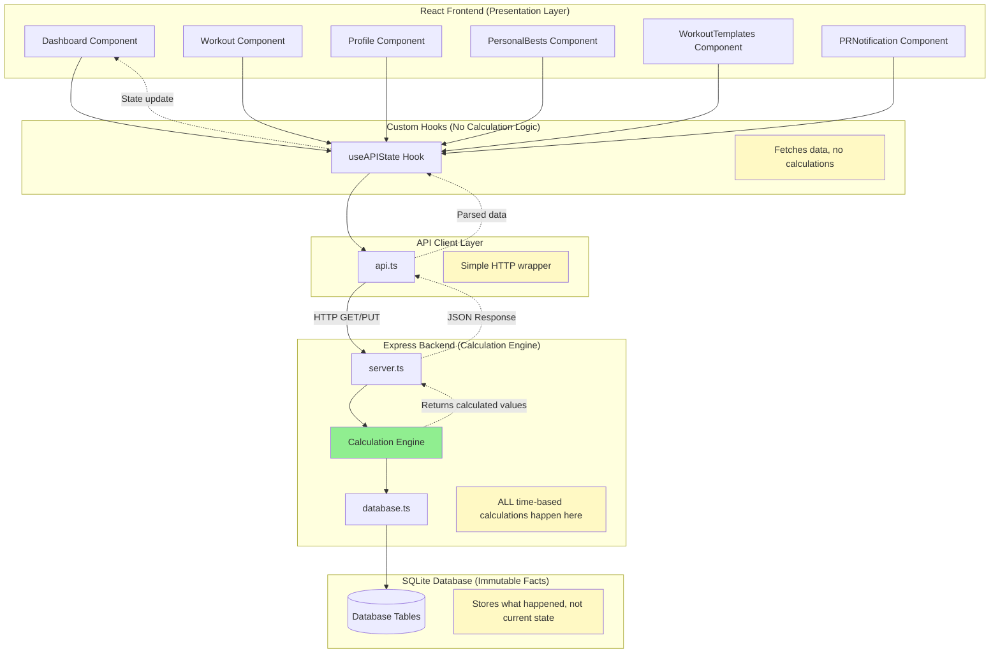
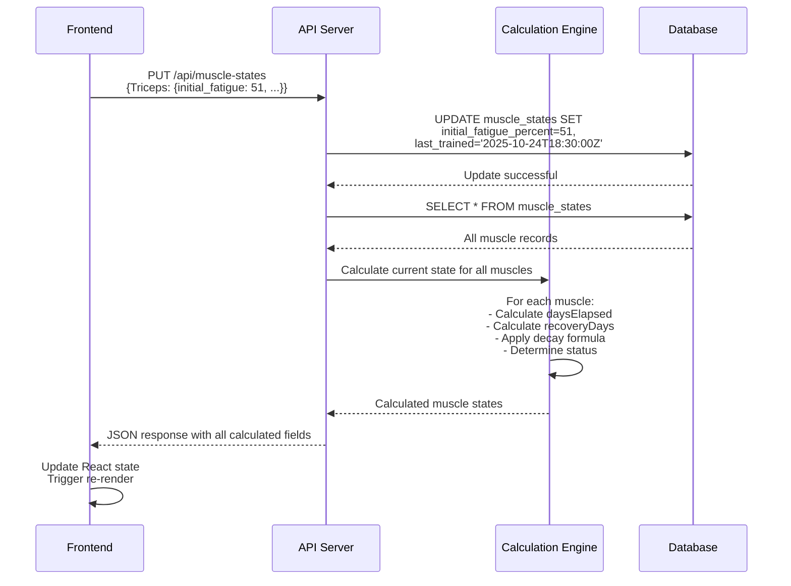
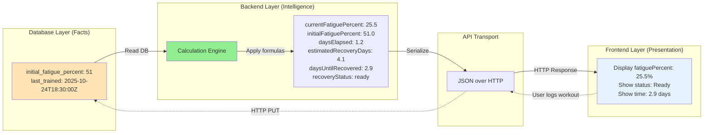
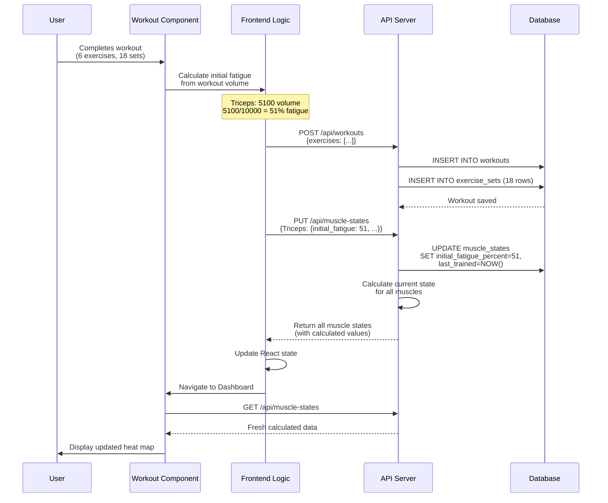

# FitForge Local - Entity Relationship Diagram (POST-REFACTOR)

**Document Version:** 2.0 (Backend-Driven Architecture)
**Status:** Proposed (Implementation Pending)
**Based On:** ARCHITECTURE-REFACTOR-BACKEND-DRIVEN.md v1.1
**Created:** 2025-10-25

---

## Database Schema ERD (Post-Refactor)



---

## Key Schema Changes from Pre-Refactor

### MUSCLE_STATES Table Changes

**REMOVED Fields:**
- ❌ `recovered_at TEXT` - Always null, unused, removed as dead code

**RENAMED Fields:**
- ✏️ `fatigue_percent` → `initial_fatigue_percent` - Semantic clarity (stores fatigue at time of workout, not current fatigue)

**CONSTRAINT Changes:**
- ✏️ `UNIQUE(muscle_name)` → `UNIQUE(user_id, muscle_name)` - **CRITICAL BUG FIX** for multi-user support

**Updated Schema Definition:**

```sql
CREATE TABLE muscle_states (
  id INTEGER PRIMARY KEY AUTOINCREMENT,
  user_id INTEGER NOT NULL,
  muscle_name TEXT NOT NULL,
  initial_fatigue_percent REAL NOT NULL DEFAULT 0,  -- ← RENAMED: fatigue at workout time
  volume_today REAL NOT NULL DEFAULT 0,              -- Kept for future same-day tracking
  last_trained TEXT,                                 -- UTC ISO timestamp
  updated_at TIMESTAMP DEFAULT CURRENT_TIMESTAMP,
  FOREIGN KEY (user_id) REFERENCES users(id) ON DELETE CASCADE,
  UNIQUE(user_id, muscle_name)                       -- ← FIXED: Composite constraint
);

CREATE INDEX idx_muscle_states_user ON muscle_states(user_id);
```

---

## Service Layer Models (Post-Refactor)



---

## Backend-Driven Architecture Data Flow



---

## New API Contract (Backend-Driven)

### GET /api/muscle-states (Enhanced Response)

**Purpose:** Return current muscle state with ALL calculated values

**Response Format:**

```json
{
  "Pectoralis": {
    "currentFatiguePercent": 25.5,
    "initialFatiguePercent": 51.0,
    "lastTrained": "2025-10-24T18:30:00.000Z",
    "daysElapsed": 1.2,
    "estimatedRecoveryDays": 4.1,
    "daysUntilRecovered": 2.9,
    "recoveryStatus": "ready"
  },
  "Triceps": {
    "currentFatiguePercent": 42.3,
    "initialFatiguePercent": 51.0,
    "lastTrained": "2025-10-24T18:30:00.000Z",
    "daysElapsed": 1.2,
    "estimatedRecoveryDays": 4.1,
    "daysUntilRecovered": 2.9,
    "recoveryStatus": "recovering"
  },
  "Lats": {
    "currentFatiguePercent": 0,
    "initialFatiguePercent": 0,
    "lastTrained": null,
    "daysElapsed": null,
    "estimatedRecoveryDays": 1.0,
    "daysUntilRecovered": 0,
    "recoveryStatus": "ready"
  }
  // ... other 10 muscles
}
```

**Field Breakdown:**

| Field | Type | Source | Calculation Logic |
|-------|------|--------|-------------------|
| `currentFatiguePercent` | number | **CALCULATED** | `initialFatigue * (1 - daysElapsed / recoveryDays)` capped at 0-100 |
| `initialFatiguePercent` | number | **DATABASE** | Stored value from last workout |
| `lastTrained` | string\|null | **DATABASE** | UTC ISO-8601 timestamp |
| `daysElapsed` | number\|null | **CALCULATED** | `(now - lastTrained) / (1000*60*60*24)` or null if never trained |
| `estimatedRecoveryDays` | number | **CALCULATED** | `1 + (initialFatigue / 100) * 6` |
| `daysUntilRecovered` | number | **CALCULATED** | `max(0, recoveryDays - daysElapsed)` |
| `recoveryStatus` | enum | **CALCULATED** | `<= 33%: 'ready'`, `<= 66%: 'recovering'`, `> 66%: 'fatigued'` |

---

### PUT /api/muscle-states (New Request Format)

**Purpose:** Update muscle states after workout (stores initial fatigue, returns calculated current state)

**Request Format:**

```json
{
  "Pectoralis": {
    "initial_fatigue_percent": 25.5,
    "last_trained": "2025-10-24T18:30:00.000Z",
    "volume_today": 2550
  },
  "Triceps": {
    "initial_fatigue_percent": 51.0,
    "last_trained": "2025-10-24T18:30:00.000Z",
    "volume_today": 5100
  }
}
```

**Response:** Same as GET /api/muscle-states (returns calculated current state for ALL muscles)

**Backend Logic Flow:**



---

## TypeScript Type Definitions (Post-Refactor)

### New Backend Response Types

```typescript
// types.ts - Backend-Calculated API Response
export interface MuscleStateResponse {
  // CALCULATED FIELDS (Backend computes these)
  currentFatiguePercent: number;      // 0-100, 1 decimal place
  daysElapsed: number | null;          // >= 0 or null if never trained
  estimatedRecoveryDays: number;      // >= 0, 1 decimal place
  daysUntilRecovered: number;         // >= 0, 1 decimal place
  recoveryStatus: 'ready' | 'recovering' | 'fatigued';

  // STORED FIELDS (From database)
  initialFatiguePercent: number;      // 0-100
  lastTrained: string | null;         // ISO 8601 UTC or null
}

export type MuscleStatesResponse = Record<Muscle, MuscleStateResponse>;
```

### New Backend Request Types

```typescript
// types.ts - API Request for updating muscle states
export interface MuscleStateUpdate {
  initial_fatigue_percent: number;    // ← Note: snake_case to match DB column
  last_trained: string;                // ISO 8601 UTC
  volume_today?: number;               // Optional
}

export type MuscleStatesUpdateRequest = Partial<Record<Muscle, MuscleStateUpdate>>;
```

### Deprecated Types (Remove in Phase 5)

```typescript
/**
 * @deprecated Use MuscleStateResponse from API instead
 * This type will be removed after frontend refactor is complete
 */
export interface MuscleState {
  lastTrained: number;
  fatiguePercentage: number;
  recoveryDaysNeeded: number;
}

export type MuscleStates = Record<Muscle, MuscleState>;
```

---

## Recovery Formula Implementation

### Backend Calculation Logic

```typescript
// backend/server.ts - GET /api/muscle-states handler
function getMuscleStates(): MuscleStatesResponse {
  const now = Date.now();
  const muscles = db.query('SELECT * FROM muscle_states WHERE user_id = 1');

  return muscles.reduce((acc, muscle) => {
    // Handle never-trained muscles
    const lastTrainedDate = muscle.last_trained ? new Date(muscle.last_trained).getTime() : null;
    const daysElapsed = lastTrainedDate
      ? (now - lastTrainedDate) / (1000 * 60 * 60 * 24)
      : null;

    // Recovery formula: 1 base day + up to 6 days based on fatigue
    // Examples: 0% → 1 day, 50% → 4 days, 100% → 7 days
    const recoveryDays = 1 + (muscle.initial_fatigue_percent / 100) * 6;

    // Linear decay: fatigue decreases linearly over recovery period
    const currentFatigue = lastTrainedDate && daysElapsed !== null
      ? Math.max(0, muscle.initial_fatigue_percent * (1 - daysElapsed / recoveryDays))
      : 0;

    const daysUntilRecovered = lastTrainedDate && daysElapsed !== null
      ? Math.max(0, recoveryDays - daysElapsed)
      : 0;

    // Recovery status thresholds
    const recoveryStatus = currentFatigue <= 33 ? 'ready'
      : currentFatigue <= 66 ? 'recovering'
      : 'fatigued';

    acc[muscle.muscle_name] = {
      // Calculated fields (rounded to 1 decimal)
      currentFatiguePercent: Math.round(currentFatigue * 10) / 10,
      daysElapsed: daysElapsed !== null ? Math.round(daysElapsed * 10) / 10 : null,
      estimatedRecoveryDays: Math.round(recoveryDays * 10) / 10,
      daysUntilRecovered: Math.round(daysUntilRecovered * 10) / 10,
      recoveryStatus,

      // Stored fields (from database)
      initialFatiguePercent: muscle.initial_fatigue_percent,
      lastTrained: muscle.last_trained
    };

    return acc;
  }, {} as MuscleStatesResponse);
}
```

### Recovery Curve Visualization

```
Fatigue %
  100 │     ●                    initialFatigue = 100%
      │      ╲                   recoveryDays = 7
      │       ╲
   75 │        ╲
      │         ╲
   50 │          ●                initialFatigue = 50%
      │           ╲               recoveryDays = 4
   25 │            ╲
      │             ╲
    0 │______________●_______     Fully recovered
      0   1   2   3   4   5   6   7
              Days Elapsed

Formula: currentFatigue = initialFatigue * (1 - daysElapsed / recoveryDays)
```

---

## Frontend Simplification (Post-Refactor)

### Dashboard.tsx - Before Refactor (Complex)

```typescript
// ❌ OLD CODE: ~50 lines of calculation logic
function Dashboard() {
  const [muscleStates] = useAPIState<MuscleStates>('/api/muscle-states');

  // Complex calculations needed because API returns minimal data
  const daysSince = getDaysSince(status.lastTrained);
  const recovery = calculateRecoveryPercentage(daysSince, status.recoveryDaysNeeded);
  const fatiguePercent = 100 - recovery;
  const isReady = fatiguePercent < 33;
  const statusColor = fatiguePercent < 33 ? 'green' : fatiguePercent < 66 ? 'yellow' : 'red';
  const daysUntilReady = calculateDaysUntilReady(daysSince, status.recoveryDaysNeeded);

  // ... more calculation logic
}
```

### Dashboard.tsx - After Refactor (Simplified)

```typescript
// ✅ NEW CODE: ~15 lines, pure presentation
function Dashboard() {
  const [muscleStates, setMuscleStates] = useState<MuscleStatesResponse>({});
  const [loading, setLoading] = useState(false);
  const [error, setError] = useState<string | null>(null);

  const fetchMuscleStates = async () => {
    setLoading(true);
    setError(null);
    try {
      const response = await fetch('/api/muscle-states');
      if (!response.ok) throw new Error('Failed to fetch muscle states');
      const data = await response.json();
      setMuscleStates(data);
    } catch (err) {
      setError(err instanceof Error ? err.message : 'Unknown error');
    } finally {
      setLoading(false);
    }
  };

  useEffect(() => {
    fetchMuscleStates();  // Auto-refresh on mount
  }, []);

  if (loading) return <LoadingSpinner />;
  if (error) return <ErrorDisplay error={error} onRetry={fetchMuscleStates} />;

  return (
    <div>
      <div className="flex justify-between items-center mb-4">
        <h3>Muscle Fatigue Heat Map</h3>
        <button onClick={fetchMuscleStates}>🔄 Refresh</button>
      </div>

      <MuscleCategory title="PUSH MUSCLES" muscles={['Pectoralis', 'Deltoids', 'Triceps']}>
        {muscle => {
          const state = muscleStates[muscle];
          if (!state) return null;

          return (
            <MuscleCard
              name={muscle}
              fatiguePercent={state.currentFatiguePercent}  // ← Direct from API
              status={state.recoveryStatus}                  // ← Direct from API
              lastTrained={state.lastTrained}                // ← Direct from API
              daysUntilRecovered={state.daysUntilRecovered}  // ← Direct from API
            />
          );
        }}
      </MuscleCategory>

      {/* Repeat for PULL, LEGS, CORE categories */}
    </div>
  );
}
```

**Code Reduction:**
- ❌ Removed: `calculateRecoveryPercentage()` calls
- ❌ Removed: `getDaysSince()` calls
- ❌ Removed: Manual fatigue calculation (`100 - recovery`)
- ❌ Removed: Manual status determination
- ✅ Added: Simple refresh button
- ✅ Added: Loading/error states
- **Net result: ~70% less code, 100% more maintainable**

---

## Data Transformation Pipeline (Post-Refactor)



**Key Insight:**
- Database stores **immutable historical facts** (what fatigue WAS)
- Backend provides **current interpretation** (what fatigue IS NOW)
- Frontend shows **visual representation** (how to display it)

---

## Workout Save Flow (Post-Refactor)



**Changes from Pre-Refactor:**
1. ✅ Frontend calculates initial fatigue from volume (unchanged)
2. ✅ Frontend sends `initial_fatigue_percent` instead of `fatiguePercentage`
3. ✅ Backend stores initial value + timestamp
4. ✅ Backend returns calculated current state in response
5. ✅ Frontend updates local state with calculated values
6. ✅ Dashboard auto-refreshes on mount (gets fresh calculations)

---

## API Endpoint Summary (Post-Refactor)

| Method | Endpoint | Request Body | Response Body | Calculation Location |
|--------|----------|--------------|---------------|---------------------|
| GET | `/api/muscle-states` | None | `MuscleStatesResponse` (7 fields per muscle) | **Backend calculates all** |
| PUT | `/api/muscle-states` | `MuscleStatesUpdateRequest` | `MuscleStatesResponse` | **Backend stores, then calculates** |
| GET | `/api/workouts` | None | Workout history | No calculation |
| POST | `/api/workouts` | Workout data | Workout + PRs | PR detection only |
| GET | `/api/profile` | None | User profile | No calculation |
| PUT | `/api/profile` | Profile updates | Updated profile | No calculation |

**Key Changes:**
- ✅ GET `/api/muscle-states` now returns **7 calculated fields** (was 4 basic fields)
- ✅ PUT `/api/muscle-states` accepts **`initial_fatigue_percent`** (was `fatiguePercentage`)
- ✅ Both endpoints ensure **backend is single source of truth**

---

## Success Metrics (Post-Refactor Goals)

### Code Quality Metrics

- ✅ **Reduce frontend calculation code by ~100 lines**
  - Dashboard.tsx: -50 lines
  - Workout.tsx: -30 lines
  - WorkoutSummaryModal.tsx: -20 lines
  - Shared utils: -removed `calculateRecoveryPercentage()`, `getDaysSince()`, etc.

- ✅ **Single source of truth established**
  - ALL time-based calculations in backend
  - Frontend has ZERO recovery/fatigue calculation logic
  - Database stores historical facts only

- ✅ **Zero duplicate logic**
  - Recovery formula exists in ONE place (backend)
  - Frontend never calculates current fatigue

### Bug Fixes

- ✅ **API-created workouts now display correct fatigue** (was showing 0%)
- ✅ **Multi-user database constraint fixed** (UNIQUE constraint now composite)
- ✅ **Eliminated race condition** where frontend and backend calculate different values

### Developer Experience

- ✅ **Easier debugging**
  - Check backend logs for calculation results
  - No need to replicate frontend environment
  - Single calculation path to verify

- ✅ **Easier to modify recovery formula**
  - Change in ONE place (backend)
  - No frontend code changes needed
  - TypeScript types prevent API contract mismatches

- ✅ **Better separation of concerns**
  - Database = storage
  - Backend = business logic
  - Frontend = presentation

### User Experience

- ✅ **Heat map always accurate** (no stale calculations)
- ✅ **Manual refresh button** provides user control
- ✅ **Fast loading** (local API, <50ms response time)
- ✅ **Consistent data** across all components

---

## Migration Impact Summary

### Database Changes

| Table | Field | Change | Impact |
|-------|-------|--------|--------|
| `muscle_states` | `fatigue_percent` | Renamed to `initial_fatigue_percent` | **Breaking change** - requires data migration |
| `muscle_states` | `recovered_at` | **REMOVED** | No impact (was always null) |
| `muscle_states` | UNIQUE constraint | Changed to composite `(user_id, muscle_name)` | **Critical bug fix** |

### API Changes

| Endpoint | Change | Breaking? | Migration Required? |
|----------|--------|-----------|---------------------|
| GET `/api/muscle-states` | Response expanded from 4 to 7 fields | **Yes** | Frontend must use new fields |
| PUT `/api/muscle-states` | Request uses `initial_fatigue_percent` | **Yes** | Frontend must send new field name |

### Code Changes

| Component | Change | Lines Changed | Risk Level |
|-----------|--------|---------------|------------|
| `backend/database/schema.sql` | Update MUSCLE_STATES schema | ~10 lines | Medium (migration required) |
| `backend/server.ts` | Add calculation engine | +60 lines | Low (new code, well-tested) |
| `types.ts` | Add new types, deprecate old | +20/-5 lines | Low (additive) |
| `Dashboard.tsx` | Remove calculations, use API | -50/+15 lines | Medium (significant refactor) |
| `Workout.tsx` | Update muscle state save | -30/+10 lines | Medium |
| `WorkoutSummaryModal.tsx` | Use API fields | -20/+5 lines | Low |

**Total Code Impact:**
- Backend: +70 lines (calculation engine)
- Frontend: -100 lines (removed calculations)
- Net: **-30 lines** with better architecture

---

## Testing Checklist (Post-Refactor Validation)

### Backend Validation

- [ ] GET `/api/muscle-states` returns 7 fields per muscle
- [ ] All calculated fields have correct types (number, string, enum)
- [ ] Never-trained muscles return: `currentFatigue=0`, `lastTrained=null`, `daysElapsed=null`, `status='ready'`
- [ ] Freshly trained muscles (daysElapsed=0) show: `currentFatigue = initialFatigue`
- [ ] Partially recovered muscles show: `0 < currentFatigue < initialFatigue`
- [ ] Fully recovered muscles show: `currentFatigue = 0`
- [ ] PUT `/api/muscle-states` accepts `initial_fatigue_percent` field
- [ ] PUT response includes calculated current state for ALL muscles

### Frontend Validation

- [ ] Dashboard displays without console errors
- [ ] All 13 muscles visible in heat map
- [ ] Fatigue percentages match backend response exactly
- [ ] Progress bars render correctly (0-100 range)
- [ ] Color coding correct: green (<=33%), yellow (<=66%), red (>66%)
- [ ] "Last trained" displays correctly or "Never trained"
- [ ] "Ready now" vs "Ready in X days" accurate
- [ ] Refresh button updates data
- [ ] Loading spinner shows during fetch
- [ ] Error state displays on fetch failure

### Workflow Validation

- [ ] Log workout → muscle states update correctly
- [ ] Navigate to Dashboard → auto-refresh works
- [ ] Manual refresh button → fetches latest data
- [ ] Multiple workouts same day → states update correctly
- [ ] PRs still detected and displayed
- [ ] Workout history still accessible

### Edge Cases

- [ ] Empty database (all muscles "Never trained")
- [ ] Single muscle trained, others never trained
- [ ] Muscle at exactly 33% fatigue (boundary: should be "ready")
- [ ] Muscle at exactly 66% fatigue (boundary: should be "recovering")
- [ ] Very high fatigue (100%) → 7 days recovery
- [ ] Very low fatigue (<5%) → <2 days recovery
- [ ] Workout at midnight UTC (boundary case)
- [ ] Network error during fetch → error state displays
- [ ] Backend down → graceful error handling

---

## Future Enhancements (V2+)

### Non-Linear Recovery Curves

Replace linear decay with physiologically accurate models:

```typescript
// Exponential decay (fast recovery initially, slower later)
const currentFatigue = initialFatigue * Math.exp(-0.3 * daysElapsed);

// Logarithmic curve (based on sports science research)
const currentFatigue = initialFatigue * (1 - Math.log(1 + daysElapsed) / Math.log(1 + recoveryDays));
```

### Muscle-Specific Recovery Rates

Different recovery times based on muscle size:

```typescript
const RECOVERY_MULTIPLIERS = {
  'Pectoralis': 1.2,   // Large muscles recover slower
  'Lats': 1.3,
  'Quadriceps': 1.4,
  'Triceps': 0.8,      // Small muscles recover faster
  'Biceps': 0.8,
  'Forearms': 0.7
};

const recoveryDays = (1 + initialFatigue / 100 * 6) * RECOVERY_MULTIPLIERS[muscle];
```

### Personalized Baselines

Learn actual capacity from workout history instead of hardcoded 10,000:

```typescript
// Track highest volume ever achieved per muscle
const personalBaseline = await db.query(`
  SELECT MAX(volume_today) as max_volume
  FROM muscle_states
  WHERE user_id = ? AND muscle_name = ?
`);

const fatiguePercent = (workoutVolume / personalBaseline.max_volume) * 100;
```

### Response Caching (If Needed)

In-memory cache with TTL for high-traffic scenarios:

```typescript
const muscleStateCache = {
  data: null as MuscleStatesResponse | null,
  timestamp: 0,
  TTL: 60000  // 1 minute
};

function getMuscleStates(): MuscleStatesResponse {
  const now = Date.now();

  // Return cached if fresh
  if (muscleStateCache.data && (now - muscleStateCache.timestamp) < muscleStateCache.TTL) {
    return muscleStateCache.data;
  }

  // Calculate fresh data
  const fresh = calculateMuscleStates();
  muscleStateCache.data = fresh;
  muscleStateCache.timestamp = now;

  return fresh;
}
```

---

## Architecture Principles (Post-Refactor)

### Separation of Concerns

**Database Layer (Storage)**
- Stores immutable historical facts
- What happened: "workout occurred, initial fatigue was X%"
- No derived/calculated values
- No business logic

**Backend API Layer (Intelligence)**
- Calculates current state from historical facts
- Applies business logic (recovery formulas, time decay)
- Returns computed values ready for display
- Single source of truth for ALL calculations

**Frontend Layer (Presentation)**
- Displays data from API
- Handles user interactions
- ZERO calculation logic (except initial fatigue from volume)
- Trusts backend completely

### Data Flow Philosophy

```
┌─────────────────────────────────────────────────┐
│  Database: "What Happened"                      │
│  - initial_fatigue_percent: 51                  │
│  - last_trained: 2025-10-24T18:30:00Z           │
│  (Immutable historical fact)                    │
└──────────────────┬──────────────────────────────┘
                   │
                   ▼
┌─────────────────────────────────────────────────┐
│  Backend: "What It Means Now"                   │
│  - Read: initial=51%, trained=1.2 days ago      │
│  - Calculate: recovery=4.1 days, current=25.5%  │
│  - Return: status="ready"                       │
│  (Real-time interpretation)                     │
└──────────────────┬──────────────────────────────┘
                   │
                   ▼
┌─────────────────────────────────────────────────┐
│  Frontend: "What User Sees"                     │
│  - Display: "Triceps: 25.5% fatigued"          │
│  - Display: "Ready in 2.9 days"                │
│  - Display: Green status badge                  │
│  (Visual presentation only)                     │
└─────────────────────────────────────────────────┘
```

---

## Rollback Plan

If issues arise during implementation, rollback is simple:

```bash
# Identify problematic commit
git log --oneline

# Rollback to last known good state (checkpoint commit)
git reset --hard <checkpoint-commit-hash>

# Rebuild containers
docker-compose down -v
docker-compose build --no-cache
docker-compose up

# Verify app works
curl http://localhost:3001/api/health
```

**Checkpoints:**
- Phase 1 complete: Backend calculation engine working
- Phase 2 complete: Types added (old types still exist)
- Phase 3 complete: Dashboard refactored
- Phase 4 complete: Workout integration updated
- Phase 5 complete: All deprecated code removed

---

## Document Version History

**Version 2.0 - 2025-10-25**
- Initial post-refactor ERD document
- Based on ARCHITECTURE-REFACTOR-BACKEND-DRIVEN.md v1.1
- Comprehensive documentation of proposed new architecture
- Includes all schema changes, API contracts, and code examples

---

**Document End**

*Post-Refactor Data Model & Architecture*
*For FitForge Backend-Driven Muscle State Calculations*
*Version 2.0 - 2025-10-25*
