# FitForge Data Flow Architecture

## Three-Layer Architecture Overview


---

## Complete Data Flow Patterns

### 1. Dashboard Load Flow

**User Action**: Opens dashboard to view muscle states, personal bests, and quick stats


**Data Transformations**:

| Layer | Input | Output | Transformation |
|-------|-------|--------|----------------|
| SQLite | SQL query | Raw rows | Database execution |
| Database Layer | Row objects | Typed responses | Calculate muscle states, group sets by workout |
| Express Server | Function calls | JSON responses | Type validation, error handling |
| API Client | HTTP responses | Typed objects | JSON parsing, error handling |
| Dashboard Component | API responses | React state | State updates, UI rendering |

**Type Flow**:
```typescript
// Database Layer
interface MuscleStateRow {
  id: number;
  user_id: number;
  muscle_name: string;
  initial_fatigue_percent: number;
  volume_today: number;
  last_trained: string | null;
  updated_at: string;
}

// Backend API Response
interface MuscleStateData {
  currentFatiguePercent: number;      // CALCULATED
  daysElapsed: number;                 // CALCULATED
  estimatedRecoveryDays: number;       // CALCULATED
  daysUntilRecovered: number;          // CALCULATED
  recoveryStatus: 'ready' | 'recovering' | 'fatigued';  // CALCULATED
  initialFatiguePercent: number;       // FROM DB
  lastTrained: string | null;          // FROM DB
}

type MuscleStatesResponse = Record<string, MuscleStateData>;

// Frontend (matches backend exactly)
// Used directly in Dashboard.tsx
```

---

### 2. Workout Save Flow

**User Action**: Completes workout and saves

```mermaid
sequenceDiagram
    autonumber
    participant User
    participant Workout
    participant API
    participant Server
    participant DB
    participant SQLite
    participant PRDetector
    participant MuscleStateCalc

    User->>Workout: Complete workout
    Workout->>Workout: Collect exercise data
    Note over Workout: {exercises: [{name, sets: [{weight, reps, to_failure}]}]}

    Workout->>API: POST /api/workouts (WorkoutSaveRequest)
    API->>Server: HTTP POST with workout data
    Server->>DB: saveWorkout(request)

    DB->>SQLite: BEGIN TRANSACTION
    activate DB

    DB->>SQLite: INSERT INTO workouts (date, category, variation, duration_seconds)
    SQLite-->>DB: workout_id

    loop For each exercise
        loop For each set
            DB->>SQLite: INSERT INTO exercise_sets (workout_id, exercise_name, weight, reps, set_number, to_failure)
        end
    end

    Note over DB,PRDetector: Personal Record Detection

    DB->>SQLite: SELECT * FROM personal_bests WHERE user_id = 1
    SQLite-->>DB: Current personal bests

    loop For each exercise in workout
        DB->>PRDetector: Calculate single-set volumes (reps × weight)
        PRDetector->>PRDetector: Find max single-set volume
        PRDetector->>PRDetector: Calculate total session volume

        alt Is new single-set PR?
            PRDetector->>PRDetector: Create PRInfo with improvement %
            PRDetector->>DB: Update personal_bests.best_single_set
            DB->>SQLite: UPDATE personal_bests SET best_single_set = ? WHERE exercise_name = ?
        end

        alt Is new session volume PR?
            PRDetector->>PRDetector: Create PRInfo with improvement %
            PRDetector->>DB: Update personal_bests.best_session_volume
            DB->>SQLite: UPDATE personal_bests SET best_session_volume = ? WHERE exercise_name = ?
        end
    end

    PRDetector-->>DB: PRInfo[] array

    Note over DB,MuscleStateCalc: Muscle State Updates

    DB->>DB: Load EXERCISE_LIBRARY muscle engagements
    DB->>MuscleStateCalc: Calculate total volume per muscle

    loop For each muscle engaged
        MuscleStateCalc->>MuscleStateCalc: Sum weighted volumes
        Note over MuscleStateCalc: volume = Σ(set_volume × engagement%)
        MuscleStateCalc->>SQLite: SELECT * FROM muscle_baselines WHERE muscle_name = ?
        SQLite-->>MuscleStateCalc: baseline_max value
        MuscleStateCalc->>MuscleStateCalc: Calculate initial_fatigue_percent
        Note over MuscleStateCalc: fatigue = (volume / baseline_max) × 100
        MuscleStateCalc->>SQLite: UPDATE muscle_states SET initial_fatigue_percent = ?, volume_today = ?, last_trained = ? WHERE muscle_name = ?
    end

    DB->>SQLite: COMMIT TRANSACTION
    deactivate DB

    DB-->>Server: {workout: WorkoutResponse, prs: PRInfo[]}
    Server-->>API: JSON response
    API-->>Workout: Response data

    Workout->>Workout: Update local state
    Workout->>Workout: Display workout summary modal
    Workout->>Workout: Show PR notifications

    alt Has PRs
        Workout->>User: 🎉 Display PR achievements
    end

    Workout-->>User: Workout saved successfully
```



**Data Transformations**:

| Step | Input | Processing | Output |
|------|-------|------------|--------|
| 1. User Input | Exercise selections, set inputs | Collect form data | WorkoutSaveRequest |
| 2. API Call | WorkoutSaveRequest | Serialize to JSON | HTTP POST body |
| 3. Workout Insert | Request data | INSERT workout row | workout_id |
| 4. Sets Insert | Exercise sets array | Loop and INSERT | exercise_sets rows |
| 5. PR Detection | Exercise volumes | Compare to personal_bests | PRInfo[] |
| 6. Muscle Fatigue | Exercise engagements | Calculate weighted volumes | Fatigue percentages |
| 7. Muscle State Update | Volume + baselines | Compute initial_fatigue_percent | UPDATE muscle_states |
| 8. Response Build | workout_id + sets + PRs | Construct response object | WorkoutResponse + PRInfo[] |
| 9. UI Update | Response data | Parse and update state | Display summary + notifications |

**Type Flow**:
```typescript
// Frontend Request
interface WorkoutSaveRequest {
  date: string;
  category: string;
  variation: string;
  progression_method?: string;
  duration_seconds?: number;
  exercises: {
    exercise_name: string;
    sets: {
      weight: number;
      reps: number;
      to_failure: boolean;
    }[];
  }[];
}

// Backend Processing
interface WorkoutRow {
  id: number;
  user_id: number;
  date: string;
  category: string;
  variation: string;
  progression_method: string | null;
  duration_seconds: number | null;
  created_at: string;
}

interface ExerciseSetRow {
  id: number;
  workout_id: number;
  exercise_name: string;
  weight: number;
  reps: number;
  set_number: number;
  to_failure: number;  // SQLite INTEGER for boolean
  created_at: string;
}

// Response with PR detection
interface PRInfo {
  isPR: boolean;
  exercise: string;
  previousBestSingleSet: number;
  newBestSingleSet: number;
  previousBestSessionVolume: number;
  newBestSessionVolume: number;
  improvementPercent: number;
}

interface SaveWorkoutResponse {
  workout: WorkoutResponse;
  prs: PRInfo[];
}
```

---

### 3. Progressive Overload Suggestion Flow

**User Action**: Starts new workout of same category as previous session

```mermaid
sequenceDiagram
    autonumber
    participant User
    participant Workout
    participant API
    participant Server
    participant DB
    participant SQLite
    participant POUtils

    User->>Workout: Select workout category (e.g., "Push A")
    Workout->>API: GET /api/workouts/last?category=Push
    API->>Server: HTTP GET with query param

    Server->>DB: getLastWorkoutByCategory('Push')
    DB->>SQLite: SELECT * FROM workouts WHERE user_id = 1 AND category = 'Push' ORDER BY date DESC LIMIT 1
    SQLite-->>DB: Most recent Push workout

    alt Workout found
        DB->>SQLite: SELECT * FROM exercise_sets WHERE workout_id = ? ORDER BY set_number
        SQLite-->>DB: Exercise sets for last workout
        DB->>DB: Group sets by exercise_name
        DB-->>Server: WorkoutResponse with exercises
    else No workout found
        DB-->>Server: null
    end

    Server-->>API: WorkoutResponse or null
    API-->>Workout: Last workout data

    alt Has last workout
        Workout->>POUtils: calculateProgressiveOverload(lastWorkout)

        loop For each exercise in last workout
            POUtils->>POUtils: Get last progression_method ('weight' or 'reps')
            POUtils->>POUtils: Determine next method (alternates)

            alt Next method: 'weight'
                POUtils->>POUtils: Increase weight by 3%
                Note over POUtils: newWeight = oldWeight × 1.03
                POUtils->>POUtils: roundToNearestHalf(newWeight)
                Note over POUtils: Rounds to .0 or .5 lbs
                POUtils->>POUtils: Check equipment constraints
                POUtils->>POUtils: Keep same reps as last session
            else Next method: 'reps'
                POUtils->>POUtils: Keep same weight
                POUtils->>POUtils: Increase reps by 3%
                Note over POUtils: newReps = ceil(oldReps × 1.03)
                POUtils->>POUtils: Ensure minimum +1 rep
            end

            POUtils->>POUtils: Build ProgressiveOverloadSuggestion
            Note over POUtils: {exercise, method, suggestedWeight, suggestedReps, previousWeight, previousReps}
        end

        POUtils-->>Workout: ProgressiveOverloadSuggestion[]

        Workout->>Workout: Pre-populate exercise form fields
        Workout->>Workout: Display "Last session" reference
        Workout-->>User: Show suggested workout with progressive values
    else No last workout
        Workout-->>User: Show blank workout form
    end
```



**Progressive Overload Calculation**:

```typescript
// utils/progressiveOverload.ts

export function calculateProgressiveOverload(
  lastPerformance: LoggedExercise,
  lastMethod: 'weight' | 'reps',
  personalBest: ExerciseMaxes
): ProgressiveOverloadSuggestion {
  const nextMethod = determineProgressionMethod(lastMethod);

  const lastSet = lastPerformance.sets[0];
  const lastWeight = lastSet.weight;
  const lastReps = lastSet.reps;

  if (nextMethod === 'weight') {
    // Increase weight by 3%
    const rawIncrease = lastWeight * 1.03;
    const suggestedWeight = roundToNearestHalf(rawIncrease);

    return {
      exercise: lastPerformance.exerciseId,
      method: 'weight',
      suggestedWeight,
      suggestedReps: lastReps,  // Keep reps constant
      previousWeight: lastWeight,
      previousReps: lastReps,
      improvementPercent: 3
    };
  } else {
    // Increase reps by 3%
    const rawIncrease = lastReps * 1.03;
    const suggestedReps = Math.max(lastReps + 1, Math.ceil(rawIncrease));

    return {
      exercise: lastPerformance.exerciseId,
      method: 'reps',
      suggestedWeight: lastWeight,  // Keep weight constant
      suggestedReps,
      previousWeight: lastWeight,
      previousReps: lastReps,
      improvementPercent: ((suggestedReps - lastReps) / lastReps) * 100
    };
  }
}

function roundToNearestHalf(value: number): number {
  return Math.round(value * 2) / 2;
}

function determineProgressionMethod(lastMethod: 'weight' | 'reps'): 'weight' | 'reps' {
  // Alternate between methods
  return lastMethod === 'weight' ? 'reps' : 'weight';
}
```

**Type Flow**:
```typescript
// Backend Response
interface WorkoutResponse {
  id: number;
  date: string;
  category: string;
  variation: string;
  progression_method?: string;
  duration_seconds?: number;
  exercises: {
    exercise_name: string;
    sets: {
      weight: number;
      reps: number;
      to_failure: boolean;
    }[];
  }[];
}

// Frontend Utility Output
interface ProgressiveOverloadSuggestion {
  exercise: string;
  method: 'weight' | 'reps';
  suggestedWeight: number;
  suggestedReps: number;
  previousWeight: number;
  previousReps: number;
  improvementPercent: number;
}
```

---

### 4. Profile Update Flow

**User Action**: Updates profile settings, equipment, or bodyweight


**Type Flow**:
```typescript
// Frontend → Backend Request
interface ProfileUpdateRequest {
  name?: string;
  experience?: string;
  equipment?: Array<{
    id?: number;  // Optional, ignored on backend
    name: string;
    min_weight: number;
    max_weight: number;
    weight_increment: number;
  }>;
  bodyweight_history?: Array<{
    date: string;  // ISO 8601
    weight: number;
  }>;
}

// Backend → Frontend Response
interface ProfileResponse {
  id: number;
  name: string;
  experience: string;
  equipment: Array<{
    id: number;
    name: string;
    min_weight: number;
    max_weight: number;
    weight_increment: number;
  }>;
  bodyweight_history: Array<{
    date: string;
    weight: number;
  }>;
}
```

---

### 5. Workout Template Flow

**User Action**: Creates, loads, or manages workout templates

#### Create Template


#### Load Template


**Type Flow**:
```typescript
// Database Row
interface WorkoutTemplateRow {
  id: number;
  user_id: number;
  name: string;
  category: string;
  variation: string;
  exercise_ids: string;  // JSON array: '["ex02","ex05","ex12"]'
  is_favorite: number;   // SQLite INTEGER for boolean
  times_used: number;
  created_at: string;
  updated_at: string;
}

// API Request/Response
interface WorkoutTemplate {
  id: number;
  name: string;
  category: string;
  variation: string;
  exerciseIds: string[];  // Parsed JSON array
  isFavorite: boolean;
  timesUsed: number;
  createdAt: string;
  updatedAt: string;
}

// Create Request
type CreateTemplateRequest = Omit<WorkoutTemplate, 'id' | 'timesUsed' | 'createdAt' | 'updatedAt'>;
```

---

## Business Logic Layer Functions

### Muscle State Recovery Calculation

**Location**: `backend/database/database.ts:getMuscleStates()`

```typescript
export function getMuscleStates(): MuscleStatesResponse {
  const rows = db.prepare(`
    SELECT * FROM muscle_states WHERE user_id = 1
  `).all() as MuscleStateRow[];

  const states: MuscleStatesResponse = {};

  for (const row of rows) {
    const now = Date.now();
    const lastTrained = row.last_trained ? new Date(row.last_trained).getTime() : null;

    let currentFatiguePercent = 0;
    let daysElapsed = 0;
    let estimatedRecoveryDays = 0;
    let daysUntilRecovered = 0;
    let recoveryStatus: 'ready' | 'recovering' | 'fatigued' = 'ready';

    if (lastTrained !== null && row.initial_fatigue_percent > 0) {
      // Calculate days elapsed since last training
      daysElapsed = (now - lastTrained) / (1000 * 60 * 60 * 24);

      // Recovery formula: 1-7 days based on fatigue
      estimatedRecoveryDays = 1 + (row.initial_fatigue_percent / 100) * 6;

      // Current fatigue decays linearly over recovery period
      if (daysElapsed >= estimatedRecoveryDays) {
        currentFatiguePercent = 0;  // Fully recovered
      } else {
        currentFatiguePercent = row.initial_fatigue_percent * (1 - daysElapsed / estimatedRecoveryDays);
      }

      daysUntilRecovered = Math.max(0, estimatedRecoveryDays - daysElapsed);

      // Determine recovery status
      if (currentFatiguePercent <= 33) {
        recoveryStatus = 'ready';
      } else if (currentFatiguePercent <= 66) {
        recoveryStatus = 'recovering';
      } else {
        recoveryStatus = 'fatigued';
      }
    }

    states[row.muscle_name] = {
      currentFatiguePercent: Math.round(currentFatiguePercent * 10) / 10,  // 1 decimal place
      daysElapsed: Math.round(daysElapsed * 10) / 10,
      estimatedRecoveryDays: Math.round(estimatedRecoveryDays * 10) / 10,
      daysUntilRecovered: Math.round(daysUntilRecovered * 10) / 10,
      recoveryStatus,
      initialFatiguePercent: row.initial_fatigue_percent,
      lastTrained: row.last_trained
    };
  }

  return states;
}
```

**Recovery Formula Explanation**:
- **Base recovery**: 1 day minimum
- **Maximum recovery**: 7 days (at 100% fatigue)
- **Linear interpolation**: `recoveryDays = 1 + (fatigue / 100) × 6`
- **Fatigue decay**: Linear reduction from initial to 0 over recovery period
- **Status thresholds**:
  - Ready: ≤33% fatigue
  - Recovering: 34-66% fatigue
  - Fatigued: >66% fatigue

---

### Personal Record Detection

**Location**: `backend/database/database.ts:saveWorkout()`

```typescript
// Inside saveWorkout function after inserting exercise_sets

const prs: PRInfo[] = [];

// Get current personal bests
const currentBests = db.prepare(`
  SELECT * FROM personal_bests WHERE user_id = 1
`).all() as PersonalBestRow[];

const bestsMap = new Map(currentBests.map(pb => [pb.exercise_name, pb]));

// Check each exercise for PRs
for (const exercise of workout.exercises) {
  const sets = exercise.sets;

  // Calculate single-set volumes
  const singleSetVolumes = sets.map(s => s.weight * s.reps);
  const maxSingleSetVolume = Math.max(...singleSetVolumes);

  // Calculate total session volume
  const totalSessionVolume = singleSetVolumes.reduce((sum, v) => sum + v, 0);

  const currentBest = bestsMap.get(exercise.exercise_name);

  if (!currentBest) {
    // First time performing this exercise - all are PRs
    db.prepare(`
      INSERT INTO personal_bests (user_id, exercise_name, best_single_set, best_session_volume, rolling_average_max)
      VALUES (?, ?, ?, ?, ?)
    `).run(1, exercise.exercise_name, maxSingleSetVolume, totalSessionVolume, maxSingleSetVolume);

    prs.push({
      isPR: true,
      exercise: exercise.exercise_name,
      previousBestSingleSet: 0,
      newBestSingleSet: maxSingleSetVolume,
      previousBestSessionVolume: 0,
      newBestSessionVolume: totalSessionVolume,
      improvementPercent: 100
    });
  } else {
    let isPR = false;
    const prInfo: PRInfo = {
      isPR: false,
      exercise: exercise.exercise_name,
      previousBestSingleSet: currentBest.best_single_set,
      newBestSingleSet: maxSingleSetVolume,
      previousBestSessionVolume: currentBest.best_session_volume,
      newBestSessionVolume: totalSessionVolume,
      improvementPercent: 0
    };

    // Check single-set PR
    if (maxSingleSetVolume > currentBest.best_single_set) {
      isPR = true;
      prInfo.improvementPercent = ((maxSingleSetVolume - currentBest.best_single_set) / currentBest.best_single_set) * 100;

      db.prepare(`
        UPDATE personal_bests
        SET best_single_set = ?, updated_at = CURRENT_TIMESTAMP
        WHERE user_id = 1 AND exercise_name = ?
      `).run(maxSingleSetVolume, exercise.exercise_name);
    }

    // Check session volume PR
    if (totalSessionVolume > currentBest.best_session_volume) {
      isPR = true;
      const volumeImprovement = ((totalSessionVolume - currentBest.best_session_volume) / currentBest.best_session_volume) * 100;

      if (volumeImprovement > prInfo.improvementPercent) {
        prInfo.improvementPercent = volumeImprovement;
      }

      db.prepare(`
        UPDATE personal_bests
        SET best_session_volume = ?, updated_at = CURRENT_TIMESTAMP
        WHERE user_id = 1 AND exercise_name = ?
      `).run(totalSessionVolume, exercise.exercise_name);
    }

    if (isPR) {
      prInfo.isPR = true;
      prs.push(prInfo);
    }
  }
}

// Return PRs for frontend notification
return { workout: savedWorkout, prs };
```

---

## Error Handling Patterns

### Backend Error Handling

```typescript
// backend/server.ts

app.post('/api/workouts', (req, res) => {
  try {
    const workoutRequest: WorkoutSaveRequest = req.body;

    // Validation
    if (!workoutRequest.date || !workoutRequest.category || !workoutRequest.exercises) {
      return res.status(400).json({
        error: 'Missing required fields',
        hint: 'date, category, and exercises are required'
      } as ApiErrorResponse);
    }

    const result = saveWorkout(workoutRequest);
    res.json(result);
  } catch (error) {
    console.error('Error saving workout:', error);
    res.status(500).json({
      error: 'Failed to save workout',
      hint: error instanceof Error ? error.message : 'Unknown error'
    } as ApiErrorResponse);
  }
});
```

### Frontend Error Handling

```typescript
// api.ts

export const workoutsAPI = {
  async create(workout: WorkoutSaveRequest): Promise<{ workout: WorkoutResponse; prs: PRInfo[] }> {
    try {
      const response = await fetch(`${API_BASE_URL}/workouts`, {
        method: 'POST',
        headers: { 'Content-Type': 'application/json' },
        body: JSON.stringify(workout)
      });

      if (!response.ok) {
        const errorData: ApiErrorResponse = await response.json();
        throw new Error(errorData.error + (errorData.hint ? `: ${errorData.hint}` : ''));
      }

      return await response.json();
    } catch (error) {
      console.error('Failed to save workout:', error);
      throw error;
    }
  }
};
```

---

## State Management Patterns

### React Component State Flow

```typescript
// components/Dashboard.tsx

export function Dashboard() {
  const [muscleStates, setMuscleStates] = useState<MuscleStatesResponse>({});
  const [personalBests, setPersonalBests] = useState<PersonalBestsResponse>({});
  const [workouts, setWorkouts] = useState<WorkoutResponse[]>([]);
  const [loading, setLoading] = useState(true);
  const [error, setError] = useState<string | null>(null);

  useEffect(() => {
    async function loadDashboardData() {
      try {
        setLoading(true);

        // Parallel API calls for performance
        const [states, bests, workoutsData] = await Promise.all([
          muscleStatesAPI.get(),
          personalBestsAPI.get(),
          workoutsAPI.getAll()
        ]);

        setMuscleStates(states);
        setPersonalBests(bests);
        setWorkouts(workoutsData);
      } catch (err) {
        setError(err instanceof Error ? err.message : 'Failed to load dashboard');
      } finally {
        setLoading(false);
      }
    }

    loadDashboardData();
  }, []);

  if (loading) return <LoadingSpinner />;
  if (error) return <ErrorMessage message={error} />;

  return (
    <div>
      <MuscleStateVisualization states={muscleStates} />
      <PersonalRecordsTable bests={personalBests} />
      <RecentWorkouts workouts={workouts.slice(0, 5)} />
    </div>
  );
}
```

---

## Summary

The FitForge data flow architecture demonstrates:

1. **Clean Layer Separation**: Database → Backend → Frontend with clear boundaries
2. **Type Safety**: End-to-end TypeScript types from SQLite to React components
3. **Backend Calculations**: Muscle states computed on read, not stored
4. **Optimized Performance**: Parallel API calls, indexed queries
5. **Progressive Enhancement**: Smart workout suggestions based on history
6. **Real-time Feedback**: Immediate PR detection and notifications
7. **Transaction Safety**: ACID compliance for multi-step database operations
8. **Error Resilience**: Comprehensive error handling at all layers

This architecture ensures data integrity, performance, and maintainability across the entire application stack.
