# FitForge Data Model Documentation

## Overview

FitForge is a single-user local fitness tracking application with a three-layer architecture:
- **Database Layer**: SQLite database with normalized relational schema
- **Service Layer**: TypeScript backend API with type-safe contracts
- **UI Layer**: React frontend with shared TypeScript types

---

## Entity Relationship Diagram

```mermaid
erDiagram
    users ||--o{ bodyweight_history : "tracks"
    users ||--o{ equipment : "owns"
    users ||--o{ workouts : "performs"
    users ||--o{ muscle_states : "has"
    users ||--o{ personal_bests : "achieves"
    users ||--o{ muscle_baselines : "has"
    users ||--o{ workout_templates : "creates"
    users ||--o{ user_exercise_calibrations : "customizes"
    users ||--o{ workout_rotation_state : "tracks"
    users ||--o{ detailed_muscle_states : "has"

    workouts ||--o{ exercise_sets : "contains"

    users {
        int id PK
        text name
        text experience
        int recovery_days_to_full
        timestamp created_at
        timestamp updated_at
    }

    bodyweight_history {
        int id PK
        int user_id FK
        text date
        real weight
        timestamp created_at
    }

    equipment {
        int id PK
        int user_id FK
        text name
        real min_weight
        real max_weight
        real weight_increment
        timestamp created_at
    }

    workouts {
        int id PK
        int user_id FK
        text date
        text category
        text variation
        text progression_method
        int duration_seconds
        timestamp created_at
    }

    exercise_sets {
        int id PK
        int workout_id FK
        text exercise_name
        real weight "CHECK(weight >= 0 AND weight <= 10000)"
        int reps "CHECK(reps > 0 AND reps <= 1000)"
        int set_number
        int to_failure
        timestamp created_at
    }

    muscle_states {
        int id PK
        int user_id FK
        text muscle_name UK
        real initial_fatigue_percent "CHECK(initial_fatigue_percent >= 0 AND initial_fatigue_percent <= 100)"
        text last_trained
        timestamp updated_at
    }

    personal_bests {
        int id PK
        int user_id FK
        text exercise_name UK
        real best_single_set
        real best_session_volume
        real rolling_average_max
        timestamp updated_at
    }

    muscle_baselines {
        int id PK
        int user_id FK
        text muscle_name UK
        real system_learned_max "CHECK(system_learned_max > 0)"
        real user_override "CHECK(user_override IS NULL OR user_override > 0)"
        timestamp updated_at
    }

    workout_templates {
        int id PK
        int user_id FK
        text name
        text category
        text variation
        text exercise_ids
        text sets
        int is_favorite
        int times_used
        timestamp created_at
        timestamp updated_at
    }

    user_exercise_calibrations {
        int id PK
        int user_id FK
        text exercise_id UK
        text muscle_name UK
        real engagement_percentage
        timestamp created_at
        timestamp updated_at
    }

    workout_rotation_state {
        int id PK
        int user_id UK
        text current_cycle
        int current_phase
        text last_workout_date
        text last_workout_category
        text last_workout_variation
        int rest_days_count
        timestamp updated_at
    }

    detailed_muscle_states {
        int id PK
        int user_id FK
        text detailed_muscle_name UK
        text visualization_muscle_name
        text role
        real fatigue_percent "CHECK(fatigue_percent >= 0 AND fatigue_percent <= 100)"
        real volume_today
        text last_trained
        real baseline_capacity
        text baseline_source
        text baseline_confidence
        timestamp created_at
        timestamp updated_at
    }
```



---

## Database Schema Details

### Core Entities

#### 1. users
**Purpose**: Stores user profile information

| Column | Type | Constraints | Description |
|--------|------|-------------|-------------|
| id | INTEGER | PRIMARY KEY | User identifier (always 1 for single-user app) |
| name | TEXT | NOT NULL | User's name |
| experience | TEXT | NOT NULL | Experience level: Beginner/Intermediate/Advanced |
| recovery_days_to_full | INTEGER | DEFAULT 5 | Days to recover from 100% fatigue (range 3-10) |
| created_at | TIMESTAMP | DEFAULT CURRENT_TIMESTAMP | Account creation time |
| updated_at | TIMESTAMP | DEFAULT CURRENT_TIMESTAMP | Last profile update |

**Notes**:
- `recovery_days_to_full` added in migration 005
- Used in recovery formula: `estimatedRecoveryDays = recovery_days_to_full * (initialFatiguePercent / 100)`

**Location**: `backend/database/schema.sql:5-11`

---

#### 2. bodyweight_history
**Purpose**: Tracks user's weight over time for progressive overload calculations

| Column | Type | Constraints | Description |
|--------|------|-------------|-------------|
| id | INTEGER | PRIMARY KEY | Entry identifier |
| user_id | INTEGER | FK → users(id) | User reference |
| date | TEXT | NOT NULL | Entry date (ISO 8601) |
| weight | REAL | NOT NULL | Weight in pounds |
| created_at | TIMESTAMP | DEFAULT CURRENT_TIMESTAMP | Entry creation time |

**Indexes**: Foreign key index on user_id
**Location**: `backend/database/schema.sql:14-21`

---

#### 3. equipment
**Purpose**: Tracks available equipment for workout planning

| Column | Type | Constraints | Description |
|--------|------|-------------|-------------|
| id | INTEGER | PRIMARY KEY | Equipment identifier |
| user_id | INTEGER | FK → users(id) | User reference |
| name | TEXT | NOT NULL | Equipment type (Dumbbells, Kettlebell, etc.) |
| min_weight | REAL | | Minimum weight capacity |
| max_weight | REAL | | Maximum weight capacity |
| weight_increment | REAL | | Weight increment step (e.g., 5 lbs) |
| created_at | TIMESTAMP | DEFAULT CURRENT_TIMESTAMP | Entry creation time |

**Indexes**: Foreign key index on user_id
**Location**: `backend/database/schema.sql:24-33`

---

#### 4. workouts
**Purpose**: Stores workout session metadata

| Column | Type | Constraints | Description |
|--------|------|-------------|-------------|
| id | INTEGER | PRIMARY KEY | Workout identifier |
| user_id | INTEGER | FK → users(id) | User reference |
| date | TEXT | NOT NULL | Workout date (ISO 8601) |
| category | TEXT | NOT NULL | Push/Pull/Legs/Core |
| variation | TEXT | NOT NULL | A/B/Both |
| progression_method | TEXT | | Weight/Reps progression method |
| duration_seconds | INTEGER | | Workout duration |
| created_at | TIMESTAMP | DEFAULT CURRENT_TIMESTAMP | Entry creation time |

**Indexes**:
- idx_workouts_user_date ON (user_id, date)
- idx_workouts_date ON (date)
- Foreign key index on user_id

**Location**: `backend/database/schema.sql:36-46`

---

#### 5. exercise_sets
**Purpose**: Stores individual exercise sets within workouts

| Column | Type | Constraints | Description |
|--------|------|-------------|-------------|
| id | INTEGER | PRIMARY KEY | Set identifier |
| workout_id | INTEGER | FK → workouts(id) | Parent workout reference |
| exercise_name | TEXT | NOT NULL | Exercise name from EXERCISE_LIBRARY |
| weight | REAL | NOT NULL | Weight used (lbs) |
| reps | INTEGER | NOT NULL | Repetitions performed |
| set_number | INTEGER | NOT NULL | Set sequence number |
| to_failure | INTEGER | DEFAULT 1 | Boolean flag (0/1) for failure sets |
| created_at | TIMESTAMP | DEFAULT CURRENT_TIMESTAMP | Entry creation time |

**Indexes**:
- idx_exercise_sets_workout ON (workout_id)
- idx_exercise_sets_to_failure ON (to_failure)
- Foreign key index on workout_id

**Notes**:
- `to_failure` column added in migration 001

**Location**: `backend/database/schema.sql:49-59`

---

#### 6. muscle_states
**Purpose**: Stores muscle fatigue state (backend-driven calculation model)

| Column | Type | Constraints | Description |
|--------|------|-------------|-------------|
| id | INTEGER | PRIMARY KEY | State identifier |
| user_id | INTEGER | FK → users(id) | User reference |
| muscle_name | TEXT | NOT NULL, UNIQUE(user_id, muscle_name) | Muscle group name |
| initial_fatigue_percent | REAL | NOT NULL DEFAULT 0 CHECK(>= 0 AND <= 100) | Fatigue % at last training |
| last_trained | TEXT | | Last training date (UTC ISO 8601) |
| updated_at | TIMESTAMP | DEFAULT CURRENT_TIMESTAMP | Last update time |

**Indexes**: idx_muscle_states_user ON (user_id)

**Schema Changes**:
- Migration 009 (2025-10-30): Removed redundant `volume_today` column, added CHECK constraint on fatigue_percent

**Calculated Fields** (computed at read time, not stored):
- `currentFatiguePercent`: Current fatigue based on recovery formula
- `daysElapsed`: Days since last_trained
- `estimatedRecoveryDays`: Total days needed for recovery (based on user's recovery_days_to_full setting)
- `daysUntilRecovered`: Remaining recovery days
- `recoveryStatus`: "ready" | "recovering" | "fatigued"

**Recovery Formula**:
```typescript
recoveryDays = users.recovery_days_to_full * (initialFatiguePercent / 100)
currentFatigue = initialFatigue * (1 - daysElapsed / recoveryDays)
```

**13 Muscles**: Pectoralis, Triceps, Deltoids, Lats, Biceps, Rhomboids, Trapezius, Forearms, Quadriceps, Glutes, Hamstrings, Calves, Core

**Notes**:
- Refactored in migration 002 to remove calculated fields
- Schema changed from storing calculated values to storing immutable historical facts

**Location**: `backend/database/schema.sql:62-72`

---

#### 7. personal_bests
**Purpose**: Tracks performance records for each exercise

| Column | Type | Constraints | Description |
|--------|------|-------------|-------------|
| id | INTEGER | PRIMARY KEY | Record identifier |
| user_id | INTEGER | FK → users(id) | User reference |
| exercise_name | TEXT | NOT NULL, UNIQUE(user_id, exercise_name) | Exercise name |
| best_single_set | REAL | NOT NULL DEFAULT 0 | Highest single-set volume |
| best_session_volume | REAL | NOT NULL DEFAULT 0 | Highest total session volume |
| rolling_average_max | REAL | NOT NULL DEFAULT 0 | Average max over recent sessions |
| updated_at | TIMESTAMP | DEFAULT CURRENT_TIMESTAMP | Last update time |

**Indexes**: idx_personal_bests_user ON (user_id)
**Location**: `backend/database/schema.sql:75-85`

---

#### 8. muscle_baselines
**Purpose**: Stores muscle fatigue capacity thresholds

| Column | Type | Constraints | Description |
|--------|------|-------------|-------------|
| id | INTEGER | PRIMARY KEY | Baseline identifier |
| user_id | INTEGER | FK → users(id) | User reference |
| muscle_name | TEXT | NOT NULL, UNIQUE(user_id, muscle_name) | Muscle group name |
| system_learned_max | REAL | NOT NULL DEFAULT 10000 | AI-learned capacity threshold |
| user_override | REAL | | User-specified override value |
| updated_at | TIMESTAMP | DEFAULT CURRENT_TIMESTAMP | Last update time |

**Indexes**:
- idx_muscle_baselines_user ON (user_id)
- idx_muscle_baselines_updated ON (updated_at)

**Location**: `backend/database/schema.sql:88-97`

---

#### 9. detailed_muscle_states
**Purpose**: Granular tracking of 42 specific muscles for dual-layer recuperation system

| Column | Type | Constraints | Description |
|--------|------|-------------|-------------|
| id | INTEGER | PRIMARY KEY | State identifier |
| user_id | INTEGER | FK → users(id) | User reference |
| detailed_muscle_name | TEXT | NOT NULL, UNIQUE(user_id, detailed_muscle_name) | DetailedMuscle enum value |
| visualization_muscle_name | TEXT | NOT NULL | Maps to Muscle enum (aggregation) |
| role | TEXT | NOT NULL CHECK | 'primary' \| 'secondary' \| 'stabilizer' |
| fatigue_percent | REAL | NOT NULL DEFAULT 0 | Current fatigue percentage |
| volume_today | REAL | NOT NULL DEFAULT 0 | Training volume from last session |
| last_trained | TEXT | | Last training date (ISO 8601) |
| baseline_capacity | REAL | NOT NULL | Learned capacity threshold |
| baseline_source | TEXT | DEFAULT 'inherited' CHECK | 'inherited' \| 'learned' \| 'user_override' |
| baseline_confidence | TEXT | DEFAULT 'low' CHECK | 'low' \| 'medium' \| 'high' |
| created_at | TIMESTAMP | DEFAULT CURRENT_TIMESTAMP | Creation time |
| updated_at | TIMESTAMP | DEFAULT CURRENT_TIMESTAMP | Last update time |

**Indexes**:
- idx_detailed_muscle_states_user ON (user_id)
- idx_detailed_muscle_states_viz ON (visualization_muscle_name)
- idx_detailed_muscle_states_role ON (role)
- idx_detailed_muscle_states_updated ON (updated_at)

**42 Detailed Muscles**:
- **Chest**: Pectoralis Major (Clavicular, Sternal)
- **Shoulders**: Anterior/Medial/Posterior Deltoid
- **Rotator Cuff**: Infraspinatus, Supraspinatus, Teres Minor, Subscapularis
- **Scapular**: Serratus Anterior, Rhomboids, Levator Scapulae
- **Back**: Latissimus Dorsi, Upper/Middle/Lower Trapezius, Erector Spinae
- **Arms**: Biceps Brachii, Brachialis, Brachioradialis, Triceps (3 heads), Wrist Flexors/Extensors
- **Core**: Rectus Abdominis, Obliques (External/Internal), Transverse Abdominis, Iliopsoas
- **Quadriceps**: Vastus Lateralis/Medialis/Intermedius, Rectus Femoris
- **Glutes**: Gluteus Maximus/Medius/Minimus
- **Hamstrings**: Biceps Femoris, Semitendinosus, Semimembranosus
- **Calves**: Gastrocnemius (Medial/Lateral), Soleus

**Notes**:
- Added in migration 007
- **INCOMPLETE FEATURE**: Table is initialized but never updated after workouts
- Dual-layer architecture: Detailed tracking for recuperation, aggregated display for UI

**Location**: `backend/database/schema.sql:99-131`

---

#### 10. workout_templates
**Purpose**: Stores saved workout configurations for reuse

| Column | Type | Constraints | Description |
|--------|------|-------------|-------------|
| id | INTEGER | PRIMARY KEY | Template identifier |
| user_id | INTEGER | FK → users(id) | User reference |
| name | TEXT | NOT NULL | Template name |
| category | TEXT | NOT NULL | Push/Pull/Legs/Core |
| variation | TEXT | NOT NULL | A/B/Both |
| exercise_ids | TEXT | | **DEPRECATED**: JSON array of exercise IDs (kept for compatibility) |
| sets | TEXT | | JSON array of TemplateSet objects with rest timers |
| is_favorite | INTEGER | DEFAULT 0 | Boolean favorite flag |
| times_used | INTEGER | DEFAULT 0 | Usage counter |
| created_at | TIMESTAMP | DEFAULT CURRENT_TIMESTAMP | Creation time |
| updated_at | TIMESTAMP | DEFAULT CURRENT_TIMESTAMP | Last update time |

**Indexes**: idx_workout_templates_user ON (user_id)

**Notes**:
- `sets` column added in migration 006
- **INCOMPLETE MIGRATION**: Code still uses `exercise_ids`, `sets` column is unused
- `sets` format: `[{exerciseId, weight, reps, restTimerSeconds}, ...]`

**Location**: `backend/database/schema.sql:136-149`

---

#### 11. user_exercise_calibrations
**Purpose**: Personal muscle engagement overrides for exercises

| Column | Type | Constraints | Description |
|--------|------|-------------|-------------|
| id | INTEGER | PRIMARY KEY | Calibration identifier |
| user_id | INTEGER | FK → users(id) | User reference |
| exercise_id | TEXT | NOT NULL, UNIQUE(user_id, exercise_id, muscle_name) | Exercise ID (e.g., "ex03") |
| muscle_name | TEXT | NOT NULL | Muscle enum value (e.g., "Pectoralis") |
| engagement_percentage | REAL | NOT NULL | Custom engagement % (0-100) |
| created_at | TIMESTAMP | DEFAULT CURRENT_TIMESTAMP | Creation time |
| updated_at | TIMESTAMP | DEFAULT CURRENT_TIMESTAMP | Last update time |

**Indexes**:
- idx_calibrations_user_exercise ON (user_id, exercise_id)
- idx_calibrations_user ON (user_id)

**Notes**:
- Added in migration 003
- Used in baseline learning but never auto-learned (manual only)
- Overrides default muscle engagement percentages from EXERCISE_LIBRARY

**Location**: `backend/database/schema.sql:152-162`

---

#### 12. workout_rotation_state
**Purpose**: Phase-based workout rotation tracking

| Column | Type | Constraints | Description |
|--------|------|-------------|-------------|
| id | INTEGER | PRIMARY KEY | State identifier |
| user_id | INTEGER | NOT NULL UNIQUE | User reference |
| current_cycle | TEXT | NOT NULL DEFAULT 'A' CHECK | 'A' \| 'B' |
| current_phase | INTEGER | NOT NULL DEFAULT 0 CHECK | 0-5 (position in rotation) |
| last_workout_date | TEXT | | ISO 8601 date |
| last_workout_category | TEXT | CHECK | 'Push' \| 'Pull' \| 'Legs' \| 'Core' \| NULL |
| last_workout_variation | TEXT | CHECK | 'A' \| 'B' \| NULL |
| rest_days_count | INTEGER | DEFAULT 0 CHECK | Rest days accumulated (>= 0) |
| updated_at | TIMESTAMP | DEFAULT CURRENT_TIMESTAMP | Last update time |

**Indexes**: idx_rotation_state_user ON (user_id)

**Rotation Sequence** (6-phase cycle):
1. Phase 0: Push A
2. Phase 1: Pull A
3. Phase 2: Legs A (2-day rest after)
4. Phase 3: Push B
5. Phase 4: Pull B
6. Phase 5: Legs B (2-day rest after) → Loop to Phase 0

**Notes**:
- Added in migration 004
- Initialized with default state for user_id = 1

**Location**: `backend/database/schema.sql:5-16` (migration 004)

---

## API Data Contracts (Backend Types)

**Location**: `backend/types.ts`

### Profile Management

```typescript
interface ProfileResponse {
  name: string;
  experience: Difficulty;
  bodyweightHistory: Array<{
    date: string;
    weight: number;
  }>;
  equipment: Array<{
    name: string;
    minWeight: number;
    maxWeight: number;
    increment: number;
  }>;
  recovery_days_to_full?: number; // Days to recover from 100% fatigue (default: 5)
}

interface ProfileUpdateRequest {
  name?: string;
  experience?: Difficulty;
  bodyweightHistory?: Array<{
    date: string;
    weight: number;
  }>;
  equipment?: Array<{
    name: string;
    minWeight: number;
    maxWeight: number;
    increment: number;
  }>;
  recovery_days_to_full?: number; // Range: 3-10
}

interface ProfileInitRequest {
  name: string;
  experience: Difficulty;
  equipment?: Array<{
    name: string;
    minWeight: number;
    maxWeight: number;
    increment: number;
  }>;
}
```

### Workout Management

```typescript
interface WorkoutExerciseSet {
  weight: number;
  reps: number;
  to_failure?: boolean;
}

interface WorkoutExercise {
  exercise: string;  // Note: field name is 'exercise', not 'exercise_name'
  sets: WorkoutExerciseSet[];
}

interface BaselineUpdate {
  muscle: string;
  oldMax: number;
  newMax: number;
}

interface WorkoutResponse {
  id: number;
  date: string;
  category: string | null;
  variation: string | null;
  progression_method?: string | null;
  duration_seconds?: number | null;
  exercises: WorkoutExercise[];
  created_at?: string;
  updated_baselines?: BaselineUpdate[];
}

interface WorkoutSaveRequest {
  date: string;
  category?: string;
  variation?: string;
  progressionMethod?: string;
  durationSeconds?: number;
  exercises: WorkoutExercise[];
}

interface PRInfo {
  isPR: boolean;
  exercise: string;
  newVolume: number;
  previousVolume: number;
  improvement: number;
  percentIncrease: number;
  isFirstTime: boolean;
}
```

### Muscle State Management

```typescript
interface MuscleStateData {
  // Calculated fields (derived from stored fields and current time)
  currentFatiguePercent: number;       // Current fatigue after time-based decay (0-100)
  daysElapsed: number | null;          // Days since last workout (null if never trained)
  estimatedRecoveryDays: number;       // Total days needed for full recovery
  daysUntilRecovered: number;          // Days remaining until full recovery
  recoveryStatus: 'ready' | 'recovering' | 'fatigued';

  // Stored fields (from database)
  initialFatiguePercent: number;       // Fatigue at time of workout (immutable fact)
  lastTrained: string | null;          // UTC ISO 8601 timestamp
}

type MuscleStatesResponse = Record<string, MuscleStateData>;

interface MuscleStatesUpdateRequest {
  [muscleName: string]: {
    initial_fatigue_percent: number;
    last_trained: string;               // UTC ISO 8601
    volume_today?: number;
  };
}
```

### Detailed Muscle States

```typescript
interface DetailedMuscleStateData {
  detailedMuscleName: string;           // DetailedMuscle enum value
  visualizationMuscleName: string;      // Muscle enum value (for aggregation)
  role: 'primary' | 'secondary' | 'stabilizer';
  currentFatiguePercent: number;
  volumeToday: number;
  lastTrained: string | null;
  baselineCapacity: number;
  baselineSource: 'inherited' | 'learned' | 'user_override';
  baselineConfidence: 'low' | 'medium' | 'high';
}

type DetailedMuscleStatesResponse = Record<string, DetailedMuscleStateData>;
```

### Performance Tracking

```typescript
interface PersonalBestData {
  bestSingleSet: number | null;
  bestSessionVolume: number | null;
  rollingAverageMax: number | null;
}

type PersonalBestsResponse = Record<string, PersonalBestData>;

interface PersonalBestsUpdateRequest {
  [exerciseName: string]: {
    bestSingleSet?: number | null;
    bestSessionVolume?: number | null;
    rollingAverageMax?: number | null;
  };
}
```

### Muscle Baselines

```typescript
interface MuscleBaselineData {
  systemLearnedMax: number;
  userOverride: number | null;
}

type MuscleBaselinesResponse = Record<string, MuscleBaselineData>;

interface MuscleBaselinesUpdateRequest {
  [muscleName: string]: {
    systemLearnedMax?: number;
    userOverride?: number | null;
  };
}
```

### Exercise Calibrations

```typescript
interface ExerciseEngagement {
  muscle: string;
  percentage: number;
  isCalibrated: boolean;
}

interface ExerciseCalibrationData {
  exerciseId: string;
  exerciseName: string;
  engagements: ExerciseEngagement[];
}

type CalibrationMap = Record<string, Record<string, number>>;

interface SaveCalibrationRequest {
  calibrations: Record<string, number>;
}
```

### Workout Rotation

```typescript
interface WorkoutRotationState {
  id?: number;
  userId: number;
  currentCycle: 'A' | 'B';
  currentPhase: number;                 // 0-5 (position in sequence)
  lastWorkoutDate: string | null;       // ISO 8601
  lastWorkoutCategory: ExerciseCategory | null;
  lastWorkoutVariation: 'A' | 'B' | null;
  restDaysCount: number;
  updatedAt?: string;
}

interface RotationSequenceItem {
  category: ExerciseCategory;
  variation: 'A' | 'B';
  restAfter: number;                    // Rest days after workout
}

interface WorkoutRecommendation {
  isRestDay: boolean;
  reason?: string;
  category?: ExerciseCategory;
  variation?: 'A' | 'B';
  phase?: number;
  lastWorkout?: {
    category: ExerciseCategory;
    variation: 'A' | 'B';
    date: string;
    daysAgo: number;
  };
}
```

### Quick-Add and Quick-Workout

```typescript
interface QuickAddRequest {
  exercise_name: string;
  weight: number;
  reps: number;
  to_failure?: boolean;
  date?: string;                        // ISO 8601
}

interface QuickAddResponse {
  workout: WorkoutResponse;
  muscle_states: MuscleStatesResponse;
  pr_info?: PRInfo;
  attached_to_active: boolean;
}

interface QuickWorkoutExercise {
  exercise_name: string;
  sets: Array<{
    weight: number;
    reps: number;
    to_failure?: boolean;
  }>;
}

interface QuickWorkoutRequest {
  exercises: QuickWorkoutExercise[];
  timestamp?: string;                   // ISO 8601
}

interface QuickWorkoutResponse {
  workout_id: number;
  category: string;
  variation: string;
  duration_seconds: number;
  prs: PRInfo[];
  updated_baselines: BaselineUpdate[];
  muscle_states_updated: boolean;
}
```

### Builder-Workout

```typescript
interface BuilderWorkoutRequest {
  sets: Array<{
    exercise_name: string;
    weight: number;
    reps: number;
    rest_timer_seconds: number;
  }>;
  timestamp: string;
  was_executed: boolean;
}
```

---

## Frontend Type Definitions

**Location**: `types.ts`

### Enums

```typescript
enum Muscle {
  Pectoralis = 'Pectoralis',
  Triceps = 'Triceps',
  Deltoids = 'Deltoids',
  Lats = 'Lats',
  Biceps = 'Biceps',
  Rhomboids = 'Rhomboids',
  Trapezius = 'Trapezius',
  Forearms = 'Forearms',
  Quadriceps = 'Quadriceps',
  Glutes = 'Glutes',
  Hamstrings = 'Hamstrings',
  Calves = 'Calves',
  Core = 'Core'
}

enum DetailedMuscle {
  // CHEST
  PectoralisMajorClavicular = "Pectoralis Major (Clavicular)",
  PectoralisMajorSternal = "Pectoralis Major (Sternal)",
  // SHOULDERS
  AnteriorDeltoid = "Anterior Deltoid",
  MedialDeltoid = "Medial Deltoid",
  PosteriorDeltoid = "Posterior Deltoid",
  // ROTATOR CUFF
  Infraspinatus = "Infraspinatus",
  Supraspinatus = "Supraspinatus",
  TeresMinor = "Teres Minor",
  Subscapularis = "Subscapularis",
  // SCAPULAR STABILIZERS
  SerratusAnterior = "Serratus Anterior",
  RhomboidsDetailed = "Rhomboids",
  LevatorScapulae = "Levator Scapulae",
  // BACK
  LatissimusDorsi = "Latissimus Dorsi",
  UpperTrapezius = "Upper Trapezius",
  MiddleTrapezius = "Middle Trapezius",
  LowerTrapezius = "Lower Trapezius",
  ErectorSpinae = "Erector Spinae",
  // ARMS
  BicepsBrachii = "Biceps Brachii",
  Brachialis = "Brachialis",
  Brachioradialis = "Brachioradialis",
  TricepsLongHead = "Triceps (Long Head)",
  TricepsLateralHead = "Triceps (Lateral Head)",
  TricepsMedialHead = "Triceps (Medial Head)",
  WristFlexors = "Wrist Flexors",
  WristExtensors = "Wrist Extensors",
  // CORE
  RectusAbdominis = "Rectus Abdominis",
  ExternalObliques = "External Obliques",
  InternalObliques = "Internal Obliques",
  TransverseAbdominis = "Transverse Abdominis",
  Iliopsoas = "Iliopsoas",
  // LEGS - QUADRICEPS
  VastusLateralis = "Vastus Lateralis",
  VastusMedialis = "Vastus Medialis",
  VastusIntermedius = "Vastus Intermedius",
  RectusFemoris = "Rectus Femoris",
  // LEGS - GLUTES
  GluteusMaximus = "Gluteus Maximus",
  GluteusMedius = "Gluteus Medius",
  GluteusMinimus = "Gluteus Minimus",
  // LEGS - HAMSTRINGS
  BicepsFemoris = "Biceps Femoris",
  Semitendinosus = "Semitendinosus",
  Semimembranosus = "Semimembranosus",
  // LEGS - CALVES
  GastrocnemiusMedial = "Gastrocnemius (Medial)",
  GastrocnemiusLateral = "Gastrocnemius (Lateral)",
  Soleus = "Soleus",
}

enum ExerciseCategory {
  Push = 'Push',
  Pull = 'Pull',
  Legs = 'Legs',
  Core = 'Core'
}

enum Equipment {
  Bodyweight = 'Bodyweight',
  Dumbbells = 'Dumbbells',
  Kettlebell = 'Kettlebell',
  PullUpBar = 'Pull-up Bar',
  TRX = 'TRX',
  DipStation = 'Dip Station',
  PlyoBox = 'Plyo Box',
  GripStrengthener = 'Grip Strengthener',
  Bench = 'Bench'
}

enum Difficulty {
  Beginner = 'Beginner',
  Intermediate = 'Intermediate',
  Advanced = 'Advanced'
}

enum Variation {
  A = 'A',
  B = 'B',
  Both = 'Both'
}
```

### Exercise Data Models

```typescript
interface MuscleEngagement {
  muscle: Muscle;
  percentage: number;
}

interface DetailedMuscleEngagement {
  muscle: DetailedMuscle;
  percentage: number;
  role: 'primary' | 'secondary' | 'stabilizer';
  citation?: string;
}

interface Exercise {
  id: string;
  name: string;
  category: ExerciseCategory;
  equipment: Equipment | Equipment[];
  difficulty: Difficulty;
  muscleEngagements: MuscleEngagement[];
  detailedMuscleEngagements?: DetailedMuscleEngagement[];
  variation: Variation;
}
```

### Logged Workout Models

```typescript
interface LoggedSet {
  id: string;
  reps: number;
  weight: number;
  bodyweightAtTime?: number;
  to_failure: boolean;
}

interface LoggedExercise {
  id: string;
  exerciseId: string;
  sets: LoggedSet[];
}

interface WorkoutSession {
  id: string;
  name: string;
  type: ExerciseCategory;
  variation: Variation;
  startTime: number;
  endTime: number | null;
  loggedExercises: LoggedExercise[];
  muscleFatigueHistory: Record<Muscle, number>;
}
```

### User Profile Models

```typescript
interface WeightEntry {
  date: number;  // timestamp
  weight: number;
}

interface EquipmentItem {
  id: string;
  type: Equipment;
  weightRange?: { min: number; max: number; increment: number };
  quantity: number;
}

interface UserProfile {
  name: string;
  height: number;
  age: number;
  experience: Difficulty;
  bodyweightHistory: WeightEntry[];
  equipment: EquipmentItem[];
}
```

### Performance Tracking Models

```typescript
interface ExerciseMaxes {
  bestSingleSet: number;
  bestSessionVolume: number;
  rollingAverageMax: number;
}

interface MuscleBaseline {
  userOverride: number | null;
  systemLearnedMax: number;
}

type MuscleBaselines = Record<Muscle, MuscleBaseline>;

interface MuscleAnalytics {
  lastTrained: number | null;
  lastVolume: number;
}

type MuscleAnalyticsRecord = Record<Muscle, MuscleAnalytics>;
```

### Template Models

```typescript
interface WorkoutTemplate {
  id: number;
  name: string;
  category: string;
  variation: string;
  exerciseIds: string[];
  isFavorite: boolean;
  timesUsed: number;
  createdAt: string;
  updatedAt: string;
}
```

### Exercise Recommendation Models

```typescript
interface MuscleReadiness {
  muscle: Muscle;
  recovery: number;        // 0-100% (100% = fully recovered)
  fatigue: number;         // 0-100% (0% = no fatigue)
  engagement: number;      // Exercise-specific engagement %
  isPrimary: boolean;      // engagement >= 50%
}

interface ExerciseRecommendation {
  exercise: Exercise;
  opportunityScore: number;
  primaryMuscles: MuscleReadiness[];
  limitingFactors: MuscleReadiness[];
  status: 'excellent' | 'good' | 'suboptimal' | 'not-recommended';
  explanation: string;
  equipmentAvailable: boolean;
}
```

### Stats and Analytics Models

```typescript
interface PRHighlight {
  exercise: string;
  type: 'single' | 'volume';
  improvement: number; // percentage increase
  date: string;
}

interface WeeklyStats {
  thisWeek: number;  // workout count this week
  lastWeek: number;  // workout count last week
}

interface RecoveryGroups {
  ready: Array<{ muscle: string; data: MuscleStateData }>;
  recovering: Array<{ muscle: string; data: MuscleStateData; daysUntil: number }>;
  fatigued: Array<{ muscle: string; data: MuscleStateData; daysUntil: number }>;
}

// Analytics Dashboard Types (Phase 1 & 2 Complete)
interface AnalyticsResponse {
  timeRange: {
    start: string;    // ISO date
    end: string;      // ISO date
    days: number;
  };
  summary: {
    totalWorkouts: number;
    totalVolume: number;
    totalPRs: number;
    currentStreak: number;
    weeklyFrequency: number;
  };
  exerciseProgression: Record<string, {
    dataPoints: Array<{ date: string; weight: number; reps: number; volume: number }>;
    bestSingleSet: number;
    percentChange: number;
    latestPR?: { date: string; weight: number; reps: number };
  }>;
  muscleCapacityTrends: Record<string, {
    dataPoints: Array<{ date: string; capacity: number }>;
    currentCapacity: number;
    startingCapacity: number;
    percentGrowth: number;
    avgGrowthPerMonth: number;
  }>;
  volumeTrends: {
    byWeek: Array<{
      weekStart: string;
      Push: number;
      Pull: number;
      Legs: number;
      Core: number;
      total: number;
    }>;
    byCategory: {
      Push: { total: number; percentChange: number };
      Pull: { total: number; percentChange: number };
      Legs: { total: number; percentChange: number };
      Core: { total: number; percentChange: number };
    };
  };
  prTimeline: Array<{
    date: string;
    exercise: string;
    newVolume: number;
    previousVolume: number;
    improvement: number;
    percentIncrease: number;
  }>;
  consistencyMetrics: {
    currentStreak: number;
    longestStreak: number;
    workoutsThisWeek: number;
    workoutsLastWeek: number;
    avgWeeklyFrequency: number;
    activityCalendar: Array<{
      date: string;
      workoutCount: number;
      category: string;
    }>;
  };
}
```

---

## API Endpoints

**Location**: `backend/server.ts`

### Health Check
- `GET /api/health` → `HealthCheckResponse`

### Profile Management
- `GET /api/profile` → `ProfileResponse`
- `PUT /api/profile` (body: `ProfileUpdateRequest`) → `ProfileResponse`
- `POST /api/profile/init` (body: `ProfileInitRequest`) → `ProfileResponse`

### Workouts
- `GET /api/workouts` → `WorkoutResponse[]`
- `GET /api/workouts/last?category={string}` → `WorkoutResponse`
- `GET /api/workouts/last-two-sets?exerciseName={string}` → Get last 2 sets for smart defaults
- `POST /api/workouts` (body: `WorkoutSaveRequest`) → `WorkoutResponse`

### Quick-Add and Quick-Workout
- `POST /api/quick-add` (body: `QuickAddRequest`) → `QuickAddResponse`
  - Quick-add single exercise (single set)
  - Attaches to active workout or creates new one
  - Returns PR info and muscle states

- `POST /api/quick-workout` (body: `QuickWorkoutRequest`) → `QuickWorkoutResponse`
  - Batch multi-exercise workout
  - Supports multiple sets per exercise
  - Returns PRs, baseline updates, muscle states

- `POST /api/builder-workout` (body: `BuilderWorkoutRequest`) → `QuickWorkoutResponse`
  - Workout from builder with rest timers
  - Includes rest_timer_seconds per set
  - Returns same response as quick-workout

### Muscle States (Backend-Driven)
- `GET /api/muscle-states` → `MuscleStatesResponse` (with calculated fields)
- `PUT /api/muscle-states` (body: `MuscleStatesUpdateRequest`) → `MuscleStatesResponse`
- `GET /api/muscle-states/detailed` → `DetailedMuscleStatesResponse`

### Personal Bests
- `GET /api/personal-bests` → `PersonalBestsResponse`
- `PUT /api/personal-bests` (body: `PersonalBestsUpdateRequest`) → `PersonalBestsResponse`

### Muscle Baselines
- `GET /api/muscle-baselines` → `MuscleBaselinesResponse`
- `PUT /api/muscle-baselines` (body: `MuscleBaselinesUpdateRequest`) → `MuscleBaselinesResponse`

### Exercise Calibrations
- `GET /api/calibrations` → `CalibrationMap`
  - Get all user calibrations

- `GET /api/calibrations/:exerciseId` → `ExerciseCalibrationData`
  - Get exercise calibrations (merged with defaults)

- `PUT /api/calibrations/:exerciseId` (body: `SaveCalibrationRequest`) → `ExerciseCalibrationData`
  - Save calibrations for exercise

- `DELETE /api/calibrations/:exerciseId` → `{ message: string; exerciseId: string }`
  - Reset exercise to defaults

### Workout Rotation
- `GET /api/rotation/next` → `WorkoutRecommendation`
  - Get next recommended workout based on rotation sequence
  - Returns rest day recommendation if needed
  - Follows 6-phase rotation: Push A → Pull A → Legs A (2-day rest) → Push B → Pull B → Legs B (2-day rest)

### Progressive Overload Suggestions
- `GET /api/progressive-suggestions?exerciseName={string}&category={string}` → `ProgressiveSuggestion`

### Workout Templates
- `GET /api/templates` → `WorkoutTemplate[]`
- `GET /api/templates/:id` → `WorkoutTemplate`
- `POST /api/templates` (body: `Omit<WorkoutTemplate, 'id' | 'timesUsed' | 'createdAt' | 'updatedAt'>`) → `WorkoutTemplate`
- `PUT /api/templates/:id` (body: `Partial<WorkoutTemplate>`) → `WorkoutTemplate`
- `DELETE /api/templates/:id` → `{ success: boolean }`

### Analytics (Phase 1 & 2 Complete)
- `GET /api/analytics?timeRange={number}` → `AnalyticsResponse`
  - Query parameters:
    - `timeRange` (optional): Number of days to analyze (default: 90)
  - Returns aggregated analytics data including:
    - Exercise progression charts (weight/reps over time)
    - Muscle capacity trend analysis
    - Volume trends by category and week
    - PR timeline with improvements
    - Consistency metrics (streak, frequency, calendar)

---

## Migration History

**Location**: `backend/database/migrations/`

### Migration 001: Add to_failure Column
**File**: `001_add_to_failure_column.sql`
**Date**: 2025-10-24
**Purpose**: Enable failure tracking for PR detection

**Changes**:
- Added `to_failure` INTEGER column to exercise_sets (DEFAULT 1)
- Created idx_exercise_sets_to_failure index
- All existing sets default to to_failure = 1 (TRUE)

**Rollback**: `001_rollback_to_failure_column.sql`

---

### Migration 002: Refactor Muscle States
**File**: `002_refactor_muscle_states.sql`
**Date**: 2025-10-25
**Purpose**: Transition to backend-driven muscle state calculations

**Changes**:
- **DESTRUCTIVE**: Dropped and recreated muscle_states table
- Removed calculated fields: `current_fatigue_percent`, `days_since_trained`, `estimated_recovery_days`, `days_until_recovered`, `recovery_status`
- Added `initial_fatigue_percent` (renamed from `fatigue_percent`)
- Added `volume_today` field
- Kept `last_trained` as UTC ISO 8601 timestamp
- Re-initialized 13 muscle groups for user_id = 1

**Schema Change**:
```
OLD: fatigue_percent, days_since_trained, estimated_recovery_days, ...
NEW: initial_fatigue_percent, volume_today, last_trained
```

---

### Migration 003: Add User Exercise Calibrations
**File**: `003_add_user_exercise_calibrations.sql`
**Date**: 2025-10-26
**Purpose**: Enable personal muscle engagement overrides

**Changes**:
- Created user_exercise_calibrations table
- Columns: user_id, exercise_id, muscle_name, engagement_percentage
- UNIQUE constraint on (user_id, exercise_id, muscle_name)
- Indexes: idx_calibrations_user_exercise, idx_calibrations_user

**Related**: openspec/changes/2025-10-26-implement-personal-engagement-calibration

---

### Migration 004: Add Workout Rotation State
**File**: `004_add_workout_rotation_state.sql`
**Date**: 2025-10-27
**Purpose**: Track user's position in workout rotation sequence

**Changes**:
- Created workout_rotation_state table
- Columns: user_id (UNIQUE), current_cycle, current_phase, last_workout_date, last_workout_category, last_workout_variation, rest_days_count
- current_cycle CHECK: 'A' | 'B'
- current_phase CHECK: 0-5
- Initialized default state for user_id = 1 (cycle='A', phase=0)

**Rotation Logic**:
- 6-phase sequence with 2-day rest after Legs workouts
- Phases 0-2 (Cycle A): Push A → Pull A → Legs A
- Phases 3-5 (Cycle B): Push B → Pull B → Legs B

---

### Migration 005: Add Recovery Days Setting
**File**: `005_add_recovery_days_setting.sql`
**Date**: 2025-10-27
**Purpose**: Add configurable recovery time to users table

**Changes**:
- Added `recovery_days_to_full` INTEGER column to users table (DEFAULT 5)
- Valid range: 3-10 days
- Updated existing users to have explicit default value (5)

**Related**: openspec/changes/implement-configurable-recovery-system

**Usage**:
```typescript
estimatedRecoveryDays = users.recovery_days_to_full * (initialFatiguePercent / 100)
```

---

### Migration 006: Update Workout Templates
**File**: `006_update_workout_templates.sql`
**Date**: 2025-10-27 (estimated)
**Purpose**: Store set configurations with rest timers

**Changes**:
- Added `sets` TEXT column to workout_templates
- Initialized as empty array '[]' for existing templates
- Kept `exercise_ids` column for backward compatibility

**⚠️ INCOMPLETE MIGRATION**:
- `sets` column added but **NEVER USED** in code
- Application still uses `exercise_ids` field
- Existing templates became unusable after migration
- Users need to recreate templates with new WorkoutBuilder

**Intended Format**:
```json
[
  {
    "exerciseId": "ex02",
    "weight": 25,
    "reps": 10,
    "restTimerSeconds": 90
  }
]
```

---

### Migration 007: Add Detailed Muscle States
**File**: `007_add_detailed_muscle_states.sql`
**Date**: 2025-10-29
**Purpose**: Enable granular tracking of 42 specific muscles

**Changes**:
- Created detailed_muscle_states table
- Columns: detailed_muscle_name, visualization_muscle_name, role, fatigue_percent, volume_today, last_trained, baseline_capacity, baseline_source, baseline_confidence
- role CHECK: 'primary' | 'secondary' | 'stabilizer'
- baseline_source CHECK: 'inherited' | 'learned' | 'user_override'
- baseline_confidence CHECK: 'low' | 'medium' | 'high'
- UNIQUE constraint on (user_id, detailed_muscle_name)
- Indexes: user, visualization_muscle_name, role, updated_at

**⚠️ INCOMPLETE FEATURE**:
- Table is initialized but **NEVER UPDATED** after workouts
- API endpoint exists (`GET /api/muscle-states/detailed`) but returns empty data
- Dual-layer architecture planned but not implemented
- No baseline learning logic implemented

**Related**: openspec/changes/2025-10-29-implement-dual-layer-muscle-tracking

---

## Known Issues

### 1. Unused workout_templates.sets Column
**Issue**: Migration 006 added `sets` column but code still uses `exercise_ids`

**Impact**:
- New column is unused in application code
- Existing templates were set to empty array '[]'
- No migration to convert old format to new format

**Status**: ⚠️ INCOMPLETE MIGRATION

---

### 2. Detailed Muscle States Never Updated
**Issue**: detailed_muscle_states table exists but is never populated after workouts

**Impact**:
- GET /api/muscle-states/detailed returns empty/stale data
- Dual-layer tracking architecture incomplete
- No baseline learning for detailed muscles
- 42 specific muscles tracked in schema but not in practice

**Missing Implementation**:
- Workout save logic doesn't update detailed_muscle_states
- No aggregation from detailed → visualization muscles
- No baseline capacity learning
- No confidence scoring

**Status**: ⚠️ INCOMPLETE FEATURE

---

### 3. Exercise Calibrations Never Auto-Learned
**Issue**: user_exercise_calibrations table exists but only supports manual entry

**Impact**:
- Calibrations are used in baseline learning calculations
- But system never learns/suggests calibrations automatically
- User must manually override every muscle engagement

**Missing Implementation**:
- No ML/statistical analysis to suggest calibrations
- No "suggested calibrations" based on workout history
- No confidence scoring for user overrides

**Status**: ⚠️ MANUAL ONLY

---

### 4. Workout Rotation State Manual Management
**Issue**: workout_rotation_state requires manual API calls to update

**Impact**:
- State can become out of sync with actual workouts
- No automatic progression after workout completion
- Rest day tracking is manual

**Workaround**: Frontend must call rotation API after saving workouts

**Status**: ⚠️ REQUIRES MANUAL SYNC

---

## Data Flow Architecture

### Layer 1: Database (SQLite)
- **Location**: `data/fitforge.db`
- **Schema**: `backend/database/schema.sql`
- **Migrations**: `backend/database/migrations/`
- **Access Layer**: `backend/database/database.ts`

### Layer 2: Backend Service (Express + TypeScript)
- **Server**: `backend/server.ts`
- **Type Contracts**: `backend/types.ts`
- **Business Logic**:
  - Muscle state calculations (recovery formulas)
  - Personal record detection
  - Progressive overload calculations
  - Template management
  - Exercise calibration merging
  - Workout rotation recommendations

### Layer 3: Frontend (React + TypeScript)
- **API Client**: `api.ts`
- **Type Definitions**: `types.ts`
- **Constants**: `constants.ts` (EXERCISE_LIBRARY)
- **Components**: `components/` (Dashboard, Workout, Profile, etc.)
- **Utilities**: `utils/` (helpers, progressive overload, recommendations, stats)
- **Hooks**: `hooks/useAPIState.ts` (state management)

---

## Key Data Flow Patterns

### 1. Workout Save Flow
```
User completes workout
  ↓
Frontend: Collect exercise sets with to_failure flags
  ↓
API POST /api/workouts (WorkoutSaveRequest)
  ↓
Backend: saveWorkout() in database.ts
  ├─ Insert workout row
  ├─ Insert exercise_sets rows
  ├─ Detect personal records (PRInfo[])
  ├─ Update muscle_states (initial_fatigue, last_trained)
  └─ Learn muscle baselines (if volume exceeds current max)
  ↓
Response: { workout: WorkoutResponse, prs: PRInfo[] }
  ↓
Frontend: Display workout summary + PR notifications
```

### 2. Muscle State Calculation Flow (Backend-Driven)
```
User opens Dashboard
  ↓
API GET /api/muscle-states
  ↓
Backend: getMuscleStates() in database.ts
  ├─ Read muscle_states rows (stored facts)
  ├─ Read user's recovery_days_to_full setting
  ├─ Calculate current fatigue using recovery formula
  ├─ Calculate days elapsed, recovery status
  └─ Return MuscleStatesResponse with calculated fields
  ↓
Frontend: Display muscle recovery visualization
```

### 3. Progressive Overload Flow
```
User starts workout of same category
  ↓
API GET /api/workouts/last?category={category}
  ↓
Backend: Returns last workout of same type/variation
  ↓
Frontend: calculateProgressiveOverload() in utils/progressiveOverload.ts
  ├─ Apply 3% increase to weight or reps
  ├─ Round to nearest 0.5 lb
  └─ Suggest progression method (alternate weight/reps)
  ↓
Display suggested sets with increased load
```

### 4. Personal Best Detection Flow
```
User saves workout
  ↓
Backend: saveWorkout() in database.ts
  ├─ Calculate single-set volumes (reps × weight)
  ├─ Calculate total session volume
  ├─ Compare to personal_bests table
  ├─ If new record:
  │   ├─ Update personal_bests row
  │   └─ Create PRInfo object
  └─ Return PRInfo[] in response
  ↓
Frontend: Display PR notifications
```

### 5. Exercise Recommendation Flow
```
User opens Dashboard or selects workout category
  ↓
Frontend: ExerciseRecommendations component renders
  ├─ Receives muscleStates from GET /api/muscle-states
  ├─ Receives equipment from user profile
  └─ Receives optional category filter
  ↓
Frontend: calculateRecommendations() in utils/exerciseRecommendations.ts
  ├─ Filter EXERCISE_LIBRARY by category and equipment
  ├─ For each exercise:
  │   ├─ Calculate muscle readiness (recovery %)
  │   ├─ Identify primary muscles (engagement >= 50%)
  │   ├─ Identify limiting factors (fatigue >= 67%)
  │   └─ Calculate opportunity score: avgFreshness - (maxFatigue × 0.5)
  ├─ Classify status (excellent/good/suboptimal/not-recommended)
  └─ Sort by opportunity score descending
  ↓
Frontend: Display recommendations with RecommendationCard components
  ├─ Color-coded status indicators
  ├─ Primary muscle highlights
  ├─ Limiting factor warnings
  └─ Equipment availability badges
  ↓
User selects recommended exercise → Start workout with optimal recovery
```

### 6. Exercise Calibration Flow
```
User opens Calibration UI for exercise
  ↓
API GET /api/calibrations/:exerciseId
  ↓
Backend: getExerciseCalibrations()
  ├─ Fetch user calibrations for exercise
  ├─ Fetch default engagements from EXERCISE_LIBRARY
  ├─ Merge: user overrides take precedence
  └─ Return ExerciseCalibrationData with isCalibrated flags
  ↓
Frontend: Display sliders with default/custom values
  ↓
User adjusts muscle engagement percentages
  ↓
API PUT /api/calibrations/:exerciseId (SaveCalibrationRequest)
  ↓
Backend: saveCalibrations()
  ├─ Validate percentages sum to 100%
  ├─ UPSERT user_exercise_calibrations rows
  └─ Return updated ExerciseCalibrationData
  ↓
Frontend: Reflect changes in recommendations
```

### 7. Workout Rotation Recommendation Flow
```
User opens Dashboard
  ↓
API GET /api/rotation/next
  ↓
Backend: getWorkoutRecommendation()
  ├─ Fetch workout_rotation_state for user
  ├─ Calculate days since last workout
  ├─ Check if rest days required (after Legs workouts)
  ├─ If rest day needed:
  │   └─ Return { isRestDay: true, reason: "..." }
  ├─ Else determine next workout:
  │   ├─ Use rotation sequence (6 phases)
  │   ├─ Increment phase after each workout
  │   └─ Reset to phase 0 after completing cycle
  └─ Return WorkoutRecommendation
  ↓
Frontend: Display "Next Workout" or "Rest Day" card
  ├─ Show category + variation (e.g., "Push A")
  ├─ Show phase position (e.g., "Phase 1 of 6")
  └─ Show last workout info + days ago
```

---

## Database Constraints and Indexes

### Foreign Key Constraints
All child tables reference `users(id)` with CASCADE on DELETE:
- bodyweight_history.user_id
- equipment.user_id
- workouts.user_id
- muscle_states.user_id
- personal_bests.user_id
- muscle_baselines.user_id
- workout_templates.user_id
- user_exercise_calibrations.user_id
- workout_rotation_state.user_id
- detailed_muscle_states.user_id

exercise_sets references workouts(id) with CASCADE on DELETE.

### Unique Constraints
- muscle_states: UNIQUE(user_id, muscle_name)
- personal_bests: UNIQUE(user_id, exercise_name)
- muscle_baselines: UNIQUE(user_id, muscle_name)
- user_exercise_calibrations: UNIQUE(user_id, exercise_id, muscle_name)
- workout_rotation_state: UNIQUE(user_id)
- detailed_muscle_states: UNIQUE(user_id, detailed_muscle_name)

### Performance Indexes
- idx_workouts_user_date ON workouts(user_id, date)
- idx_workouts_date ON workouts(date)
- idx_exercise_sets_workout ON exercise_sets(workout_id)
- idx_exercise_sets_to_failure ON exercise_sets(to_failure)
- idx_muscle_states_user ON muscle_states(user_id)
- idx_personal_bests_user ON personal_bests(user_id)
- idx_muscle_baselines_user ON muscle_baselines(user_id)
- idx_muscle_baselines_updated ON muscle_baselines(updated_at)
- idx_workout_templates_user ON workout_templates(user_id)
- idx_calibrations_user_exercise ON user_exercise_calibrations(user_id, exercise_id)
- idx_calibrations_user ON user_exercise_calibrations(user_id)
- idx_rotation_state_user ON workout_rotation_state(user_id)
- idx_detailed_muscle_states_user ON detailed_muscle_states(user_id)
- idx_detailed_muscle_states_viz ON detailed_muscle_states(visualization_muscle_name)
- idx_detailed_muscle_states_role ON detailed_muscle_states(role)
- idx_detailed_muscle_states_updated ON detailed_muscle_states(updated_at)

---

## Data Persistence

**Database File**: `data/fitforge.db`
**Type**: SQLite 3
**Journal Mode**: DELETE (for Docker compatibility)

---

## Summary

This data model supports a comprehensive fitness tracking application with:
- **Workout logging** with exercise sets and progressive overload
- **Muscle fatigue tracking** with backend-driven recovery calculations
- **Personal record detection** across multiple metrics
- **Intelligent exercise recommendations** based on recovery states and equipment
- **Template system** for workout reuse (partially implemented)
- **Equipment management** for progressive resistance
- **Bodyweight tracking** for contextual performance analysis
- **Performance analytics** with weekly stats and PR highlights
- **Exercise calibration system** for personalized muscle engagement
- **Workout rotation system** with 6-phase sequence and rest day tracking
- **Dual-layer muscle tracking** (42 detailed muscles - incomplete)
- **Configurable recovery system** with user-adjustable recovery days
- **Analytics dashboard** (Phase 1 & 2 Complete) with:
  - Exercise progression charts (weight/reps over time)
  - Muscle capacity trend analysis
  - Volume tracking by category and week
  - PR timeline with improvement percentages
  - Consistency metrics (streak, frequency, activity calendar)
- **50+ exercises** across Push/Pull/Legs/Core categories

The three-layer architecture ensures type safety, separation of concerns, and maintainability while providing a responsive single-user experience with smart workout intelligence.

### Recent Updates

**2025-10-30**: Database Architecture Integrity Improvements (Migration 009)
- **Removed redundant `volume_today` column** from `muscle_states` table (never validated against source data)
- **Added CHECK constraints** to enforce data integrity at database level:
  - `exercise_sets`: weight (0-10000), reps (1-1000)
  - `muscle_states`: initial_fatigue_percent (0-100)
  - `muscle_baselines`: system_learned_max > 0, user_override > 0 or NULL
  - `detailed_muscle_states`: fatigue_percent (0-100)
- **New state recalculation functions**: rebuildMuscleBaselines(), rebuildPersonalBests(), resetMuscleStatesForDate()
- **Safe workout deletion**: DELETE /api/workouts/:id now recalculates all dependent state (baselines, PRs, muscle states)
- **Expanded transactions**: saveWorkout() now atomically updates workouts, sets, baselines, and PRs

**2025-10-29**: Added dual-layer muscle tracking system with detailed_muscle_states table (42 specific muscles). **Note**: Table created but feature incomplete - never updated after workouts.

**2025-10-27**: Added workout rotation tracking with workout_rotation_state table. Implements 6-phase rotation sequence: Push A → Pull A → Legs A (2-day rest) → Push B → Pull B → Legs B (2-day rest).

**2025-10-27**: Added configurable recovery system with recovery_days_to_full setting on users table (range 3-10 days, default 5).

**2025-10-26**: Added exercise calibration system with user_exercise_calibrations table. Enables personal muscle engagement overrides but calibrations are manual-only (no auto-learning).

**2025-10-25**: Added Analytics Dashboard (Phase 1 & 2) - `/api/analytics` endpoint with comprehensive performance tracking and visualization support.

**2025-10-25**: Removed gamification barriers - Deprecated `getUserLevel()` function and removed level-based UI elements to provide unrestricted access to user data.

**2025-10-24**: Added failure tracking with to_failure column on exercise_sets for accurate PR detection.
