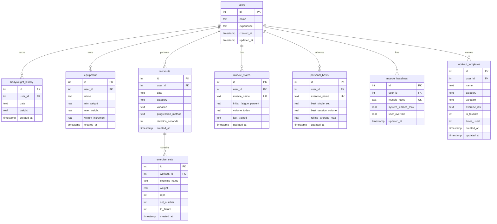

# FitForge Data Model Documentation

## Overview

FitForge is a single-user local fitness tracking application with a three-layer architecture:
- **Database Layer**: SQLite database with normalized relational schema
- **Service Layer**: TypeScript backend API with type-safe contracts
- **UI Layer**: React frontend with shared TypeScript types

---

## Entity Relationship Diagram



---

## Database Schema Details

### Core Entities

#### 1. users
**Purpose**: Stores user profile information

| Column | Type | Constraints | Description |
|--------|------|-------------|-------------|
| id | INTEGER | PRIMARY KEY | User identifier (always 1 for single-user app) |
| name | TEXT | NOT NULL | User's name |
| experience | TEXT | NOT NULL | Experience level: Beginner/Intermediate/Advanced |
| created_at | TIMESTAMP | DEFAULT CURRENT_TIMESTAMP | Account creation time |
| updated_at | TIMESTAMP | DEFAULT CURRENT_TIMESTAMP | Last profile update |

**Location**: `backend/database/schema.sql:1-7`

---

#### 2. bodyweight_history
**Purpose**: Tracks user's weight over time for progressive overload calculations

| Column | Type | Constraints | Description |
|--------|------|-------------|-------------|
| id | INTEGER | PRIMARY KEY | Entry identifier |
| user_id | INTEGER | FK → users(id) | User reference |
| date | TEXT | NOT NULL | Entry date (ISO 8601) |
| weight | REAL | NOT NULL | Weight in pounds |
| created_at | TIMESTAMP | DEFAULT CURRENT_TIMESTAMP | Entry creation time |

**Indexes**: Foreign key index on user_id
**Location**: `backend/database/schema.sql:9-16`

---

#### 3. equipment
**Purpose**: Tracks available equipment for workout planning

| Column | Type | Constraints | Description |
|--------|------|-------------|-------------|
| id | INTEGER | PRIMARY KEY | Equipment identifier |
| user_id | INTEGER | FK → users(id) | User reference |
| name | TEXT | NOT NULL | Equipment type (Dumbbells, Kettlebell, etc.) |
| min_weight | REAL | | Minimum weight capacity |
| max_weight | REAL | | Maximum weight capacity |
| weight_increment | REAL | | Weight increment step (e.g., 5 lbs) |
| created_at | TIMESTAMP | DEFAULT CURRENT_TIMESTAMP | Entry creation time |

**Indexes**: Foreign key index on user_id
**Location**: `backend/database/schema.sql:18-27`

---

#### 4. workouts
**Purpose**: Stores workout session metadata

| Column | Type | Constraints | Description |
|--------|------|-------------|-------------|
| id | INTEGER | PRIMARY KEY | Workout identifier |
| user_id | INTEGER | FK → users(id) | User reference |
| date | TEXT | NOT NULL | Workout date (ISO 8601) |
| category | TEXT | NOT NULL | Push/Pull/Legs/Core |
| variation | TEXT | NOT NULL | A/B/Both |
| progression_method | TEXT | | Weight/Reps progression method |
| duration_seconds | INTEGER | | Workout duration |
| created_at | TIMESTAMP | DEFAULT CURRENT_TIMESTAMP | Entry creation time |

**Indexes**:
- idx_workouts_user_date ON (user_id, date)
- Foreign key index on user_id

**Location**: `backend/database/schema.sql:29-41`

---

#### 5. exercise_sets
**Purpose**: Stores individual exercise sets within workouts

| Column | Type | Constraints | Description |
|--------|------|-------------|-------------|
| id | INTEGER | PRIMARY KEY | Set identifier |
| workout_id | INTEGER | FK → workouts(id) | Parent workout reference |
| exercise_name | TEXT | NOT NULL | Exercise name from EXERCISE_LIBRARY |
| weight | REAL | NOT NULL | Weight used (lbs) |
| reps | INTEGER | NOT NULL | Repetitions performed |
| set_number | INTEGER | NOT NULL | Set sequence number |
| to_failure | INTEGER | NOT NULL DEFAULT 0 | Boolean flag (0/1) for failure sets |
| created_at | TIMESTAMP | DEFAULT CURRENT_TIMESTAMP | Entry creation time |

**Indexes**:
- idx_exercise_sets_workout ON (workout_id)
- idx_exercise_sets_to_failure ON (to_failure)
- Foreign key index on workout_id

**Location**: `backend/database/schema.sql:43-55`

---

#### 6. muscle_states
**Purpose**: Stores muscle fatigue state (backend-driven calculation model)

| Column | Type | Constraints | Description |
|--------|------|-------------|-------------|
| id | INTEGER | PRIMARY KEY | State identifier |
| user_id | INTEGER | FK → users(id) | User reference |
| muscle_name | TEXT | NOT NULL, UNIQUE(user_id, muscle_name) | Muscle group name |
| initial_fatigue_percent | REAL | NOT NULL DEFAULT 0 | Fatigue % at last training |
| volume_today | REAL | NOT NULL DEFAULT 0 | Training volume from last session |
| last_trained | TEXT | | Last training date (UTC ISO 8601) |
| updated_at | TIMESTAMP | DEFAULT CURRENT_TIMESTAMP | Last update time |

**Indexes**: idx_muscle_states_user ON (user_id)

**Calculated Fields** (computed at read time, not stored):
- `currentFatiguePercent`: Current fatigue based on recovery formula
- `daysElapsed`: Days since last_trained
- `estimatedRecoveryDays`: Total days needed for recovery (1-7 days)
- `daysUntilRecovered`: Remaining recovery days
- `recoveryStatus`: "ready" | "recovering" | "fatigued"

**Recovery Formula**:
```typescript
recoveryDays = 1 + (initialFatigue / 100) * 6
currentFatigue = initialFatigue * (1 - daysElapsed / recoveryDays)
```

**13 Muscles**: Pectoralis, Triceps, Deltoids, Lats, Biceps, Rhomboids, Trapezius, Forearms, Quadriceps, Glutes, Hamstrings, Calves, Core

**Location**: `backend/database/schema.sql:57-69`

---

#### 7. personal_bests
**Purpose**: Tracks performance records for each exercise

| Column | Type | Constraints | Description |
|--------|------|-------------|-------------|
| id | INTEGER | PRIMARY KEY | Record identifier |
| user_id | INTEGER | FK → users(id) | User reference |
| exercise_name | TEXT | NOT NULL, UNIQUE(user_id, exercise_name) | Exercise name |
| best_single_set | REAL | NOT NULL DEFAULT 0 | Highest single-set volume |
| best_session_volume | REAL | NOT NULL DEFAULT 0 | Highest total session volume |
| rolling_average_max | REAL | NOT NULL DEFAULT 0 | Average max over recent sessions |
| updated_at | TIMESTAMP | DEFAULT CURRENT_TIMESTAMP | Last update time |

**Indexes**: idx_personal_bests_user ON (user_id)
**Location**: `backend/database/schema.sql:71-82`

---

#### 8. muscle_baselines
**Purpose**: Stores muscle fatigue capacity thresholds

| Column | Type | Constraints | Description |
|--------|------|-------------|-------------|
| id | INTEGER | PRIMARY KEY | Baseline identifier |
| user_id | INTEGER | FK → users(id) | User reference |
| muscle_name | TEXT | NOT NULL, UNIQUE(user_id, muscle_name) | Muscle group name |
| system_learned_max | REAL | NOT NULL DEFAULT 10000 | AI-learned capacity threshold |
| user_override | REAL | | User-specified override value |
| updated_at | TIMESTAMP | DEFAULT CURRENT_TIMESTAMP | Last update time |

**Indexes**: idx_muscle_baselines_user ON (user_id)
**Location**: `backend/database/schema.sql:84-95`

---

#### 9. workout_templates
**Purpose**: Stores saved workout configurations for reuse

| Column | Type | Constraints | Description |
|--------|------|-------------|-------------|
| id | INTEGER | PRIMARY KEY | Template identifier |
| user_id | INTEGER | FK → users(id) | User reference |
| name | TEXT | NOT NULL | Template name |
| category | TEXT | NOT NULL | Push/Pull/Legs/Core |
| variation | TEXT | NOT NULL | A/B/Both |
| exercise_ids | TEXT | NOT NULL | JSON array of exercise IDs |
| is_favorite | INTEGER | DEFAULT 0 | Boolean favorite flag |
| times_used | INTEGER | DEFAULT 0 | Usage counter |
| created_at | TIMESTAMP | DEFAULT CURRENT_TIMESTAMP | Creation time |
| updated_at | TIMESTAMP | DEFAULT CURRENT_TIMESTAMP | Last update time |

**Indexes**: idx_workout_templates_user ON (user_id)
**Location**: `backend/database/schema.sql:97-111`

---

## API Data Contracts (Backend Types)

**Location**: `backend/types.ts`

### Profile Management

```typescript
interface ProfileResponse {
  id: number;
  name: string;
  experience: string;
  equipment: Array<{
    id: number;
    name: string;
    min_weight: number;
    max_weight: number;
    weight_increment: number;
  }>;
  bodyweight_history: Array<{
    date: string;
    weight: number;
  }>;
}

interface ProfileUpdateRequest {
  name?: string;
  experience?: string;
  equipment?: Array<{
    id?: number;
    name: string;
    min_weight: number;
    max_weight: number;
    weight_increment: number;
  }>;
  bodyweight_history?: Array<{
    date: string;
    weight: number;
  }>;
}
```

### Workout Management

```typescript
interface WorkoutExerciseSet {
  weight: number;
  reps: number;
  to_failure?: boolean;
}

interface WorkoutExercise {
  exercise: string;  // Note: field name is 'exercise', not 'exercise_name'
  sets: WorkoutExerciseSet[];
}

interface WorkoutResponse {
  id: number;
  date: string;
  category: string | null;
  variation: string | null;
  progression_method?: string | null;
  duration_seconds?: number | null;
  exercises: WorkoutExercise[];
  created_at?: string;
  prs?: PRInfo[];  // PRs attached to workout response
}

interface WorkoutSaveRequest {
  date: string;
  category?: string;
  variation?: string;
  progressionMethod?: string;
  durationSeconds?: number;
  exercises: WorkoutExercise[];
}

interface PRInfo {
  isPR: boolean;
  exercise: string;
  newVolume: number;
  previousVolume: number;
  improvement: number;
  percentIncrease: number;
  isFirstTime: boolean;
}
```

### Muscle State Management

```typescript
interface MuscleStateData {
  currentFatiguePercent: number;      // Calculated
  daysElapsed: number;                 // Calculated
  estimatedRecoveryDays: number;       // Calculated
  daysUntilRecovered: number;          // Calculated
  recoveryStatus: 'ready' | 'recovering' | 'fatigued';  // Calculated
  initialFatiguePercent: number;       // Stored
  lastTrained: string | null;          // Stored (UTC ISO 8601)
}

type MuscleStatesResponse = Record<string, MuscleStateData>;

interface MuscleStatesUpdateRequest {
  states: Record<string, {
    initial_fatigue_percent: number;
    volume_today: number;
    last_trained: string;
  }>;
}
```

### Performance Tracking

```typescript
interface PersonalBestData {
  best_single_set: number;
  best_session_volume: number;
  rolling_average_max: number;
}

type PersonalBestsResponse = Record<string, PersonalBestData>;

interface PersonalBestsUpdateRequest {
  bests: Record<string, {
    best_single_set: number;
    best_session_volume: number;
    rolling_average_max: number;
  }>;
}
```

### Muscle Baselines

```typescript
interface MuscleBaselineData {
  system_learned_max: number;
  user_override: number | null;
}

type MuscleBaselinesResponse = Record<string, MuscleBaselineData>;

interface MuscleBaselinesUpdateRequest {
  baselines: Record<string, {
    system_learned_max?: number;
    user_override?: number;
  }>;
}
```

---

## Frontend Type Definitions

**Location**: `types.ts`

### Enums

```typescript
enum Muscle {
  Pectoralis = 'Pectoralis',
  Triceps = 'Triceps',
  Deltoids = 'Deltoids',
  Lats = 'Lats',
  Biceps = 'Biceps',
  Rhomboids = 'Rhomboids',
  Trapezius = 'Trapezius',
  Forearms = 'Forearms',
  Quadriceps = 'Quadriceps',
  Glutes = 'Glutes',
  Hamstrings = 'Hamstrings',
  Calves = 'Calves',
  Core = 'Core'
}

enum ExerciseCategory {
  Push = 'Push',
  Pull = 'Pull',
  Legs = 'Legs',
  Core = 'Core'
}

enum Equipment {
  Bodyweight = 'Bodyweight',
  Dumbbells = 'Dumbbells',
  Kettlebell = 'Kettlebell',
  PullUpBar = 'Pull-up Bar',
  TRX = 'TRX',
  DipStation = 'Dip Station',
  PlyoBox = 'Plyo Box',
  GripStrengthener = 'Grip Strengthener',
  Bench = 'Bench'
}

enum Difficulty {
  Beginner = 'Beginner',
  Intermediate = 'Intermediate',
  Advanced = 'Advanced'
}

enum Variation {
  A = 'A',
  B = 'B',
  Both = 'Both'
}
```

### Exercise Data Models

```typescript
interface MuscleEngagement {
  muscle: Muscle;
  percentage: number;
}

interface Exercise {
  id: string;
  name: string;
  category: ExerciseCategory;
  equipment: Equipment | Equipment[];
  difficulty: Difficulty;
  muscleEngagements: MuscleEngagement[];
  variation: Variation;
}
```

### Logged Workout Models

```typescript
interface LoggedSet {
  id: string;
  reps: number;
  weight: number;
  bodyweightAtTime?: number;
  to_failure: boolean;
}

interface LoggedExercise {
  id: string;
  exerciseId: string;
  sets: LoggedSet[];
}

interface WorkoutSession {
  id: string;
  name: string;
  type: ExerciseCategory;
  variation: Variation;
  startTime: number;
  endTime: number | null;
  loggedExercises: LoggedExercise[];
  muscleFatigueHistory: Record<Muscle, number>;
}
```

### User Profile Models

```typescript
interface WeightEntry {
  date: number;  // timestamp
  weight: number;
}

interface EquipmentItem {
  id: string;
  type: Equipment;
  weightRange?: { min: number; max: number; increment: number };
  quantity: number;
}

interface UserProfile {
  name: string;
  height: number;
  age: number;
  experience: Difficulty;
  bodyweightHistory: WeightEntry[];
  equipment: EquipmentItem[];
}
```

### Performance Tracking Models

```typescript
interface ExerciseMaxes {
  bestSingleSet: number;
  bestSessionVolume: number;
  rollingAverageMax: number;
}

interface MuscleBaseline {
  userOverride: number | null;
  systemLearnedMax: number;
}

type MuscleBaselines = Record<Muscle, MuscleBaseline>;

interface MuscleAnalytics {
  lastTrained: number | null;
  lastVolume: number;
}

type MuscleAnalyticsRecord = Record<Muscle, MuscleAnalytics>;
```

### Template Models

```typescript
interface WorkoutTemplate {
  id: number;
  name: string;
  category: string;
  variation: string;
  exerciseIds: string[];
  isFavorite: boolean;
  timesUsed: number;
  createdAt: string;
  updatedAt: string;
}
```

### Exercise Recommendation Models

```typescript
interface MuscleReadiness {
  muscle: Muscle;
  recovery: number;        // 0-100% (100% = fully recovered)
  fatigue: number;         // 0-100% (0% = no fatigue)
  engagement: number;      // Exercise-specific engagement %
  isPrimary: boolean;      // engagement >= 50%
}

interface ExerciseRecommendation {
  exercise: Exercise;
  opportunityScore: number;
  primaryMuscles: MuscleReadiness[];
  limitingFactors: MuscleReadiness[];
  status: 'excellent' | 'good' | 'suboptimal' | 'not-recommended';
  explanation: string;
  equipmentAvailable: boolean;
}
```

### Stats and Analytics Models

```typescript
interface PRHighlight {
  exercise: string;
  type: 'single' | 'volume';
  improvement: number; // percentage increase
  date: string;
}

interface WeeklyStats {
  thisWeek: number;  // workout count this week
  lastWeek: number;  // workout count last week
}

interface RecoveryGroups {
  ready: Array<{ muscle: string; data: MuscleStateData }>;
  recovering: Array<{ muscle: string; data: MuscleStateData; daysUntil: number }>;
  fatigued: Array<{ muscle: string; data: MuscleStateData; daysUntil: number }>;
}

// Analytics Dashboard Types (Phase 1 & 2 Complete)
interface AnalyticsResponse {
  timeRange: {
    start: string;    // ISO date
    end: string;      // ISO date
    days: number;
  };
  summary: {
    totalWorkouts: number;
    totalVolume: number;
    totalPRs: number;
    currentStreak: number;
    weeklyFrequency: number;
  };
  exerciseProgression: Record<string, {
    dataPoints: Array<{ date: string; weight: number; reps: number; volume: number }>;
    bestSingleSet: number;
    percentChange: number;
    latestPR?: { date: string; weight: number; reps: number };
  }>;
  muscleCapacityTrends: Record<string, {
    dataPoints: Array<{ date: string; capacity: number }>;
    currentCapacity: number;
    startingCapacity: number;
    percentGrowth: number;
    avgGrowthPerMonth: number;
  }>;
  volumeTrends: {
    byWeek: Array<{
      weekStart: string;
      Push: number;
      Pull: number;
      Legs: number;
      Core: number;
      total: number;
    }>;
    byCategory: {
      Push: { total: number; percentChange: number };
      Pull: { total: number; percentChange: number };
      Legs: { total: number; percentChange: number };
      Core: { total: number; percentChange: number };
    };
  };
  prTimeline: Array<{
    date: string;
    exercise: string;
    newVolume: number;
    previousVolume: number;
    improvement: number;
    percentIncrease: number;
  }>;
  consistencyMetrics: {
    currentStreak: number;
    longestStreak: number;
    workoutsThisWeek: number;
    workoutsLastWeek: number;
    avgWeeklyFrequency: number;
    activityCalendar: Array<{
      date: string;
      workoutCount: number;
      category: string;
    }>;
  };
}
```

---

## API Endpoints

**Location**: `backend/server.ts`

### Health Check
- `GET /api/health` → `HealthCheckResponse`

### Profile Management
- `GET /api/profile` → `ProfileResponse`
- `PUT /api/profile` (body: `ProfileUpdateRequest`) → `ProfileResponse`

### Workouts
- `GET /api/workouts` → `WorkoutResponse[]`
- `GET /api/workouts/last?category={string}` → `WorkoutResponse`
- `POST /api/workouts` (body: `WorkoutSaveRequest`) → `{ workout: WorkoutResponse, prs: PRInfo[] }`
- `POST /api/quick-add` (body: `QuickAddRequest`) → `QuickAddResponse`

### Muscle States (Backend-Driven)
- `GET /api/muscle-states` → `MuscleStatesResponse` (with calculated fields)
- `PUT /api/muscle-states` (body: `MuscleStatesUpdateRequest`) → `MuscleStatesResponse`

### Personal Bests
- `GET /api/personal-bests` → `PersonalBestsResponse`
- `PUT /api/personal-bests` (body: `PersonalBestsUpdateRequest`) → `PersonalBestsResponse`

### Muscle Baselines
- `GET /api/muscle-baselines` → `MuscleBaselinesResponse`
- `PUT /api/muscle-baselines` (body: `MuscleBaselinesUpdateRequest`) → `MuscleBaselinesResponse`

### Workout Templates
- `GET /api/templates` → `WorkoutTemplate[]`
- `GET /api/templates/:id` → `WorkoutTemplate`
- `POST /api/templates` (body: `Omit<WorkoutTemplate, 'id' | 'timesUsed' | 'createdAt' | 'updatedAt'>`) → `WorkoutTemplate`
- `PUT /api/templates/:id` (body: `Partial<WorkoutTemplate>`) → `WorkoutTemplate`
- `DELETE /api/templates/:id` → `{ success: boolean }`

### Analytics (Phase 1 & 2 Complete)
- `GET /api/analytics?timeRange={number}` → `AnalyticsResponse`
  - Query parameters:
    - `timeRange` (optional): Number of days to analyze (default: 90)
  - Returns aggregated analytics data including:
    - Exercise progression charts (weight/reps over time)
    - Muscle capacity trend analysis
    - Volume trends by category and week
    - PR timeline with improvements
    - Consistency metrics (streak, frequency, calendar)

---

## Data Flow Architecture

### Layer 1: Database (SQLite)
- **Location**: `data/fitforge.db`
- **Schema**: `backend/database/schema.sql`
- **Migrations**: `backend/database/migrations/`
- **Access Layer**: `backend/database/database.ts`

### Layer 2: Backend Service (Express + TypeScript)
- **Server**: `backend/server.ts`
- **Type Contracts**: `backend/types.ts`
- **Business Logic**:
  - Muscle state calculations (recovery formulas)
  - Personal record detection
  - Progressive overload calculations
  - Template management

### Layer 3: Frontend (React + TypeScript)
- **API Client**: `api.ts`
- **Type Definitions**: `types.ts`
- **Constants**: `constants.ts` (EXERCISE_LIBRARY)
- **Components**: `components/` (Dashboard, Workout, Profile, etc.)
- **Utilities**: `utils/` (helpers, progressive overload, recommendations, stats)
- **Hooks**: `hooks/useAPIState.ts` (state management)

---

## Key Data Flow Patterns

### 1. Workout Save Flow
```
User completes workout
  ↓
Frontend: Collect exercise sets with to_failure flags
  ↓
API POST /api/workouts (WorkoutSaveRequest)
  ↓
Backend: saveWorkout() in database.ts
  ├─ Insert workout row
  ├─ Insert exercise_sets rows
  ├─ Detect personal records (PRInfo[])
  └─ Update muscle_states (initial_fatigue, last_trained)
  ↓
Response: { workout: WorkoutResponse, prs: PRInfo[] }
  ↓
Frontend: Display workout summary + PR notifications
```

### 2. Muscle State Calculation Flow (Backend-Driven)
```
User opens Dashboard
  ↓
API GET /api/muscle-states
  ↓
Backend: getMuscleStates() in database.ts
  ├─ Read muscle_states rows (stored facts)
  ├─ Calculate current fatigue using recovery formula
  ├─ Calculate days elapsed, recovery status
  └─ Return MuscleStatesResponse with calculated fields
  ↓
Frontend: Display muscle recovery visualization
```

### 3. Progressive Overload Flow
```
User starts workout of same category
  ↓
API GET /api/workouts/last?category={category}
  ↓
Backend: Returns last workout of same type/variation
  ↓
Frontend: calculateProgressiveOverload() in utils/progressiveOverload.ts
  ├─ Apply 3% increase to weight or reps
  ├─ Round to nearest 0.5 lb
  └─ Suggest progression method (alternate weight/reps)
  ↓
Display suggested sets with increased load
```

### 4. Personal Best Detection Flow
```
User saves workout
  ↓
Backend: saveWorkout() in database.ts
  ├─ Calculate single-set volumes (reps × weight)
  ├─ Calculate total session volume
  ├─ Compare to personal_bests table
  ├─ If new record:
  │   ├─ Update personal_bests row
  │   └─ Create PRInfo object
  └─ Return PRInfo[] in response
  ↓
Frontend: Display PR notifications
```

### 5. Exercise Recommendation Flow
```
User opens Dashboard or selects workout category
  ↓
Frontend: ExerciseRecommendations component renders
  ├─ Receives muscleStates from GET /api/muscle-states
  ├─ Receives equipment from user profile
  └─ Receives optional category filter
  ↓
Frontend: calculateRecommendations() in utils/exerciseRecommendations.ts
  ├─ Filter EXERCISE_LIBRARY by category and equipment
  ├─ For each exercise:
  │   ├─ Calculate muscle readiness (recovery %)
  │   ├─ Identify primary muscles (engagement >= 50%)
  │   ├─ Identify limiting factors (fatigue >= 67%)
  │   └─ Calculate opportunity score: avgFreshness - (maxFatigue × 0.5)
  ├─ Classify status (excellent/good/suboptimal/not-recommended)
  └─ Sort by opportunity score descending
  ↓
Frontend: Display recommendations with RecommendationCard components
  ├─ Color-coded status indicators
  ├─ Primary muscle highlights
  ├─ Limiting factor warnings
  └─ Equipment availability badges
  ↓
User selects recommended exercise → Start workout with optimal recovery
```

---

## Database Migrations

**Location**: `backend/database/migrations/`

### Migration 001: Add to_failure Column
- **File**: `001_add_to_failure_column.sql`
- **Purpose**: Add `to_failure` flag to exercise_sets
- **Rollback**: `001_rollback_to_failure_column.sql`

### Migration 002: Refactor Muscle States
- **File**: `002_refactor_muscle_states.sql`
- **Purpose**: Transition to backend-driven muscle state calculations
- **Changes**:
  - Remove `current_fatigue_percent`, `days_since_trained`, `estimated_recovery_days`, `days_until_recovered`, `recovery_status`
  - Add `initial_fatigue_percent`, `volume_today`
  - Keep `last_trained` as UTC ISO 8601 timestamp

---

## Exercise Library

**Location**: `constants.ts`

The `EXERCISE_LIBRARY` constant defines 50+ exercises with:
- Unique IDs (ex02, ex03, ex05, etc.)
- Exercise names
- Category assignment (Push/Pull/Legs/Core)
- Equipment requirements
- Difficulty levels
- Muscle engagement percentages
- Variation assignments (A/B/Both)

**Example**:
```typescript
{
  id: 'ex02',
  name: 'Dumbbell Bench Press',
  category: ExerciseCategory.Push,
  equipment: Equipment.Dumbbells,
  difficulty: Difficulty.Intermediate,
  muscleEngagements: [
    { muscle: Muscle.Pectoralis, percentage: 70 },
    { muscle: Muscle.Triceps, percentage: 20 },
    { muscle: Muscle.Deltoids, percentage: 10 }
  ],
  variation: Variation.A
}
```

---

## Utility Functions

### Progressive Overload Calculations
**Location**: `utils/progressiveOverload.ts`

```typescript
// 3% progression formula
function calculateProgressiveOverload(
  lastPerformance: LoggedExercise,
  lastMethod: 'weight' | 'reps',
  personalBest: ExerciseMaxes
): ProgressiveOverloadSuggestion
```

### Helpers
**Location**: `utils/helpers.ts`

```typescript
getUserLevel(workoutCount: number): number         // DEPRECATED: Level 1-4 (removed from UI)
formatDuration(milliseconds: number): string       // "Xh Ym Zs"
calculateVolume(reps: number, weight: number): number  // reps × weight
findPreviousWorkout(current, all): WorkoutSession | null
```

**Note**: `getUserLevel()` has been deprecated as of the "remove-gamification-gates" change. Level-based gamification has been removed from the UI to provide users with unrestricted access to their training data. The function is kept for backward compatibility but should not be used in new code.

### Exercise Recommendation Engine
**Location**: `utils/exerciseRecommendations.ts`

The recommendation engine intelligently suggests exercises based on muscle recovery states and available equipment.

```typescript
// Main recommendation function
function calculateRecommendations(
  muscleStates: MuscleStatesResponse,
  equipment: EquipmentItem[],
  category?: ExerciseCategory
): ExerciseRecommendation[]

// Equipment availability checker
function checkEquipmentAvailable(
  requiredEquipment: Equipment | Equipment[],
  userEquipment: EquipmentItem[]
): boolean

// Opportunity scoring algorithm
function calculateOpportunityScore(
  exercise: Exercise,
  muscleStates: MuscleStatesResponse
): {
  score: number;
  primaryMuscles: MuscleReadiness[];
  limitingFactors: MuscleReadiness[];
}
```

**Recommendation Algorithm**:
1. Filter exercises by category (if specified) and equipment availability
2. For each exercise:
   - Calculate muscle readiness scores (recovery % for all engaged muscles)
   - Identify primary muscles (engagement >= 50%)
   - Identify limiting factors (fatigued muscles >= 67%)
   - Calculate opportunity score: `avgFreshness - (maxFatigue × 0.5)`
3. Classify exercise status:
   - **excellent**: No limiting factors, avgFreshness >= 90%
   - **good**: No limiting factors, avgFreshness >= 70%
   - **suboptimal**: Has limiting factors, avgFreshness >= 50%
   - **not-recommended**: Primary muscles too fatigued
4. Sort by opportunity score (descending)

**Types**:
```typescript
interface MuscleReadiness {
  muscle: Muscle;
  recovery: number;        // 0-100% (100% = fully recovered)
  fatigue: number;         // 0-100% (0% = no fatigue)
  engagement: number;      // Exercise-specific engagement %
  isPrimary: boolean;      // engagement >= 50%
}

interface ExerciseRecommendation {
  exercise: Exercise;
  opportunityScore: number;
  primaryMuscles: MuscleReadiness[];
  limitingFactors: MuscleReadiness[];
  status: 'excellent' | 'good' | 'suboptimal' | 'not-recommended';
  explanation: string;
  equipmentAvailable: boolean;
}
```

### Stats Helpers
**Location**: `utils/statsHelpers.ts`

```typescript
// Calculate consecutive workout streak
function calculateStreak(workouts: WorkoutResponse[]): number

// Weekly workout count comparison
function calculateWeeklyStats(workouts: WorkoutResponse[]): WeeklyStats

// Find recent PRs (last 7 days)
function findRecentPRs(
  personalBests: PersonalBestsResponse,
  workouts: WorkoutResponse[]
): PRHighlight[]

// Group muscles by recovery status
function groupMusclesByRecovery(
  muscleStates: MuscleStatesResponse
): RecoveryGroups

// Format relative dates (Today, Yesterday, X days ago)
function formatRelativeDate(dateString: string): string

// Types
interface PRHighlight {
  exercise: string;
  type: 'single' | 'volume';
  improvement: number; // percentage increase
  date: string;
}

interface WeeklyStats {
  thisWeek: number;  // workout count this week
  lastWeek: number;  // workout count last week
}

interface RecoveryGroups {
  ready: Array<{ muscle: string; data: MuscleStateData }>;
  recovering: Array<{ muscle: string; data: MuscleStateData; daysUntil: number }>;
  fatigued: Array<{ muscle: string; data: MuscleStateData; daysUntil: number }>;
}
```

---

## Frontend Components

**Location**: `components/`

### Dashboard Components

#### ExerciseRecommendations
**Location**: `components/ExerciseRecommendations.tsx`

Displays intelligent exercise recommendations based on muscle recovery states and available equipment.

**Features**:
- Real-time recommendation calculations using `calculateRecommendations()`
- Category filtering (Push/Pull/Legs/Core)
- Status-based styling (excellent/good/suboptimal/not-recommended)
- Equipment availability indicators
- Collapsible sections for organized display

**Props**:
```typescript
interface ExerciseRecommendationsProps {
  muscleStates: MuscleStatesResponse;
  equipment: EquipmentItem[];
  category?: ExerciseCategory;
}
```

#### RecommendationCard
**Location**: `components/RecommendationCard.tsx`

Displays individual exercise recommendations with detailed muscle readiness information.

**Features**:
- Visual status indicators (color-coded)
- Primary muscle highlights
- Limiting factor warnings
- Opportunity score display
- Equipment requirements

**Props**:
```typescript
interface RecommendationCardProps {
  recommendation: ExerciseRecommendation;
  onClick?: () => void;
}
```

#### CategoryTabs
**Location**: `components/CategoryTabs.tsx`

Tab navigation component for filtering exercises by category.

**Features**:
- Push/Pull/Legs/Core tabs
- Active state styling
- Click handlers for category selection
- Responsive design

**Props**:
```typescript
interface CategoryTabsProps {
  activeCategory: ExerciseCategory | 'All';
  onCategoryChange: (category: ExerciseCategory | 'All') => void;
}
```

#### CollapsibleSection
**Location**: `components/CollapsibleSection.tsx`

Reusable collapsible section component for organizing dashboard content.

**Features**:
- Expand/collapse animation
- Custom header content
- Configurable default state (open/closed)
- Smooth transitions

**Props**:
```typescript
interface CollapsibleSectionProps {
  title: string;
  defaultOpen?: boolean;
  children: React.ReactNode;
}
```

### Analytics Components (Phase 1 & 2 Complete)

#### Analytics
**Location**: `components/Analytics.tsx`

Main analytics dashboard component that displays comprehensive performance tracking and visualization.

**Features**:
- Time-range filtering (7/30/90/365 days, all-time)
- Summary statistics cards
- Empty state handling for new users
- Loading and error states
- Responsive layout

**Props**:
```typescript
// Standalone component, fetches data via /api/analytics
```

#### ExerciseProgressionChart
**Location**: `components/ExerciseProgressionChart.tsx`

Interactive chart showing weight and rep progression for selected exercises over time.

**Features**:
- Exercise selector dropdown
- Line chart visualization
- Hover tooltips with detailed data
- Percentage change calculations

#### MuscleCapacityChart
**Location**: `components/MuscleCapacityChart.tsx`

Displays muscle capacity baseline growth trends over time.

**Features**:
- Muscle group selector
- Trend line visualization
- Growth rate statistics
- Current vs starting capacity comparison

#### VolumeTrendsChart
**Location**: `components/VolumeTrendsChart.tsx`

Stacked bar chart showing training volume by category over weeks.

**Features**:
- Category breakdown (Push/Pull/Legs/Core)
- Weekly aggregation
- Color-coded categories
- Total volume trends

#### ActivityCalendarHeatmap
**Location**: `components/ActivityCalendarHeatmap.tsx`

Visual workout frequency calendar showing training consistency.

**Features**:
- Heatmap visualization
- Daily workout indicators
- Category color coding
- Streak highlighting

---

## React Hooks

### useAPIState Hook
**Location**: `hooks/useAPIState.ts`

A custom React hook that manages API state with automatic fetching, optimistic updates, and error handling.

```typescript
function useAPIState<T>(
  fetchFn: () => Promise<T>,
  updateFn: (value: T) => Promise<T>,
  initialValue: T
): [
  T,                                          // Current state value
  (value: T | ((prev: T) => T)) => Promise<void>,  // Update function
  boolean,                                    // Loading state
  Error | null                               // Error state
]
```

**Features**:
- Automatic data fetching on mount
- Optimistic UI updates
- Automatic rollback on API errors
- Loading and error state management
- Support for functional updates `setState(prev => newValue)`

**Usage Example**:
```typescript
const [muscleStates, setMuscleStates, loading, error] = useAPIState(
  muscleStatesAPI.get,
  muscleStatesAPI.update,
  {}
);

// Optimistic update with automatic rollback on error
await setMuscleStates(prev => ({
  ...prev,
  Pectoralis: { ...prev.Pectoralis, currentFatiguePercent: 50 }
}));
```

---

## Architecture Highlights

### 1. Type Safety Throughout Stack
- Database schema → Backend types → Frontend types
- No type casting or `any` usage
- Compile-time safety from DB to UI

### 2. Backend-Driven Calculations
- Muscle states calculated on read (not stored)
- Single source of truth for recovery formulas
- Frontend receives ready-to-display data

### 3. Single-User Local Application
- All queries hardcode `user_id = 1`
- No authentication/authorization layer
- SQLite file-based persistence

### 4. Immutable Historical Facts
- `muscle_states` stores what happened (initial fatigue, last trained date)
- Current state calculated from facts + time elapsed
- Never mutate historical data

### 5. Progressive Overload Intelligence
- 3% increase per session
- Alternates weight vs. reps progression
- Respects equipment constraints

### 6. Personal Record Tracking
- Automatic PR detection on workout save
- Multiple record types (single-set, session volume, rolling average)
- Real-time notification on achievement

### 7. Intelligent Exercise Recommendations
- Real-time opportunity scoring based on muscle recovery
- Equipment availability filtering
- Category-specific recommendations (Push/Pull/Legs/Core)
- Status classification (excellent/good/suboptimal/not-recommended)
- Primary muscle and limiting factor analysis

### 8. Performance Analytics
- Weekly workout statistics and comparisons
- PR highlight tracking
- Recovery status grouping (ready/recovering/fatigued)
- Volume and duration analysis

---

## Database Constraints and Indexes

### Foreign Key Constraints
All child tables reference `users(id)` with CASCADE on DELETE:
- bodyweight_history.user_id
- equipment.user_id
- workouts.user_id
- muscle_states.user_id
- personal_bests.user_id
- muscle_baselines.user_id
- workout_templates.user_id

exercise_sets references workouts(id) with CASCADE on DELETE.

### Unique Constraints
- muscle_states: UNIQUE(user_id, muscle_name)
- personal_bests: UNIQUE(user_id, exercise_name)
- muscle_baselines: UNIQUE(user_id, muscle_name)

### Performance Indexes
- idx_workouts_user_date ON workouts(user_id, date)
- idx_exercise_sets_workout ON exercise_sets(workout_id)
- idx_exercise_sets_to_failure ON exercise_sets(to_failure)
- idx_muscle_states_user ON muscle_states(user_id)
- idx_personal_bests_user ON personal_bests(user_id)
- idx_muscle_baselines_user ON muscle_baselines(user_id)
- idx_workout_templates_user ON workout_templates(user_id)

---

## Data Persistence

**Database File**: `data/fitforge.db`
**Type**: SQLite 3
**Journal Mode**: DELETE (for Docker compatibility)

---

## Summary

This data model supports a comprehensive fitness tracking application with:
- **Workout logging** with exercise sets and progressive overload
- **Muscle fatigue tracking** with backend-driven recovery calculations
- **Personal record detection** across multiple metrics
- **Intelligent exercise recommendations** based on recovery states and equipment
- **Template system** for workout reuse
- **Equipment management** for progressive resistance
- **Bodyweight tracking** for contextual performance analysis
- **Performance analytics** with weekly stats and PR highlights
- **Analytics dashboard** (Phase 1 & 2 Complete) with:
  - Exercise progression charts (weight/reps over time)
  - Muscle capacity trend analysis
  - Volume tracking by category and week
  - PR timeline with improvement percentages
  - Consistency metrics (streak, frequency, activity calendar)
- **50+ exercises** across Push/Pull/Legs/Core categories

The three-layer architecture ensures type safety, separation of concerns, and maintainability while providing a responsive single-user experience with smart workout intelligence.

### Recent Updates

**2025-10-25**: Added Analytics Dashboard (Phase 1 & 2) - `/api/analytics` endpoint with comprehensive performance tracking and visualization support.

**2025-10-25**: Removed gamification barriers - Deprecated `getUserLevel()` function and removed level-based UI elements to provide unrestricted access to user data.
