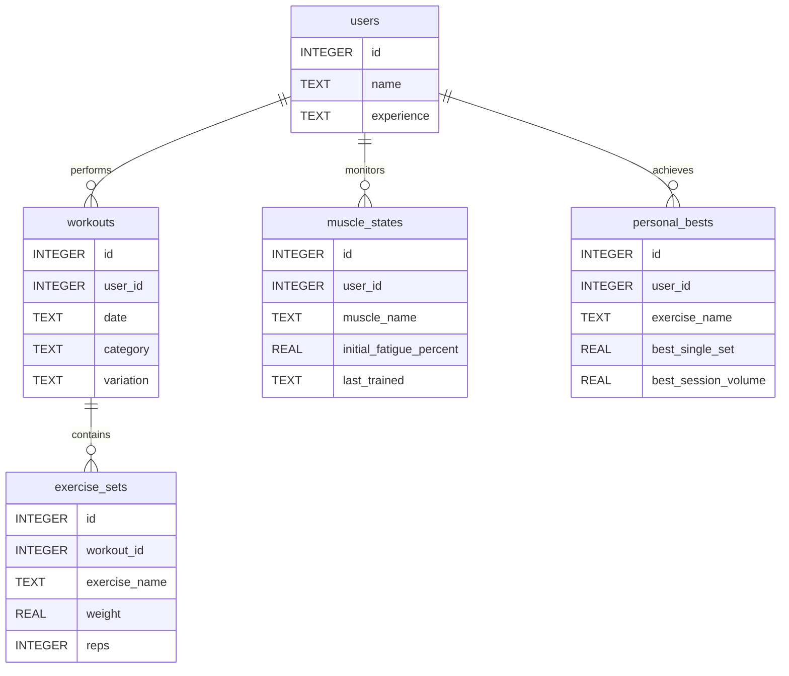
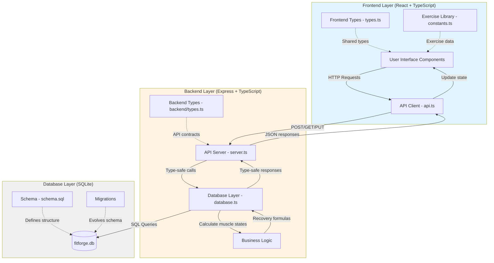
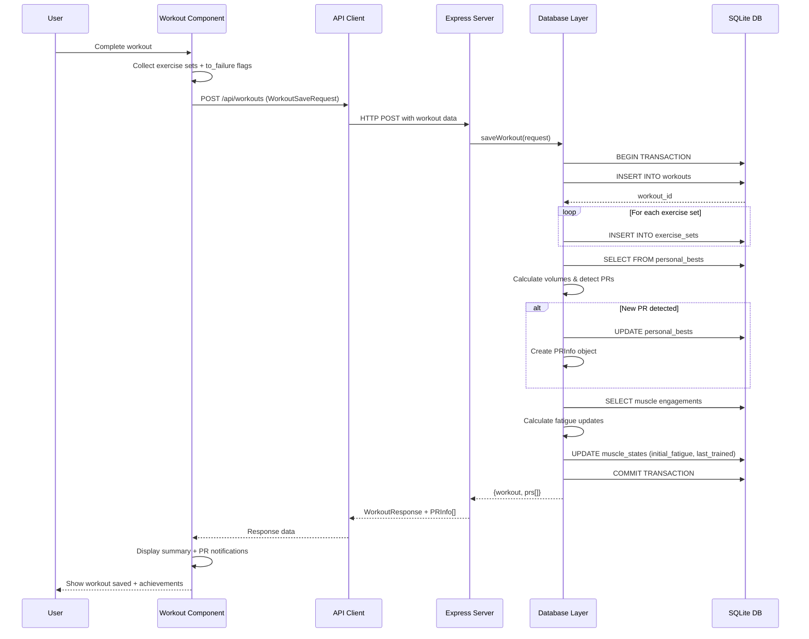
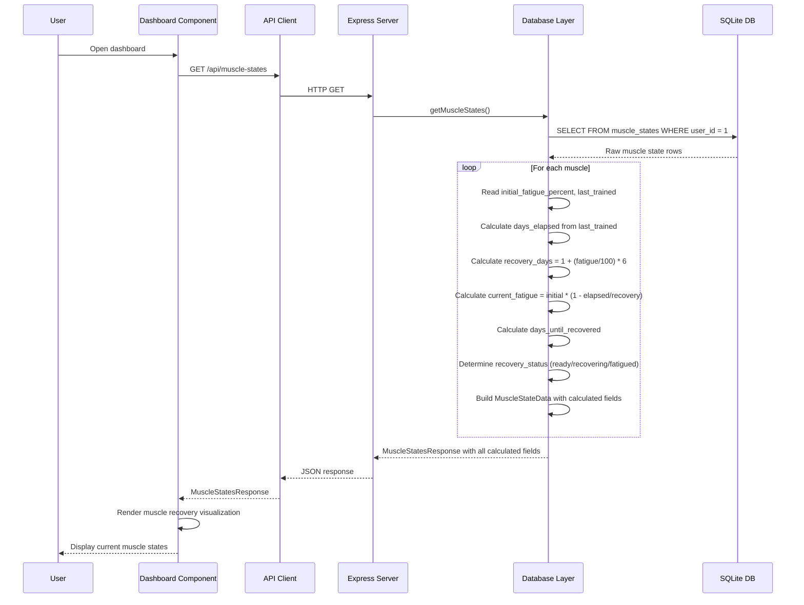
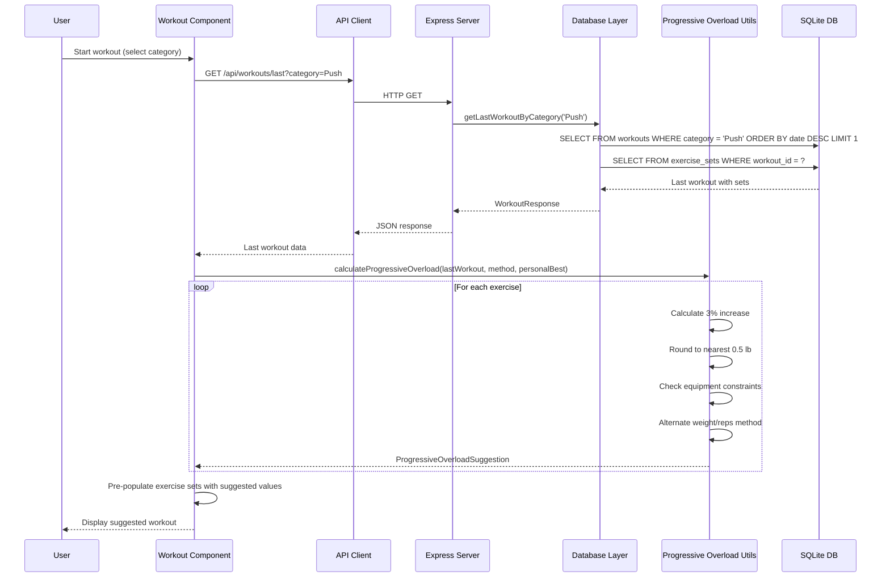
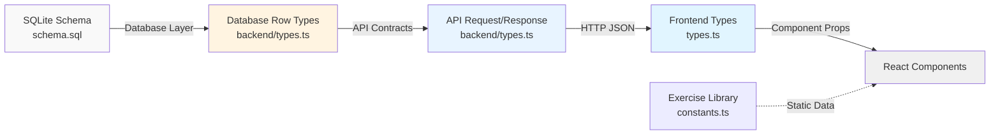

# FitForge Entity Relationship Diagram

## Complete ERD with All Relationships

```mermaid
erDiagram
    users ||--o{ bodyweight_history : "tracks weight"
    users ||--o{ equipment : "owns"
    users ||--o{ workouts : "performs"
    users ||--o{ muscle_states : "monitors"
    users ||--o{ personal_bests : "achieves"
    users ||--o{ muscle_baselines : "maintains"
    users ||--o{ workout_templates : "creates"

    workouts ||--o{ exercise_sets : "contains"

    users {
        INTEGER id PK "Auto-increment primary key"
        TEXT name "User's display name"
        TEXT experience "Beginner/Intermediate/Advanced"
        TIMESTAMP created_at "Account creation timestamp"
        TIMESTAMP updated_at "Last profile update"
    }

    bodyweight_history {
        INTEGER id PK "Auto-increment primary key"
        INTEGER user_id FK "References users(id)"
        TEXT date "Entry date (ISO 8601)"
        REAL weight "Weight in pounds"
        TIMESTAMP created_at "Entry timestamp"
    }

    equipment {
        INTEGER id PK "Auto-increment primary key"
        INTEGER user_id FK "References users(id)"
        TEXT name "Equipment type"
        REAL min_weight "Minimum weight capacity"
        REAL max_weight "Maximum weight capacity"
        REAL weight_increment "Weight step increment"
        TIMESTAMP created_at "Entry timestamp"
    }

    workouts {
        INTEGER id PK "Auto-increment primary key"
        INTEGER user_id FK "References users(id)"
        TEXT date "Workout date (ISO 8601)"
        TEXT category "Push/Pull/Legs/Core"
        TEXT variation "A/B/Both"
        TEXT progression_method "Weight/Reps"
        INTEGER duration_seconds "Session duration"
        TIMESTAMP created_at "Entry timestamp"
    }

    exercise_sets {
        INTEGER id PK "Auto-increment primary key"
        INTEGER workout_id FK "References workouts(id)"
        TEXT exercise_name "Exercise identifier"
        REAL weight "Weight used (lbs)"
        INTEGER reps "Repetitions performed"
        INTEGER set_number "Set sequence (1,2,3...)"
        INTEGER to_failure "Boolean flag (0/1)"
        TIMESTAMP created_at "Entry timestamp"
    }

    muscle_states {
        INTEGER id PK "Auto-increment primary key"
        INTEGER user_id FK "References users(id)"
        TEXT muscle_name UK "Unique per user"
        REAL initial_fatigue_percent "Fatigue at training"
        REAL volume_today "Training volume"
        TEXT last_trained "UTC ISO 8601 timestamp"
        TIMESTAMP updated_at "Last update timestamp"
    }

    personal_bests {
        INTEGER id PK "Auto-increment primary key"
        INTEGER user_id FK "References users(id)"
        TEXT exercise_name UK "Unique per user"
        REAL best_single_set "Max single-set volume"
        REAL best_session_volume "Max total volume"
        REAL rolling_average_max "Average maximum"
        TIMESTAMP updated_at "Last update timestamp"
    }

    muscle_baselines {
        INTEGER id PK "Auto-increment primary key"
        INTEGER user_id FK "References users(id)"
        TEXT muscle_name UK "Unique per user"
        REAL system_learned_max "AI-learned threshold"
        REAL user_override "User-specified override"
        TIMESTAMP updated_at "Last update timestamp"
    }

    workout_templates {
        INTEGER id PK "Auto-increment primary key"
        INTEGER user_id FK "References users(id)"
        TEXT name "Template name"
        TEXT category "Push/Pull/Legs/Core"
        TEXT variation "A/B/Both"
        TEXT exercise_ids "JSON array of IDs"
        INTEGER is_favorite "Boolean flag (0/1)"
        INTEGER times_used "Usage counter"
        TIMESTAMP created_at "Creation timestamp"
        TIMESTAMP updated_at "Last update timestamp"
    }
```

---

## Simplified ERD (Key Relationships Only)

---

## Data Flow Diagram

---

## Workout Save Data Flow

---

## Muscle State Calculation Flow

---

## Progressive Overload Suggestion Flow

---

## Relationship Cardinalities

| Relationship | Parent | Child | Type | Cascade |
|--------------|--------|-------|------|---------|
| User → Bodyweight History | users | bodyweight_history | 1:N | DELETE CASCADE |
| User → Equipment | users | equipment | 1:N | DELETE CASCADE |
| User → Workouts | users | workouts | 1:N | DELETE CASCADE |
| User → Muscle States | users | muscle_states | 1:N | DELETE CASCADE |
| User → Personal Bests | users | personal_bests | 1:N | DELETE CASCADE |
| User → Muscle Baselines | users | muscle_baselines | 1:N | DELETE CASCADE |
| User → Workout Templates | users | workout_templates | 1:N | DELETE CASCADE |
| Workout → Exercise Sets | workouts | exercise_sets | 1:N | DELETE CASCADE |

---

## Index Strategy

### Query Optimization Indexes

1. **Workout Queries**
   - `idx_workouts_user_date` ON `workouts(user_id, date)`
   - Optimizes: Recent workout retrieval, date-range queries

2. **Exercise Set Queries**
   - `idx_exercise_sets_workout` ON `exercise_sets(workout_id)`
   - Optimizes: Loading sets for workout display
   - `idx_exercise_sets_to_failure` ON `exercise_sets(to_failure)`
   - Optimizes: Filtering failure sets for analytics

3. **Muscle State Queries**
   - `idx_muscle_states_user` ON `muscle_states(user_id)`
   - Optimizes: Dashboard muscle state loading

4. **Personal Best Queries**
   - `idx_personal_bests_user` ON `personal_bests(user_id)`
   - Optimizes: Personal records retrieval

5. **Muscle Baseline Queries**
   - `idx_muscle_baselines_user` ON `muscle_baselines(user_id)`
   - Optimizes: Baseline threshold lookups

6. **Template Queries**
   - `idx_workout_templates_user` ON `workout_templates(user_id)`
   - Optimizes: Template library loading

---

## Data Integrity Constraints

### Primary Keys
All tables use auto-incrementing INTEGER primary keys for efficient indexing and referential integrity.

### Foreign Keys
All child tables enforce foreign key constraints with CASCADE DELETE to maintain referential integrity when users (or workouts) are deleted.

### Unique Constraints
Prevent duplicate records for:
- Muscle states per user/muscle combination
- Personal bests per user/exercise combination
- Muscle baselines per user/muscle combination

### Not Null Constraints
Critical fields enforce NOT NULL to prevent incomplete data:
- User names and experience levels
- Workout dates, categories, variations
- Exercise set weights and reps
- Muscle state names and fatigue values
- Personal best exercise names

---

## Denormalization Decisions

### 1. Exercise Names in exercise_sets
**Decision**: Store exercise names as TEXT instead of foreign key to exercises table

**Rationale**:
- Exercise library is static (defined in constants.ts)
- No need for dynamic exercise CRUD operations
- Simplifies queries (no JOIN required)
- Prevents orphaned sets if exercise deleted from library

### 2. Calculated Fields in Muscle States
**Decision**: Calculate current fatigue at read-time instead of storing

**Rationale**:
- Source of truth is initial_fatigue + last_trained
- Time-dependent values become stale immediately
- Backend calculation ensures consistency
- Reduces storage and update complexity

### 3. JSON Array in workout_templates
**Decision**: Store exercise_ids as JSON array string

**Rationale**:
- Templates are read-heavy, write-light
- Simplifies template retrieval (single row)
- Exercise order preservation critical
- No need for complex queries on exercise IDs

---

## Type Safety Mapping

**Type Safety Chain**:
1. SQLite schema defines column types
2. Database layer uses typed row interfaces
3. API layer uses request/response contracts
4. Frontend uses matching TypeScript types
5. Components receive strongly-typed props

**No Type Casting**: Entire application maintains compile-time type safety from database to UI components.

---

## Summary

This ERD documentation provides:
- Complete entity relationships with all tables
- Simplified view for quick reference
- Data flow diagrams showing layer interactions
- Sequence diagrams for key operations
- Index and constraint strategy
- Type safety architecture

The FitForge data model supports a robust fitness tracking application with normalized storage, backend-driven calculations, and end-to-end type safety.
