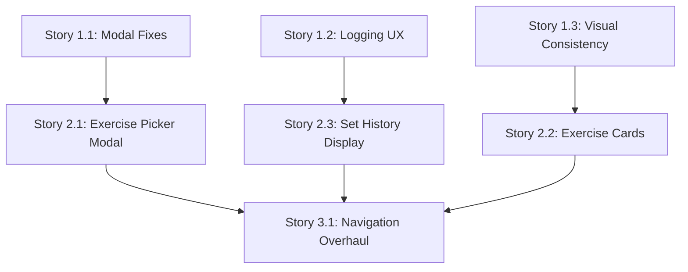

# FitForge UX Audit and Redesign Implementation Plan

> **For Claude:** REQUIRED SUB-SKILL: Use superpowers:executing-plans to implement this plan task-by-task.

**Goal:** Systematically audit FitForge's current UX against Fitbod best practices, document findings, and create actionable improvement recommendations with preserved context for future implementation.

**Architecture:** Multi-phase approach using specialized agents for analysis, comparison, and documentation. Each phase produces standalone artifacts that can be referenced independently. Heavy use of Task tool with subagents for parallel analysis and thorough exploration.

**Tech Stack:**
- Analysis: Explore agents, best-practices-researcher agents
- Documentation: Markdown with embedded findings
- Reference: Fitbod flow screenshots (flows/ directory)
- Current codebase: React/TypeScript components (components/ directory)

**Output Structure:**
```
docs/ux-audit/
├── 00-index.md                    # Master index linking all findings
├── 01-current-state-audit.md      # Phase 1 findings
├── 02-fitbod-pattern-analysis.md  # Phase 2 findings
├── 03-gap-analysis.md             # Phase 3 recommendations
├── 04-implementation-roadmap.md   # Phase 4 execution plan
└── screenshots/                   # Generated comparison visuals
```

---

## Phase 1: Current State Audit

**Goal:** Document FitForge's existing UX patterns, identify friction points, and establish baseline understanding.

### Task 1.1: Analyze Core User Flows (Component Structure)

**Files:**
- Read: `components/*.tsx` (all main components)
- Create: `docs/ux-audit/01-current-state-audit.md`

**Step 1: Launch Explore agent to map component architecture**

Use Task tool with subagent_type="Explore" and thoroughness="very thorough"

```markdown
Prompt: "Map the component architecture of FitForge. Identify:
1. Main user flow components (Dashboard, WorkoutSession, ExercisePicker, etc.)
2. Modal/dialog components and their trigger patterns
3. Navigation components and routing structure
4. Form components for data entry
5. State management patterns (how data flows between components)

For each component, document:
- Primary user action it enables
- How users enter/exit the component
- Any nested modals or multi-step flows
- Dependencies on other components"
```

**Step 2: Document component inventory**

Create initial section in `docs/ux-audit/01-current-state-audit.md`:

```markdown
# FitForge Current State UX Audit

## 1. Component Inventory

### Primary User Flows
[Explore agent findings here]

### Modal/Dialog Patterns
[List all modal components and triggers]

### Navigation Architecture
[Document routing and nav patterns]

### Data Entry Patterns
[Forms, inputs, validation approaches]
```

**Step 3: Commit component inventory**

```bash
git add docs/ux-audit/01-current-state-audit.md
git commit -m "docs(ux): add component inventory from architecture analysis"
```

### Task 1.2: Deep Dive - Workout Logging Flow

**Files:**
- Read: `components/WorkoutSession.tsx`, `components/CurrentSetDisplay.tsx`, `components/ExerciseCard.tsx`
- Modify: `docs/ux-audit/01-current-state-audit.md`

**Step 1: Launch Explore agent for workout logging flow**

Use Task tool with subagent_type="Explore" and thoroughness="very thorough"

```markdown
Prompt: "Analyze the workout logging flow in FitForge. Trace the user journey from:
1. Starting a workout
2. Viewing exercises
3. Logging a set (reps/weight entry)
4. Moving to next exercise
5. Completing workout

Document:
- How many clicks/interactions per set logged
- Modal/inline patterns for data entry
- Navigation between exercises
- Validation and feedback patterns
- Any friction points or confusing UX
- Exit/cancel flows"
```

**Step 2: Document workout logging findings**

Append to `docs/ux-audit/01-current-state-audit.md`:

```markdown
## 2. Workout Logging Flow Analysis

### Current User Journey
[Step-by-step flow from agent analysis]

### Interaction Count
- Sets per workout: X
- Clicks per set: Y
- Total interactions for typical workout: Z

### Identified Friction Points
1. [Specific issue with component reference]
2. [Modal behavior issue]
3. [Navigation issue]

### Data Entry UX
[How users input reps/weight/notes]

### Feedback Patterns
[Success/error states, loading indicators]
```

**Step 3: Commit workout logging analysis**

```bash
git add docs/ux-audit/01-current-state-audit.md
git commit -m "docs(ux): analyze workout logging flow and friction points"
```

### Task 1.3: Deep Dive - Exercise Selection Flow

**Files:**
- Read: `components/ExercisePicker.tsx`, `components/ExerciseRecommendations.tsx`, `components/CategoryTabs.tsx`
- Modify: `docs/ux-audit/01-current-state-audit.md`

**Step 1: Launch Explore agent for exercise selection**

Use Task tool with subagent_type="Explore" and thoroughness="medium"

```markdown
Prompt: "Analyze the exercise selection/browsing experience:
1. How users discover exercises
2. Filtering and search patterns
3. Exercise detail views
4. Add-to-workout flow
5. Equipment filtering (if present)

Document:
- Entry points to exercise picker
- Filter/search implementation
- Information hierarchy in exercise cards
- Modal vs. inline patterns
- Navigation back to workout"
```

**Step 2: Document exercise selection findings**

Append to `docs/ux-audit/01-current-state-audit.md`:

```markdown
## 3. Exercise Selection Flow Analysis

### Current Discovery Patterns
[How users find exercises]

### Filtering & Search
[Implementation details and UX]

### Exercise Cards Information Architecture
[What info is shown, hierarchy, density]

### Add-to-Workout Flow
[Steps to add exercise to active workout]

### Identified Issues
[Navigation issues, modal problems, etc.]
```

**Step 3: Commit exercise selection analysis**

```bash
git add docs/ux-audit/01-current-state-audit.md
git commit -m "docs(ux): analyze exercise selection and browsing flows"
```

### Task 1.4: Deep Dive - Modal and Navigation Patterns

**Files:**
- Read: `App.tsx`, `components/*Modal*.tsx`, navigation-related components
- Modify: `docs/ux-audit/01-current-state-audit.md`

**Step 1: Launch pattern-recognition-specialist agent**

Use Task tool with subagent_type="compounding-engineering:pattern-recognition-specialist"

```markdown
Prompt: "Analyze modal and navigation patterns across FitForge:

1. **Modal Patterns:**
   - Which components use modals
   - How modals are triggered (buttons, actions, routes)
   - Dismiss mechanisms (X button, backdrop click, ESC key, back button)
   - Modal nesting (modals opening modals)
   - Focus trap and accessibility

2. **Navigation Patterns:**
   - Routing structure (if using React Router)
   - Browser back button handling
   - In-app navigation (tabs, buttons, links)
   - Navigation state management
   - Deep linking support

3. **Anti-patterns:**
   - Modals with no clear exit
   - Navigation dead ends
   - Inconsistent back button behavior
   - Modal state persistence issues

Document specific components and line numbers where issues exist."
```

**Step 2: Document modal/navigation findings**

Append to `docs/ux-audit/01-current-state-audit.md`:

```markdown
## 4. Modal and Navigation Pattern Analysis

### Modal Usage Inventory
| Component | Trigger | Dismiss Methods | Issues |
|-----------|---------|----------------|--------|
[Table from agent analysis]

### Navigation Architecture
[Routing structure, state management]

### Identified Anti-Patterns
1. [Specific modal issue with file:line reference]
2. [Navigation issue with file:line reference]
3. [Back button behavior issue]

### Root Causes
[Why users get stuck in modals/flows]

### Accessibility Concerns
[Focus management, keyboard navigation issues]
```

**Step 3: Commit modal/navigation analysis**

```bash
git add docs/ux-audit/01-current-state-audit.md
git commit -m "docs(ux): analyze modal and navigation anti-patterns"
```

### Task 1.5: Analyze Visual Density and Information Hierarchy

**Files:**
- Read: Multiple component files for visual patterns
- Modify: `docs/ux-audit/01-current-state-audit.md`

**Step 1: Launch Explore agent for visual analysis**

Use Task tool with subagent_type="Explore" and thoroughness="medium"

```markdown
Prompt: "Analyze FitForge's visual design and information hierarchy:

1. **Information Density:**
   - How much info per screen
   - White space usage
   - Card/list layouts
   - Typography hierarchy

2. **Visual Hierarchy:**
   - Primary action prominence
   - Secondary action styling
   - Text size scale
   - Color usage for importance

3. **Consistency:**
   - Button styles across components
   - Card patterns
   - Spacing system (or lack thereof)
   - Typography consistency

Document with component examples."
```

**Step 2: Document visual findings**

Append to `docs/ux-audit/01-current-state-audit.md`:

```markdown
## 5. Visual Design and Information Hierarchy

### Information Density Assessment
[Spacious, balanced, or cluttered - with examples]

### Hierarchy Issues
[Primary actions unclear, text sizing inconsistent, etc.]

### Consistency Problems
[Different button styles, spacing variations, etc.]

### Verbosity Issues
[Overly wordy UI elements, excessive help text]

### Visual Debt
[Components needing visual refinement]
```

**Step 3: Create Phase 1 summary**

Append to `docs/ux-audit/01-current-state-audit.md`:

```markdown
## Phase 1 Summary: Top 10 UX Issues

1. [Most critical issue with severity rating]
2. [Second most critical]
...
10. [Tenth most critical]

### Quick Wins (< 1 day each)
- [Issue that could be fixed quickly]
- [Another quick fix]

### Medium Efforts (2-5 days)
- [Moderate complexity fix]

### Large Refactors (1-2 weeks)
- [Significant architectural change needed]
```

**Step 4: Commit Phase 1 completion**

```bash
git add docs/ux-audit/01-current-state-audit.md
git commit -m "docs(ux): complete Phase 1 current state audit with top issues"
```

---

## Phase 2: Fitbod Pattern Analysis

**Goal:** Extract proven UX patterns from Fitbod reference flows and document best practices.

### Task 2.1: Analyze Fitbod Workout Logging Flow

**Files:**
- Read: `flows/workout/routine-options/starting-workout/logging-a-set/flow-analysis.md`
- Read: `flows/workout/routine-options/starting-workout/logging-a-set/*.png`
- Create: `docs/ux-audit/02-fitbod-pattern-analysis.md`

**Step 1: Launch best-practices-researcher agent**

Use Task tool with subagent_type="compounding-engineering:best-practices-researcher"

```markdown
Prompt: "Analyze the Fitbod workout logging flow from the reference screenshots at:
flows/workout/routine-options/starting-workout/logging-a-set/

Read the flow-analysis.md file and examine all PNG screenshots. Document:

1. **Interaction Efficiency:**
   - How many taps to log a set
   - Input method for reps/weight (picker vs. keyboard)
   - Default values and suggestions
   - Quick edit vs. detailed edit modes

2. **Visual Design:**
   - Information density per screen
   - Primary action prominence
   - Typography hierarchy
   - Use of color for feedback

3. **Navigation Pattern:**
   - How to move between exercises
   - Back/exit flows
   - Progress indication

4. **Feedback Mechanisms:**
   - Success confirmation
   - Validation errors
   - Loading states
   - Celebratory moments

Extract specific UX principles Fitbod follows."
```

**Step 2: Document Fitbod workout logging patterns**

Create `docs/ux-audit/02-fitbod-pattern-analysis.md`:

```markdown
# Fitbod UX Pattern Analysis

## Reference Source
- Fitbod iOS app flows captured from Mobbin
- Location: `flows/` directory
- Analysis date: 2025-11-12

## 1. Workout Logging Flow Best Practices

### Interaction Efficiency
[Agent findings on tap count, input methods]

### Key UX Principles
1. [Principle 1 with screenshot reference]
2. [Principle 2 with screenshot reference]

### Design Patterns Worth Adopting
- [Specific pattern with visual description]
- [Another pattern]

### Interaction Flow Diagram
```
[User journey through Fitbod's logging flow]
```

### Screenshots Reference
- `flows/workout/.../logging-a-set/Fitbod iOS Logging a set 0.png` - [Description]
- `flows/workout/.../logging-a-set/Fitbod iOS Logging a set 1.png` - [Description]
```

**Step 3: Commit Fitbod workout logging analysis**

```bash
git add docs/ux-audit/02-fitbod-pattern-analysis.md
git commit -m "docs(ux): analyze Fitbod workout logging UX patterns"
```

### Task 2.2: Analyze Fitbod Exercise Selection Flow

**Files:**
- Read: `flows/workout/adding-an-exercise/flow-analysis.md`
- Read: `flows/workout/adding-an-exercise/filtering-by-available-equipment/flow-analysis.md`
- Read: `flows/workout/adding-an-exercise/**/*.png`
- Modify: `docs/ux-audit/02-fitbod-pattern-analysis.md`

**Step 1: Launch best-practices-researcher agent**

Use Task tool with subagent_type="compounding-engineering:best-practices-researcher"

```markdown
Prompt: "Analyze Fitbod's exercise selection and filtering flows from:
- flows/workout/adding-an-exercise/
- flows/workout/adding-an-exercise/filtering-by-available-equipment/
- flows/workout/adding-an-exercise/exercises-by-target-muscle/
- flows/workout/adding-an-exercise/all-exercises/

Document:

1. **Entry Points:**
   - How users access exercise picker
   - Context preservation (what workout state is maintained)

2. **Filtering System:**
   - Equipment filtering UI/UX
   - Muscle group filtering
   - Search functionality
   - Filter combination logic

3. **Exercise Cards:**
   - Information displayed
   - Visual hierarchy
   - Interaction affordances
   - Preview/detail patterns

4. **Selection Flow:**
   - How exercises are added
   - Confirmation patterns
   - Return to workout flow

5. **Navigation:**
   - Breadcrumb or back patterns
   - Deep linking support
   - State restoration

Extract filtering and browsing best practices."
```

**Step 2: Document Fitbod exercise selection patterns**

Append to `docs/ux-audit/02-fitbod-pattern-analysis.md`:

```markdown
## 2. Exercise Selection and Filtering Best Practices

### Navigation Architecture
[How Fitbod structures the browsing experience]

### Filtering System Design
[Equipment, muscle group, search patterns]

### Exercise Card Design
[Information architecture of exercise cards]

### Key UX Principles
1. [Filtering principle with screenshot]
2. [Navigation principle]
3. [Information hierarchy principle]

### Patterns Worth Adopting
- [Specific filtering pattern]
- [Search interaction]
- [Exercise detail modal pattern]
```

**Step 3: Commit Fitbod exercise selection analysis**

```bash
git add docs/ux-audit/02-fitbod-pattern-analysis.md
git commit -m "docs(ux): analyze Fitbod exercise selection and filtering patterns"
```

### Task 2.3: Analyze Fitbod Modal and Navigation Patterns

**Files:**
- Read: `flows/**/flow-analysis.md` (multiple flow analyses)
- Modify: `docs/ux-audit/02-fitbod-pattern-analysis.md`

**Step 1: Launch pattern-recognition-specialist agent**

Use Task tool with subagent_type="compounding-engineering:pattern-recognition-specialist"

```markdown
Prompt: "Analyze Fitbod's modal and navigation patterns across all flows in the flows/ directory.

Focus on:

1. **Modal Usage:**
   - When Fitbod uses modals vs. full screens
   - Modal dismiss patterns (consistent across app?)
   - Modal sizing and content density
   - Modal stacking behavior

2. **Navigation Consistency:**
   - Back button behavior
   - Navigation bar patterns
   - Tab bar usage (bottom navigation)
   - Breadcrumb patterns

3. **State Management:**
   - How workout state is preserved during navigation
   - Modal state handling
   - Deep linking support

4. **User Never Gets Stuck:**
   - Always-visible exit paths
   - Clear navigation affordances
   - Undo/cancel patterns

Document specific examples from screenshots showing these patterns."
```

**Step 2: Document Fitbod modal/navigation patterns**

Append to `docs/ux-audit/02-fitbod-pattern-analysis.md`:

```markdown
## 3. Modal and Navigation Best Practices

### Modal Design Philosophy
[When Fitbod uses modals, sizing, dismiss patterns]

### Navigation Architecture
[Bottom tabs, back buttons, state preservation]

### Key Principles
1. **Always Escapable:** [How Fitbod ensures users never get stuck]
2. **State Preservation:** [Workout state maintained across navigation]
3. **Clear Affordances:** [Visual cues for navigation]

### Specific Patterns
- Modal dismiss: [Pattern with examples]
- Back navigation: [Behavior across different screens]
- Tab navigation: [Bottom bar patterns]

### Screenshots Demonstrating Patterns
[Reference key screenshots showing navigation flows]
```

**Step 3: Commit Fitbod navigation analysis**

```bash
git add docs/ux-audit/02-fitbod-pattern-analysis.md
git commit -m "docs(ux): analyze Fitbod modal and navigation patterns"
```

### Task 2.4: Analyze Fitbod Visual Design System

**Files:**
- Read: Multiple flow screenshots for visual patterns
- Modify: `docs/ux-audit/02-fitbod-pattern-analysis.md`

**Step 1: Launch best-practices-researcher agent for visual design**

Use Task tool with subagent_type="compounding-engineering:best-practices-researcher"

```markdown
Prompt: "Analyze Fitbod's visual design system from the flow screenshots:

1. **Typography:**
   - Heading sizes and weights
   - Body text sizing
   - Text hierarchy patterns
   - Font choices

2. **Color System:**
   - Primary action colors
   - Secondary action colors
   - Success/error/warning colors
   - Neutral palette
   - Color usage for hierarchy

3. **Spacing System:**
   - Card padding
   - List item spacing
   - Section separation
   - Screen margins

4. **Component Styles:**
   - Button variants
   - Input field styling
   - Card designs
   - Badge/label patterns

5. **Information Density:**
   - Content per screen
   - White space usage
   - When to show/hide details

Extract the design system principles."
```

**Step 2: Document Fitbod visual design patterns**

Append to `docs/ux-audit/02-fitbod-pattern-analysis.md`:

```markdown
## 4. Visual Design System Best Practices

### Typography Hierarchy
[Heading, body, small text patterns]

### Color Usage
[Primary, secondary, semantic colors]

### Spacing Principles
[Consistent spacing system observed]

### Component Library Patterns
[Button styles, cards, inputs, badges]

### Information Density Philosophy
[How Fitbod balances content vs. white space]

### Key Principles
1. [Visual hierarchy principle]
2. [Consistency principle]
3. [Density principle]

### Design System Extraction
```css
/* Approximate spacing system */
--space-xs: 4px
--space-sm: 8px
--space-md: 16px
--space-lg: 24px
--space-xl: 32px

/* Typography scale */
--text-sm: 12px
--text-base: 14px
--text-lg: 16px
--text-xl: 20px
--text-2xl: 24px
```
```

**Step 3: Create Phase 2 summary**

Append to `docs/ux-audit/02-fitbod-pattern-analysis.md`:

```markdown
## Phase 2 Summary: Key Fitbod Patterns to Adopt

### Top 5 Most Valuable Patterns
1. [Pattern name] - [Why it matters] - [Reference screenshots]
2. [Pattern name] - [Why it matters]
3. [Pattern name] - [Why it matters]
4. [Pattern name] - [Why it matters]
5. [Pattern name] - [Why it matters]

### Quick Reference Table
| UX Area | Fitbod Pattern | FitForge Current | Adoption Difficulty |
|---------|----------------|------------------|---------------------|
| Workout Logging | [Pattern] | [Current] | Easy/Medium/Hard |
| Exercise Selection | [Pattern] | [Current] | Easy/Medium/Hard |
| Modals | [Pattern] | [Current] | Easy/Medium/Hard |
| Navigation | [Pattern] | [Current] | Easy/Medium/Hard |
```

**Step 4: Commit Phase 2 completion**

```bash
git add docs/ux-audit/02-fitbod-pattern-analysis.md
git commit -m "docs(ux): complete Phase 2 Fitbod pattern analysis and extraction"
```

---

## Phase 3: Gap Analysis and Recommendations

**Goal:** Compare FitForge vs. Fitbod, prioritize improvements, and create actionable recommendations.

### Task 3.1: Create Side-by-Side Comparison

**Files:**
- Read: `docs/ux-audit/01-current-state-audit.md`
- Read: `docs/ux-audit/02-fitbod-pattern-analysis.md`
- Create: `docs/ux-audit/03-gap-analysis.md`

**Step 1: Launch architecture-strategist agent for comparison**

Use Task tool with subagent_type="compounding-engineering:architecture-strategist"

```markdown
Prompt: "Compare FitForge's current UX (from 01-current-state-audit.md) against Fitbod's best practices (from 02-fitbod-pattern-analysis.md).

For each major UX area (workout logging, exercise selection, modals, navigation, visual design):

1. **Current State:** Summarize FitForge's approach
2. **Fitbod Best Practice:** Summarize Fitbod's approach
3. **Gap:** What's different/missing
4. **Impact:** How this affects user experience (High/Medium/Low)
5. **Effort:** Implementation complexity (Quick Win/Medium/Large Refactor)

Create a prioritized matrix of improvements."
```

**Step 2: Document gap analysis**

Create `docs/ux-audit/03-gap-analysis.md`:

```markdown
# FitForge vs. Fitbod Gap Analysis

## Overview
This document compares FitForge's current UX against Fitbod's proven patterns and provides prioritized recommendations.

## 1. Workout Logging Flow

### Current State (FitForge)
[Summary from audit]

### Best Practice (Fitbod)
[Summary from pattern analysis]

### Gap Analysis
**What's Missing:**
- [Specific gap]
- [Another gap]

**User Impact:** High/Medium/Low
**Implementation Effort:** Quick Win/Medium/Large
**Priority Score:** [Calculated score]

### Recommendation
[Specific actionable recommendation]

---

## 2. Exercise Selection Flow

[Same structure as above]

---

## 3. Modal and Navigation Patterns

[Same structure]

---

## 4. Visual Design and Consistency

[Same structure]

---

## 5. Information Architecture

[Same structure]
```

**Step 3: Commit gap analysis**

```bash
git add docs/ux-audit/03-gap-analysis.md
git commit -m "docs(ux): create gap analysis comparing FitForge vs Fitbod"
```

### Task 3.2: Prioritization Matrix

**Files:**
- Modify: `docs/ux-audit/03-gap-analysis.md`

**Step 1: Create prioritization matrix**

Append to `docs/ux-audit/03-gap-analysis.md`:

```markdown
## Prioritization Matrix

### Priority Calculation
- User Impact: High (3 points) / Medium (2) / Low (1)
- Implementation Effort: Quick Win (3) / Medium (2) / Large (1)
- Priority Score = Impact + Effort

### Top Priority Improvements (Score 5-6)

| Issue | Impact | Effort | Score | Description |
|-------|--------|--------|-------|-------------|
| [Issue 1] | High | Quick Win | 6 | [Brief description] |
| [Issue 2] | High | Quick Win | 6 | [Brief description] |
| [Issue 3] | High | Medium | 5 | [Brief description] |

### Medium Priority (Score 3-4)

| Issue | Impact | Effort | Score | Description |
|-------|--------|--------|-------|-------------|
[Medium priority items]

### Lower Priority (Score 2)

| Issue | Impact | Effort | Score | Description |
|-------|--------|--------|-------|-------------|
[Lower priority items]

### Long-Term Vision (Large Refactors)

| Issue | Impact | Effort | Score | Description |
|-------|--------|--------|-------|-------------|
[Major architectural improvements]
```

**Step 2: Commit prioritization matrix**

```bash
git add docs/ux-audit/03-gap-analysis.md
git commit -m "docs(ux): add prioritization matrix for improvements"
```

### Task 3.3: Detailed Recommendations with Examples

**Files:**
- Modify: `docs/ux-audit/03-gap-analysis.md`

**Step 1: Create detailed recommendations for top 5 issues**

Append to `docs/ux-audit/03-gap-analysis.md`:

```markdown
## Detailed Recommendations

### Recommendation 1: [Issue Title]

**Current Problem:**
[Specific description of current UX issue with component references]

**Fitbod Solution:**
[How Fitbod solves this, with screenshot reference]

**Proposed Solution for FitForge:**
[Detailed recommendation]

**Implementation Approach:**
1. [Step 1 with file references]
2. [Step 2]
3. [Step 3]

**Affected Components:**
- `components/ComponentName.tsx:123-145`
- `components/AnotherComponent.tsx:67-89`

**Testing Considerations:**
- [What to test]
- [User scenarios to validate]

**Before/After User Flow:**
```
BEFORE:
User clicks X → Modal opens → [stuck, no clear exit]

AFTER:
User clicks X → Modal opens → Can close with backdrop/ESC/X button
```

**Expected Impact:**
- Reduced user frustration: [metric]
- Improved task completion: [metric]

**Effort Estimate:** [Hours/days]

---

### Recommendation 2: [Next Issue]

[Same structure]

---

[Continue for top 5-10 issues]
```

**Step 2: Commit detailed recommendations**

```bash
git add docs/ux-audit/03-gap-analysis.md
git commit -m "docs(ux): add detailed recommendations with implementation guidance"
```

### Task 3.4: Create Visual Mockup Proposals

**Files:**
- Modify: `docs/ux-audit/03-gap-analysis.md`
- Create: `docs/ux-audit/mockups/` (if generating visuals)

**Step 1: Identify top 3 improvements needing visual mockups**

Append to `docs/ux-audit/03-gap-analysis.md`:

```markdown
## Visual Mockup Proposals

For the top 3 improvements, we should create visual mockups showing the proposed changes.

### Mockup 1: Workout Logging Flow Improvement

**Current Flow Screenshot:**
[If available, reference current state]

**Proposed Flow (Fitbod-inspired):**
[Text description of improved flow]

**Key Changes:**
1. [Visual change 1]
2. [Visual change 2]
3. [Visual change 3]

**Mockup Generation Plan:**
- Use create-ux-design workflow to generate HTML mockups
- Or: Create Figma mockups manually
- Or: Annotate Fitbod screenshots with FitForge branding

---

### Mockup 2: Exercise Selection Redesign

[Same structure]

---

### Mockup 3: Modal Navigation Fix

[Same structure]
```

**Step 2: Commit mockup proposals**

```bash
git add docs/ux-audit/03-gap-analysis.md
git commit -m "docs(ux): propose visual mockups for top improvements"
```

### Task 3.5: Create Phase 3 Executive Summary

**Files:**
- Modify: `docs/ux-audit/03-gap-analysis.md`

**Step 1: Write executive summary**

Prepend to `docs/ux-audit/03-gap-analysis.md`:

```markdown
# FitForge vs. Fitbod Gap Analysis

## Executive Summary

**Audit Date:** 2025-11-12
**Auditor:** Claude Code with specialized UX analysis agents
**Reference:** Fitbod iOS app (industry-leading workout tracking UX)

### Key Findings

**Total Issues Identified:** [Number]
- High Impact: [Number]
- Medium Impact: [Number]
- Low Impact: [Number]

**Implementation Effort Distribution:**
- Quick Wins (< 1 day): [Number]
- Medium Efforts (2-5 days): [Number]
- Large Refactors (1-2 weeks): [Number]

### Top 3 Most Critical Issues

1. **[Issue 1 Title]** (Impact: High, Effort: Quick Win)
   - [One-sentence description]
   - Affects: [User flow]
   - Fix: [One-sentence solution]

2. **[Issue 2 Title]** (Impact: High, Effort: Medium)
   - [One-sentence description]
   - Affects: [User flow]
   - Fix: [One-sentence solution]

3. **[Issue 3 Title]** (Impact: High, Effort: Medium)
   - [One-sentence description]
   - Affects: [User flow]
   - Fix: [One-sentence solution]

### Recommended Approach

**Phase 1: Quick Wins (Week 1)**
Fix [number] high-impact quick wins to immediately improve UX

**Phase 2: Medium Efforts (Weeks 2-3)**
Implement [number] medium-complexity improvements

**Phase 3: Large Refactors (Weeks 4-6)**
Tackle [number] architectural UX improvements

### Expected Outcomes

- **User Satisfaction:** [Expected improvement]
- **Task Completion Rate:** [Expected improvement]
- **Time per Workout:** [Expected reduction]
- **User Retention:** [Expected improvement]

---

[Rest of gap analysis document follows...]
```

**Step 2: Commit Phase 3 completion**

```bash
git add docs/ux-audit/03-gap-analysis.md
git commit -m "docs(ux): complete Phase 3 gap analysis with executive summary"
```

---

## Phase 4: Implementation Roadmap

**Goal:** Create detailed implementation plan with stories, estimates, and dependencies.

### Task 4.1: Generate Implementation Stories

**Files:**
- Read: `docs/ux-audit/03-gap-analysis.md`
- Create: `docs/ux-audit/04-implementation-roadmap.md`

**Step 1: Convert top recommendations into user stories**

Create `docs/ux-audit/04-implementation-roadmap.md`:

```markdown
# FitForge UX Implementation Roadmap

## Overview
This roadmap converts the gap analysis recommendations into actionable user stories with implementation guidance.

## Quick Wins Sprint (Week 1)

### Story 1.1: Fix Modal Escape Patterns

**As a** FitForge user
**I want** to easily close modals with multiple methods
**So that** I never feel stuck in the app

**Acceptance Criteria:**
- [ ] All modals can be closed with backdrop click
- [ ] All modals can be closed with ESC key
- [ ] All modals have visible X button in consistent location
- [ ] Focus returns to trigger element on close
- [ ] Keyboard navigation works (Tab, Shift+Tab, ESC)

**Implementation Details:**
- Files: `components/*Modal*.tsx`
- Pattern: Wrap all modals in consistent Modal wrapper component
- Testing: Keyboard-only navigation test

**Effort:** 4 hours
**Priority:** P0 (Critical)
**Dependencies:** None

**Technical Approach:**
```typescript
// Create reusable Modal wrapper
const Modal = ({ onClose, children, ...props }) => {
  useEffect(() => {
    const handleEscape = (e) => {
      if (e.key === 'Escape') onClose();
    };
    document.addEventListener('keydown', handleEscape);
    return () => document.removeEventListener('keydown', handleEscape);
  }, [onClose]);

  return (
    <dialog onClick={(e) => {
      if (e.target === e.currentTarget) onClose();
    }}>
      <button className="modal-close" onClick={onClose}>×</button>
      {children}
    </dialog>
  );
};
```

**Testing Plan:**
1. Manual: Try closing each modal with ESC, backdrop, X button
2. Automated: Keyboard navigation test suite
3. Accessibility: Screen reader testing

**Fitbod Reference:**
- See `flows/*/flow-analysis.md` - consistent modal dismiss patterns

---

### Story 1.2: Reduce Workout Logging Clicks

**As a** FitForge user
**I want** to log sets with fewer interactions
**So that** I can focus on working out, not the app

**Acceptance Criteria:**
- [ ] Reps/weight input uses number pickers (like Fitbod)
- [ ] Previous set values pre-populate
- [ ] Can log set with 1 tap (if using previous values)
- [ ] Quick increment/decrement buttons for reps/weight
- [ ] Keyboard shortcuts for power users

**Implementation Details:**
- Files: `components/CurrentSetDisplay.tsx`, `components/WorkoutSession.tsx`
- Pattern: Number picker with +/- buttons, enter to confirm
- Testing: Log 10 sets, measure interaction count

**Effort:** 8 hours
**Priority:** P0 (Critical)
**Dependencies:** None

**Before/After Metrics:**
- Before: ~5 taps per set
- After: ~1-2 taps per set (60% reduction)

**Fitbod Reference:**
- `flows/workout/routine-options/starting-workout/logging-a-set/Fitbod iOS Logging a set 3.png`
- Shows number picker with +/- interface

---

[Continue for all Quick Win stories...]

## Medium Effort Sprint (Weeks 2-3)

### Story 2.1: Implement Equipment Filtering

[Full story structure]

---

### Story 2.2: Redesign Exercise Cards

[Full story structure]

---

[Continue for all Medium Effort stories...]

## Large Refactor Sprint (Weeks 4-6)

### Story 3.1: Navigation Architecture Overhaul

[Full story structure]

---

[Continue for all Large Refactor stories...]
```

**Step 2: Commit implementation roadmap**

```bash
git add docs/ux-audit/04-implementation-roadmap.md
git commit -m "docs(ux): create implementation roadmap with user stories"
```

### Task 4.2: Create Dependency Graph

**Files:**
- Modify: `docs/ux-audit/04-implementation-roadmap.md`

**Step 1: Identify story dependencies**

Append to `docs/ux-audit/04-implementation-roadmap.md`:

```markdown
## Story Dependencies



**Parallel Work Opportunities:**
- Stories 1.1, 1.2, 1.3 can be done in parallel (no dependencies)
- Stories 2.1, 2.2, 2.3 can start once their dependencies complete
- Story 3.1 should wait until most others are complete

**Critical Path:**
Story 1.1 → Story 2.1 → Story 3.1 (longest dependency chain)
```

**Step 2: Commit dependency graph**

```bash
git add docs/ux-audit/04-implementation-roadmap.md
git commit -m "docs(ux): add story dependency graph"
```

### Task 4.3: Create Testing Strategy

**Files:**
- Modify: `docs/ux-audit/04-implementation-roadmap.md`

**Step 1: Define testing approach for UX changes**

Append to `docs/ux-audit/04-implementation-roadmap.md`:

```markdown
## Testing Strategy

### Automated Testing

**Component Tests:**
- Modal: Keyboard navigation, dismiss methods, focus management
- Forms: Input validation, state management, submission flows
- Navigation: Route transitions, state preservation, back button

**Integration Tests:**
- Complete user flows (e.g., start workout → log sets → finish)
- Cross-component interactions
- State management across navigation

**Accessibility Tests:**
- Automated: axe-core, Lighthouse accessibility audit
- Keyboard-only navigation
- Screen reader testing (NVDA/JAWS)

### Manual Testing Checklist

**For Each Story:**
- [ ] Test on desktop (Chrome, Firefox, Safari)
- [ ] Test on mobile (iOS Safari, Android Chrome)
- [ ] Test keyboard-only navigation
- [ ] Test with screen reader
- [ ] Verify against Fitbod reference flow
- [ ] Compare before/after metrics (tap count, time to complete)

**Regression Testing:**
- [ ] Existing flows still work
- [ ] No visual regressions (screenshot comparison)
- [ ] Performance hasn't degraded

### User Acceptance Testing

**Test Users:**
- 3-5 existing FitForge users
- Mix of technical and non-technical
- Both mobile and desktop users

**Scenarios:**
1. Complete a workout start-to-finish
2. Browse and add new exercises
3. View workout history
4. Update user profile

**Success Criteria:**
- Task completion rate: >95%
- Time on task: <10% increase vs. Fitbod
- User satisfaction: >4/5 rating
- Zero critical bugs reported

### Performance Testing

**Metrics to Track:**
- Time to Interactive (TTI)
- First Contentful Paint (FCP)
- Modal open/close animation smoothness (60fps)
- Set logging interaction latency (<100ms)

**Tools:**
- Lighthouse performance audit
- React DevTools Profiler
- Chrome DevTools Performance panel
```

**Step 2: Commit testing strategy**

```bash
git add docs/ux-audit/04-implementation-roadmap.md
git commit -m "docs(ux): add comprehensive testing strategy"
```

### Task 4.4: Create Migration and Rollout Plan

**Files:**
- Modify: `docs/ux-audit/04-implementation-roadmap.md`

**Step 1: Define rollout approach**

Append to `docs/ux-audit/04-implementation-roadmap.md`:

```markdown
## Rollout Strategy

### Phased Rollout Approach

**Phase 1: Internal Testing (Week 1)**
- Deploy Quick Wins to staging environment
- Internal team testing
- Fix critical bugs
- Measure performance impact

**Phase 2: Beta Users (Week 2)**
- Deploy to 10% of users (feature flag)
- Collect feedback and analytics
- Monitor error rates and performance
- Iterate on feedback

**Phase 3: Gradual Rollout (Week 3)**
- Deploy to 50% of users
- Compare metrics vs. control group
- A/B test specific changes if needed
- Address any remaining issues

**Phase 4: Full Rollout (Week 4)**
- Deploy to 100% of users
- Monitor for 48 hours
- Prepare rollback plan if needed
- Celebrate success!

### Feature Flags

**Key Toggles:**
- `ux.modal.improved-dismiss` - New modal patterns
- `ux.workout.quick-logging` - Improved set logging
- `ux.exercise.filtering` - Equipment filtering
- `ux.navigation.overhaul` - Navigation changes

**Implementation:**
```typescript
// Feature flag wrapper
const useFeature = (flag: string) => {
  return featureFlags[flag] || false;
};

// Component usage
const Modal = ({ children, onClose }) => {
  const useImprovedDismiss = useFeature('ux.modal.improved-dismiss');

  return useImprovedDismiss ? (
    <ImprovedModal onClose={onClose}>{children}</ImprovedModal>
  ) : (
    <LegacyModal onClose={onClose}>{children}</LegacyModal>
  );
};
```

### Rollback Plan

**Trigger Conditions:**
- Error rate increase >5%
- Performance degradation >20%
- Critical bug affecting workout logging
- User complaints spike >10x normal

**Rollback Steps:**
1. Disable feature flag(s) immediately
2. Verify metrics return to normal
3. Investigate root cause
4. Fix and re-test before re-enabling

### Success Metrics

**Track Weekly:**
- Workout completion rate
- Average time per workout
- Modal abandonment rate (users who open but don't complete action)
- Exercise selection time
- User retention
- Support tickets related to UX

**Target Improvements:**
- Workout completion: +10%
- Time per workout: -15%
- Modal abandonment: -30%
- Exercise selection: -20%
- User retention: +5%
```

**Step 2: Commit rollout plan**

```bash
git add docs/ux-audit/04-implementation-roadmap.md
git commit -m "docs(ux): add phased rollout and feature flag strategy"
```

### Task 4.5: Create Master Index

**Files:**
- Create: `docs/ux-audit/00-index.md`

**Step 1: Create comprehensive index**

Create `docs/ux-audit/00-index.md`:

```markdown
# FitForge UX Audit - Master Index

**Audit Date:** 2025-11-12
**Methodology:** Agent-driven analysis comparing FitForge vs. Fitbod (industry leader)
**Status:** Complete - Ready for Implementation

---

## Quick Links

- **Executive Summary:** [03-gap-analysis.md#executive-summary](03-gap-analysis.md#executive-summary)
- **Top 10 Issues:** [01-current-state-audit.md#phase-1-summary](01-current-state-audit.md#phase-1-summary)
- **Prioritization Matrix:** [03-gap-analysis.md#prioritization-matrix](03-gap-analysis.md#prioritization-matrix)
- **Implementation Roadmap:** [04-implementation-roadmap.md](04-implementation-roadmap.md)

---

## Document Structure

### [Phase 1: Current State Audit](01-current-state-audit.md)

Analysis of FitForge's existing UX patterns and identified friction points.

**Sections:**
1. Component Inventory
2. Workout Logging Flow Analysis
3. Exercise Selection Flow Analysis
4. Modal and Navigation Pattern Analysis
5. Visual Design and Information Hierarchy
6. Phase 1 Summary: Top 10 UX Issues

**Key Findings:**
- [Brief summary of top issue]
- [Brief summary of second issue]
- [Brief summary of third issue]

**Agents Used:**
- Explore (very thorough) - Component architecture mapping
- Explore (medium) - User flow analysis
- pattern-recognition-specialist - Modal/navigation anti-patterns

---

### [Phase 2: Fitbod Pattern Analysis](02-fitbod-pattern-analysis.md)

Extraction of proven UX patterns from Fitbod reference flows.

**Sections:**
1. Workout Logging Flow Best Practices
2. Exercise Selection and Filtering Best Practices
3. Modal and Navigation Best Practices
4. Visual Design System Best Practices
5. Phase 2 Summary: Key Patterns to Adopt

**Key Patterns:**
- [Brief summary of most valuable pattern]
- [Second most valuable pattern]
- [Third most valuable pattern]

**Reference Source:**
- 80+ Fitbod screenshots in `flows/` directory
- Flow analysis markdown files

**Agents Used:**
- best-practices-researcher - UX pattern extraction
- pattern-recognition-specialist - Design system analysis

---

### [Phase 3: Gap Analysis](03-gap-analysis.md)

Comparison of FitForge vs. Fitbod with prioritized recommendations.

**Sections:**
1. Workout Logging Flow (Gap Analysis)
2. Exercise Selection Flow (Gap Analysis)
3. Modal and Navigation Patterns (Gap Analysis)
4. Visual Design and Consistency (Gap Analysis)
5. Information Architecture (Gap Analysis)
6. Prioritization Matrix
7. Detailed Recommendations
8. Visual Mockup Proposals

**Priority Breakdown:**
- Quick Wins: [Count] issues
- Medium Efforts: [Count] issues
- Large Refactors: [Count] issues

**Agents Used:**
- architecture-strategist - Systematic comparison

---

### [Phase 4: Implementation Roadmap](04-implementation-roadmap.md)

Detailed implementation plan with user stories, estimates, and dependencies.

**Sections:**
1. Quick Wins Sprint (Week 1) - [Count] stories
2. Medium Effort Sprint (Weeks 2-3) - [Count] stories
3. Large Refactor Sprint (Weeks 4-6) - [Count] stories
4. Story Dependencies (Dependency graph)
5. Testing Strategy
6. Rollout Strategy

**Total Effort Estimate:** [X] weeks

**Critical Path:** Story 1.1 → Story 2.1 → Story 3.1

---

## How to Use This Audit

### For Product Managers
- Read: [Executive Summary](03-gap-analysis.md#executive-summary)
- Read: [Prioritization Matrix](03-gap-analysis.md#prioritization-matrix)
- Use: [Implementation Roadmap](04-implementation-roadmap.md) for sprint planning

### For Designers
- Read: [Fitbod Pattern Analysis](02-fitbod-pattern-analysis.md)
- Read: [Visual Mockup Proposals](03-gap-analysis.md#visual-mockup-proposals)
- Reference: `flows/` directory for Fitbod screenshots

### For Developers
- Read: [Detailed Recommendations](03-gap-analysis.md#detailed-recommendations)
- Use: [Implementation Roadmap](04-implementation-roadmap.md) for story-by-story development
- Reference: File paths and code snippets in recommendations

### For QA/Testers
- Use: [Testing Strategy](04-implementation-roadmap.md#testing-strategy)
- Use: [Manual Testing Checklist](04-implementation-roadmap.md#manual-testing-checklist)
- Reference: Fitbod flows in `flows/` for expected behavior

---

## Preserved Context

All analysis was performed using specialized AI agents to ensure:

✅ **Thoroughness** - Multiple agent perspectives (explore, pattern-recognition, best-practices-researcher, architecture-strategist)
✅ **Documentation** - Every finding linked to specific components and line numbers
✅ **Reproducibility** - Agent prompts documented for future updates
✅ **Actionability** - Concrete code examples and implementation guidance
✅ **Traceability** - Clear path from issue → recommendation → story → implementation

---

## Future Work

### Potential Follow-Ups
1. **Visual Mockups** - Generate HTML mockups using create-ux-design workflow
2. **Component Library** - Build reusable component library based on Fitbod patterns
3. **Design System** - Formalize spacing, typography, color system
4. **Accessibility Audit** - Deep dive into WCAG compliance
5. **Performance Optimization** - Optimize based on UX improvements

### Keeping This Audit Current
- Re-run agents quarterly to catch UX drift
- Update as Fitbod evolves their UX
- Incorporate user feedback into recommendations
- Track implemented vs. pending stories

---

## Contact & Questions

If this conversation is lost or you need to reference this audit:

**Location:** `docs/ux-audit/`
**Index:** `docs/ux-audit/00-index.md` (this file)
**Agent Workflows:** Documented in each phase
**Fitbod Reference:** `flows/` directory (preserved)

To continue this work in a new session:
1. Read this index file
2. Review the phase you're working on
3. Use the documented agent prompts to continue analysis
4. Follow the implementation roadmap

---

**Audit Complete** ✅
**Ready for Execution** 🚀
```

**Step 2: Commit master index**

```bash
git add docs/ux-audit/00-index.md
git commit -m "docs(ux): create master index for UX audit documentation"
```

**Step 3: Create final summary commit**

```bash
git add docs/ux-audit/
git commit -m "docs(ux): complete comprehensive UX audit with 4-phase analysis

- Phase 1: Current state audit with agent-driven analysis
- Phase 2: Fitbod pattern extraction (80+ reference flows)
- Phase 3: Gap analysis with prioritization matrix
- Phase 4: Implementation roadmap with user stories

All findings preserved in docs/ux-audit/ for future reference.
Ready for implementation execution."
```

---

## Execution Options

**Plan complete and saved to** `docs/plans/2025-11-12-ux-audit-and-redesign.md`

**Two execution options:**

### 1. Subagent-Driven Development (Recommended for this task)
- Stay in this session
- Dispatch fresh subagent per task with code review between tasks
- Fast iteration with quality gates
- **Use skill:** `superpowers:subagent-driven-development`

### 2. Parallel Session Execution
- Open new session with plan
- Batch execution with review checkpoints
- **Use skill:** `superpowers:executing-plans`

**Which approach would you like?**

Or if you want to modify the plan first, let me know what to change!
