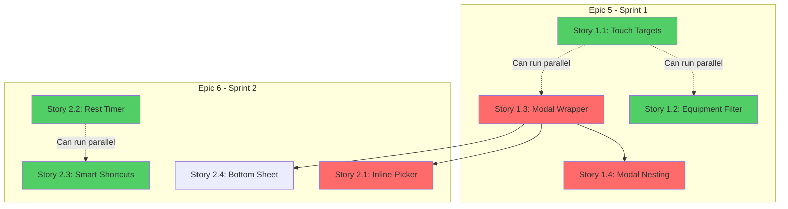

# Gap-Fixing Execution Plan for UX Redesign

**Created:** 2025-11-12
**Purpose:** Pre-Epic 5 preparation to ensure UX Implementation Roadmap is execution-ready
**Based on:** UX Audit completion review and implementation readiness assessment

---

## Context

The UX Audit (Phases 1-4) is complete with 15 user stories across 3 sprints. This execution plan addresses preparation tasks needed before Epic 5 (Sprint 1 implementation) begins.

**Current Status:**
- ✅ Phase 1: Current State Audit complete
- ✅ Phase 2: Fitbod Pattern Analysis complete
- ✅ Phase 3: Gap Analysis complete
- ✅ Phase 4: Implementation Roadmap complete (15 stories)
- ⏳ Pre-implementation validation needed

**Goal:** Validate roadmap completeness, enrich stories with missing details, and ensure execution readiness.

---

## Assessment: What's Missing

### Roadmap Completeness Review

**Strengths:**
- ✅ All 15 stories have user story format
- ✅ Acceptance criteria present for all stories
- ✅ Code examples in most stories
- ✅ File paths specified
- ✅ Effort estimates provided
- ✅ Dependencies mapped

**Gaps Identified:**

1. **Story Validation** - Stories not validated against actual codebase
2. **Component Audit** - "All buttons" in Story 1.1 lacks specific list
3. **Testing Specifications** - Test cases need detail (component-level)
4. **Epic Organization** - Stories not organized into formal epics
5. **Missing Artifacts** - No dependency visualization diagram
6. **Timeline Documentation** - Effort vs. calendar time not clarified
7. **Rollback Criteria** - Quantified thresholds needed
8. **Dark Mode Considerations** - Color specifications for dark mode incomplete

---

## Phase 1: Critical Pre-Epic 5 Tasks

**Must complete before Sprint 1 implementation begins**

### Task 1.1: Component Touch Target Audit

**Gap:** Story 1.1 says "All buttons minimum 44×44px (audit completed)" but audit doesn't exist

**Priority:** Critical
**Estimated Time:** 2 hours
**Blocking:** Story 1.1 (Sprint 1)
**Agent Type:** Explore agent

**Files to Create:**
- `docs/ux-audit/touch-target-audit.md` - Complete inventory

**Specific Changes:**
1. Scan all component files for interactive elements
2. Measure current sizes (className analysis or browser inspection)
3. Create spreadsheet/table with:
   - Component name
   - File path + line number
   - Current size
   - WCAG status (Pass/Fail)
   - Priority (P0/P1/P2)

**Success Criteria:**
- [ ] All components with buttons/inputs inventoried
- [ ] Current sizes documented
- [ ] Priorities assigned
- [ ] Story 1.1 updated with specific file paths

**Agent Prompt:**
```
Audit all interactive elements in FitForge for WCAG touch target compliance.

**Task:**
1. Scan components/ directory for all files
2. Identify interactive elements: <button>, <input>, <a>, clickable <div>
3. Extract className or inline styles to determine size
4. Flag elements < 44×44px (WCAG failure)
5. Categorize by priority:
   - P0: Core workout flow (Workout.tsx, QuickAdd.tsx)
   - P1: Common actions (Dashboard, ExercisePicker)
   - P2: Settings, admin pages

**Output Format (Markdown Table):**
| Component | File Path | Line | Element | Current Size | WCAG | Priority |
|-----------|-----------|------|---------|--------------|------|----------|
| To Failure checkbox | components/Workout.tsx | 798 | button | 20×20px | FAIL | P0 |
| Add Exercise button | components/Dashboard.tsx | 45 | button | 40×40px | FAIL | P1 |

**Deliverable:** docs/ux-audit/touch-target-audit.md
```

**Can Run in Parallel With:** Task 1.2, 1.3

---

### Task 1.2: Modal Inventory Verification

**Gap:** Story 1.3 lists 11 modals but doesn't verify if list is complete

**Priority:** Critical
**Estimated Time:** 1 hour
**Blocking:** Story 1.3 (Sprint 1)
**Agent Type:** Explore agent (medium thoroughness)

**Files to Modify:**
- `docs/ux-audit/04-implementation-roadmap.md` - Update Story 1.3 modal list if incomplete

**Specific Changes:**
1. Search codebase for all modal patterns:
   - Components with "Modal" in name
   - Components using `fixed inset-0` or similar overlay patterns
   - Components with backdrop/overlay divs
2. Verify current list of 11 is complete
3. Document any missing modals
4. For each modal, document current dismiss methods

**Success Criteria:**
- [ ] All modals found and documented
- [ ] Current dismiss methods catalogued
- [ ] Story 1.3 refactor list updated if needed
- [ ] No modals missed

**Agent Prompt:**
```
Verify the modal inventory for Story 1.3 is complete and accurate.

**Task:**
1. Search components/ for modal patterns:
   - Files with "Modal" in name
   - Components with className="fixed" or "absolute inset-0"
   - Components rendering overlays/backdrops
2. Compare findings to Story 1.3 list (11 modals listed):
   - BaselineUpdateModal.tsx
   - SetEditModal.tsx
   - WorkoutSummaryModal.tsx
   - WorkoutPlannerModal.tsx
   - MuscleDeepDiveModal.tsx
   - TemplateSelector.tsx
   - FABMenu.tsx
   - EquipmentModal.tsx
   - ExercisePicker.tsx (when modal)
   - HistoryModal.tsx
   - FailureTooltip.tsx
3. For each modal, document:
   - Current dismiss methods (X button, backdrop, ESC, swipe)
   - Usage context (when does it appear?)
   - Current size/variant

**Output:** Updated Story 1.3 in 04-implementation-roadmap.md with verified modal list
```

**Can Run in Parallel With:** Task 1.1, 1.3

---

### Task 1.3: Story Validation Against Codebase

**Gap:** Stories reference files/line numbers but haven't been validated against current code

**Priority:** High
**Estimated Time:** 3 hours
**Blocking:** Epic 5 (Sprint 1)
**Agent Type:** Explore agent (medium thoroughness)

**Files to Modify:**
- `docs/ux-audit/04-implementation-roadmap.md` - Update all file references

**Specific Changes:**
For each story in Sprint 1 (Stories 1.1-1.4):
1. Verify referenced files exist
2. Verify line numbers are accurate
3. Check if code structure matches expectations
4. Update if files have been moved/refactored
5. Flag any breaking changes

**Success Criteria:**
- [ ] All file paths in Sprint 1 stories validated
- [ ] Line numbers verified or updated
- [ ] Any missing files documented
- [ ] Stories updated with accurate references

**Agent Prompt:**
```
Validate Sprint 1 story file references against current codebase.

**Stories to Validate:**
1. Story 1.1: components/Workout.tsx:798-810
2. Story 1.2: components/ExercisePicker.tsx, components/QuickAdd.tsx
3. Story 1.3: 11 modal files (see Story 1.3 list)
4. Story 1.4: components/FABMenu.tsx, components/QuickAdd.tsx, components/Dashboard.tsx

**For each file reference:**
1. Verify file exists at path
2. If line numbers specified, check if code matches description
3. Read relevant sections to confirm story assumptions are valid
4. Note any discrepancies or moved code

**Output:**
- Updated 04-implementation-roadmap.md with corrected file paths
- Document any blocking issues found (e.g., file doesn't exist, code structure incompatible)
```

**Can Run in Parallel With:** Task 1.1, 1.2

---

### Task 1.4: Create Epic Structure from Stories

**Gap:** 15 stories exist but not organized into formal epics for tracking

**Priority:** High
**Estimated Time:** 2 hours
**Blocking:** Epic 5 execution
**Agent Type:** PM agent (product manager)

**Files to Create:**
- `docs/ux-audit/epics/epic-5-critical-ux-fixes.md`
- `docs/ux-audit/epics/epic-6-interaction-efficiency.md`
- `docs/ux-audit/epics/epic-7-visual-polish.md`

**Specific Changes:**
1. Create 3 epic files matching 3 sprints
2. Format epics with:
   - Epic goal/theme
   - Success criteria
   - Story list with links
   - Dependencies
   - Risk assessment
   - Testing approach
3. Link from 04-implementation-roadmap.md

**Success Criteria:**
- [ ] 3 epic files created
- [ ] Each epic has clear goal and success criteria
- [ ] Stories linked to epics
- [ ] Dependencies mapped
- [ ] Risk assessment documented

**Agent Prompt:**
```
Create formal epic structures for the 3 UX implementation sprints.

**Source:** docs/ux-audit/04-implementation-roadmap.md

**Task:**
Convert the 3 sprints into formal epics:

**Epic 5: Critical UX Fixes** (Sprint 1, Week 1)
- Goal: Achieve WCAG compliance and fix navigation blockers
- Stories: 1.1, 1.2, 1.3, 1.4
- Duration: 5 days
- Success: 100% WCAG touch target compliance, max 2 modal levels

**Epic 6: Interaction Efficiency** (Sprint 2, Weeks 2-3)
- Goal: Reduce per-set interactions from 8-12 to 3-4
- Stories: 2.1, 2.2, 2.3, 2.4, 2.5
- Duration: 10 days
- Success: 60% interaction reduction measured

**Epic 7: Visual Polish & Consistency** (Sprint 3, Week 4)
- Goal: Standardize design system and improve information architecture
- Stories: 3.1, 3.2, 3.3, 3.4, 3.5, 3.6
- Duration: 5 days
- Success: Design system documented, UI consistency audit passes

**For each epic, create a file with:**
1. Epic overview (goal, scope, duration)
2. User value proposition
3. Story list with checkboxes
4. Dependencies (inter-story and external)
5. Risk assessment
6. Testing strategy (from 04-implementation-roadmap.md)
7. Success metrics
8. Rollback plan

**Deliverable:** 3 epic files in docs/ux-audit/epics/
```

**Dependencies:** Should run after Tasks 1.1, 1.2, 1.3 complete (to have validated story details)

---

## Phase 2: Story Enrichment (Can Run Parallel with Sprint 1)

**Nice-to-have details that improve execution quality but don't block start**

### Task 2.1: Add Component-Level Test Specifications

**Gap:** Testing strategy exists but lacks component-specific test cases

**Priority:** High
**Estimated Time:** 4 hours
**Blocking:** No (can write tests during implementation)
**Agent Type:** Tech Writer or Dev agent

**Files to Modify:**
- `docs/ux-audit/04-implementation-roadmap.md` - Add test cases to each story
- OR create `docs/ux-audit/test-specifications.md`

**Specific Changes:**
For each component in Stories 1.1-2.5:
1. Define unit test cases (component behavior)
2. Define integration test cases (interactions)
3. Define accessibility test cases (WCAG checks)
4. Define manual test cases (browser/device matrix)

**Example Output:**
```markdown
### Story 1.3 Test Specification

**Unit Tests (Modal.tsx):**
- [ ] ESC key calls onClose prop
- [ ] Backdrop click calls onClose (when not preventBackdropClose)
- [ ] X button renders and calls onClose
- [ ] Focus trap prevents tabbing outside modal
- [ ] First focusable element receives focus on open
- [ ] Focus returns to trigger on close

**Integration Tests:**
- [ ] Modal opens when trigger clicked
- [ ] Modal closes and cleans up event listeners
- [ ] Multiple modals don't interfere with each other
- [ ] Nested modals (2 levels) work correctly

**Accessibility Tests:**
- [ ] ARIA role="dialog" present
- [ ] aria-modal="true" set
- [ ] aria-labelledby points to title
- [ ] Keyboard navigation works (Tab, Shift+Tab, ESC)
- [ ] Screen reader announces modal open/close

**Manual Tests:**
- [ ] Desktop: Chrome, Firefox, Safari
- [ ] Mobile: iOS Safari, Android Chrome
- [ ] Swipe gesture (bottom sheets only)
- [ ] Visual regression (screenshot comparison)
```

**Success Criteria:**
- [ ] Every component in Sprint 1-2 has test specification
- [ ] Test cases are specific and measurable
- [ ] Accessibility tests comprehensive
- [ ] Manual test matrix complete

**Agent Prompt:**
```
Create detailed test specifications for UX roadmap components.

**Source:** docs/ux-audit/04-implementation-roadmap.md

**For each story in Sprints 1-2:**
1. Identify all new/modified components
2. Write unit test cases (component behavior)
3. Write integration test cases (user flows)
4. Write accessibility test cases (WCAG 2.1 AA)
5. Write manual test cases (browsers/devices)

**Format:**
For each component, provide:
- Test category (unit/integration/a11y/manual)
- Specific test cases with checkboxes
- Expected behavior
- Test data needed

**Deliverable:** docs/ux-audit/test-specifications.md
```

**Can Run in Parallel With:** Task 2.2, 2.3

---

### Task 2.2: Create Dependency Visualization

**Gap:** Dependencies listed in text but no visual diagram

**Priority:** Medium
**Estimated Time:** 1 hour
**Blocking:** No (nice-to-have for planning)
**Agent Type:** Architect or PM agent

**Files to Create:**
- `docs/ux-audit/dependencies.md` - Mermaid diagrams

**Specific Changes:**
1. Create Mermaid dependency graph showing:
   - Story dependencies (which stories block others)
   - Component dependencies (which components depend on others)
   - Epic dependencies (Epic 5 → Epic 6 → Epic 7)
2. Add parallel work visualization
3. Add critical path highlighting

**Example Output:**


**Success Criteria:**
- [ ] Dependency graph created
- [ ] Critical path identified
- [ ] Parallel work opportunities highlighted
- [ ] Component-level dependencies shown

**Agent Prompt:**
```
Create visual dependency diagrams for UX roadmap implementation.

**Source:** docs/ux-audit/04-implementation-roadmap.md (Story Dependencies section)

**Task:**
1. Create Mermaid diagram showing story dependencies
2. Highlight critical path (longest dependency chain)
3. Show parallel work opportunities
4. Add timeline estimates (can stories run in parallel?)

**Diagrams to Create:**
1. Story Dependency Graph (all 15 stories)
2. Epic Timeline (3 sprints with dependencies)
3. Component Dependency Graph (Modal → Inline Picker → Bottom Sheet)

**Deliverable:** docs/ux-audit/dependencies.md with 3 Mermaid diagrams
```

**Can Run in Parallel With:** Task 2.1, 2.3

---

### Task 2.3: Quantify Rollback Criteria

**Gap:** Rollback plan says "Error rate increase >5%" but doesn't define how to measure

**Priority:** Medium
**Estimated Time:** 2 hours
**Blocking:** No (needed before production rollout, not Sprint 1 start)
**Agent Type:** Architect or DevOps agent

**Files to Modify:**
- `docs/ux-audit/04-implementation-roadmap.md` - Enhance Rollback Plan section

**Specific Changes:**
1. Define baseline metrics (current error rates, performance)
2. Specify monitoring tools (Sentry, LogRocket, Lighthouse CI)
3. Create alert thresholds
4. Document rollback procedures (step-by-step)
5. Define success metrics per sprint

**Example Output:**
```markdown
### Rollback Plan (Quantified)

**Baseline Metrics (Before Implementation):**
- JavaScript errors: 0.3 errors per user session (measured via Sentry)
- Performance: Lighthouse score 75, TTI 3.2s
- Modal abandonment: 12% (users who open modal but dismiss without completing action)
- User complaints: 2-3 per week (support tickets)

**Trigger Conditions:**
- Error rate: >0.35 errors/session (>16% increase from 0.3)
- Performance: Lighthouse <68 (>10% degradation from 75)
- TTI: >3.8s (>20% slower than 3.2s)
- Modal abandonment: >15.6% (>30% increase from 12%)
- User complaints: >6 per week (>2x increase)

**Monitoring Tools:**
- Sentry: JavaScript error tracking
- Lighthouse CI: Automated performance tests on each deploy
- Google Analytics: User behavior (modal abandonment, flow completion)
- Support ticket system: Tag UX-related tickets

**Rollback Procedure:**
1. Identify trigger (which metric exceeded threshold?)
2. Check feature flag status
3. Disable feature flag(s) for affected story
4. Verify metrics return to baseline within 1 hour
5. Create incident report
6. Schedule fix
```

**Success Criteria:**
- [ ] Baseline metrics documented
- [ ] Thresholds quantified
- [ ] Monitoring tools specified
- [ ] Rollback procedure step-by-step
- [ ] Per-sprint success metrics defined

**Agent Prompt:**
```
Quantify rollback criteria and define monitoring strategy.

**Source:** docs/ux-audit/04-implementation-roadmap.md (Rollback Plan section)

**Task:**
1. Define baseline metrics (current state before changes)
   - Error rates
   - Performance (Lighthouse, TTI, FCP)
   - User behavior (modal abandonment, flow completion)
   - Support tickets
2. Calculate trigger thresholds from baselines
3. Specify monitoring tools
4. Document step-by-step rollback procedure
5. Define per-sprint success metrics

**Deliverable:** Enhanced Rollback Plan section in 04-implementation-roadmap.md
```

**Can Run in Parallel With:** Task 2.1, 2.2

---

### Task 2.4: Document Timeline Assumptions

**Gap:** Effort estimates (hours/days) don't account for testing, review, deployment

**Priority:** Medium
**Estimated Time:** 1 hour
**Blocking:** No (planning clarity, not blocking)
**Agent Type:** PM agent

**Files to Modify:**
- `docs/ux-audit/04-implementation-roadmap.md` - Add Timeline section

**Specific Changes:**
1. Clarify effort vs. calendar time
2. Account for code review, testing, deployment
3. Document assumptions (developer experience, working hours/day)
4. Create calendar-based timeline

**Example Output:**
```markdown
### Timeline Assumptions

**Effort Estimates:**
- Effort = Development time only (coding + unit tests)
- Does NOT include: Code review, integration testing, QA, deployment

**Conversion to Calendar Time:**
- Development effort × 1.5 = Calendar time
  - 1.5x factor accounts for: code review (20%), testing (15%), deployment (10%), buffer (5%)

**Example:**
- Story 1.3: 8 hours effort → 12 hours calendar → 1.5 days calendar
- Sprint 1: 90 hours effort → 135 hours calendar → 3.4 weeks calendar (with parallel work)

**Assumptions:**
- Developers work 6 productive hours/day (48-hour week)
- Code review: Same-day turnaround
- Testing: Parallel with development
- No major blockers or scope changes

**Realistic Timelines:**
- Sprint 1: 1.5 weeks (not 1 week) with 2 developers
- Sprint 2: 2 weeks (not 10 days) with 2 developers
- Sprint 3: 1 week with 1 developer
- **Total: 4.5 weeks** (not 4 weeks)
```

**Success Criteria:**
- [ ] Effort vs. calendar time clarified
- [ ] Realistic timeline with buffer
- [ ] Assumptions documented
- [ ] Resource allocation specified

**Agent Prompt:**
```
Document timeline assumptions and create realistic calendar estimates.

**Source:** docs/ux-audit/04-implementation-roadmap.md

**Task:**
1. Analyze effort estimates (hours/days per story)
2. Calculate realistic calendar time accounting for:
   - Code review
   - Testing
   - Deployment
   - Buffer for unknowns
3. Document assumptions (team size, hours/day, parallel work)
4. Create calendar-based timeline

**Deliverable:** Timeline Assumptions section in 04-implementation-roadmap.md
```

**Can Run in Parallel With:** All Phase 2 tasks

---

## Phase 3: Polish & Documentation (Optional)

**Nice-to-have improvements that don't block execution**

### Task 3.1: Add Stagger Animation Examples

**Gap:** Stories mention animations but no implementation examples

**Priority:** Low
**Estimated Time:** 2 hours
**Blocking:** No
**Agent Type:** UX Designer or Dev agent

**Files to Create:**
- `docs/ux-audit/animation-specifications.md`

**Specific Changes:**
1. Define animation timing (duration, easing)
2. Provide CSS/Tailwind examples
3. Show stagger patterns for lists
4. Document reduced motion preferences

**Success Criteria:**
- [ ] Animation timing defined
- [ ] Code examples provided
- [ ] Accessibility (prefers-reduced-motion) considered

---

### Task 3.2: Dark Mode Color Specifications

**Gap:** Dark mode mentioned but color palette incomplete

**Priority:** Low
**Estimated Time:** 2 hours
**Blocking:** No (FitForge already has dark mode)
**Agent Type:** UX Designer agent

**Files to Create:**
- `docs/ux-audit/design-tokens.md`

**Specific Changes:**
1. Document dark mode color values
2. Define semantic color tokens
3. Ensure WCAG contrast compliance
4. Provide Tailwind config snippet

---

## Execution Order

### Sequential (Must Run in Order)

**Phase 1: Critical Pre-Epic 5**
1. Task 1.1 → Task 1.4 (audit results feed into epics)
2. Task 1.2 → Task 1.4 (modal list feed into epics)
3. Task 1.3 → Task 1.4 (validated stories feed into epics)

### Parallel Group A (Can Run Together)

**Phase 1: Pre-validation**
- Task 1.1 (Touch Target Audit)
- Task 1.2 (Modal Inventory)
- Task 1.3 (Story Validation)

### Parallel Group B (After Phase 1 Complete)

**Phase 2: Enrichment**
- Task 2.1 (Test Specs)
- Task 2.2 (Dependency Viz)
- Task 2.3 (Rollback Criteria)
- Task 2.4 (Timeline Docs)

### Parallel Group C (Anytime)

**Phase 3: Polish**
- Task 3.1 (Animations)
- Task 3.2 (Dark Mode)

---

## Total Effort Estimate

**Phase 1: Critical (Blocks Epic 5 start)**
- Task 1.1: 2 hours
- Task 1.2: 1 hour
- Task 1.3: 3 hours
- Task 1.4: 2 hours
- **Phase 1 Total: 8 hours (1 day)** with parallelization

**Phase 2: Enrichment (Can run parallel with Epic 5)**
- Task 2.1: 4 hours
- Task 2.2: 1 hour
- Task 2.3: 2 hours
- Task 2.4: 1 hour
- **Phase 2 Total: 8 hours (1 day)** with parallelization

**Phase 3: Polish (Optional)**
- Task 3.1: 2 hours
- Task 3.2: 2 hours
- **Phase 3 Total: 4 hours (0.5 days)**

**Grand Total: 20 hours (2.5 days)**

---

## Recommendation

**Critical Path to Epic 5 Start:**
1. Run Phase 1 (all 4 tasks) - **1 day with parallel execution**
2. Review and approve epics
3. Start Epic 5 implementation

**Optimal Approach:**
- Day 1: Run Phase 1 tasks (1.1, 1.2, 1.3 in parallel → 1.4 sequentially)
- Day 2: Start Epic 5 Story 1.1 while running Phase 2 tasks in background
- Week 1: Complete Epic 5 with enriched documentation from Phase 2

**Phase 3 is optional** - can be done anytime or skipped entirely.

---

## Success Criteria

**Phase 1 Complete:**
- [ ] Touch target audit complete with specific file list
- [ ] Modal inventory verified and complete
- [ ] All Sprint 1 story file references validated
- [ ] 3 formal epics created
- [ ] Epic 5 ready to start

**Phase 2 Complete:**
- [ ] Test specifications written for all Sprint 1-2 components
- [ ] Dependency diagrams created
- [ ] Rollback criteria quantified
- [ ] Timeline assumptions documented

**Ready for Epic 5:**
- [ ] Phase 1 complete
- [ ] Epic 5 file created
- [ ] Story 1.1 has complete file list
- [ ] Story 1.3 has complete modal list
- [ ] All file paths validated

---

**Plan Created:** 2025-11-12
**Status:** Ready for execution
**Next Step:** Run Phase 1 tasks or approve plan
