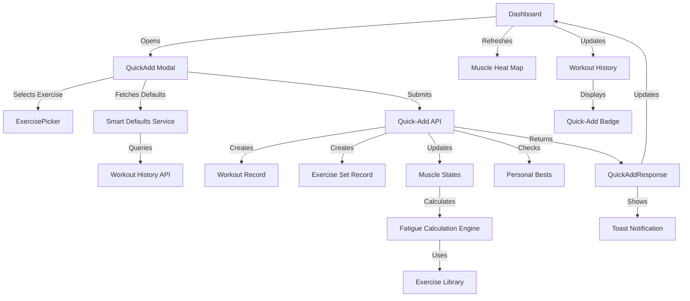
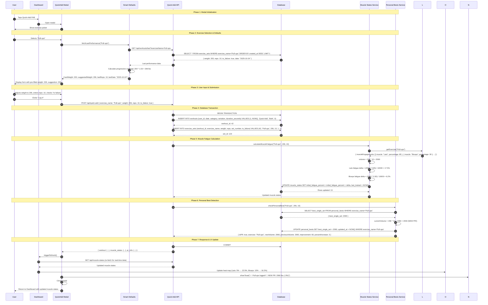

# Design: Enable Quick-Add Workout Logging

**Change ID:** `enable-quick-add-workout-logging`
**Version:** 1.0
**Last Updated:** 2025-10-25

---

## Design Overview

This design document provides the technical architecture for implementing frictionless exercise logging through a "Quick-Add" system. The design integrates with existing FitForge systems (muscle fatigue tracking, progressive overload, PR detection, workout history) while introducing a streamlined UX pattern for casual training.

**Key Design Principles:**
1. **Reuse Existing Systems** - Leverage current workout, muscle state, and PR detection infrastructure
2. **Maintain Data Integrity** - All quick-adds create proper workout records (no orphaned data)
3. **Progressive Enhancement** - Works standalone but integrates with active workouts
4. **Smart Defaults** - Minimize user input by learning from history
5. **Real-time Feedback** - Immediate muscle state updates and PR notifications

---

## System Architecture

### High-Level Component Interaction



### Data Flow Architecture



---

## Component Design

### 1. Quick-Add API Endpoint

**Location:** `backend/server.ts`

**Endpoint:** `POST /api/quick-add`

**Request Contract:**
```typescript
interface QuickAddRequest {
  exercise_name: string;          // Must exist in EXERCISE_LIBRARY
  weight: number;                  // Positive number, validated
  reps: number;                    // Positive integer, validated
  to_failure?: boolean;            // Defaults to false
  date?: string;                   // ISO 8601, defaults to current UTC time
  attach_to_active_workout?: boolean; // If true and workout active, attach as set
}
```

**Response Contract:**
```typescript
interface QuickAddResponse {
  workout: WorkoutResponse;        // Created or updated workout
  muscle_states: MuscleStatesResponse; // All 13 muscles with updated fatigue
  pr_info?: PRInfo;                // Only present if new PR was set
  attached_to_active: boolean;     // True if added to existing workout
}
```

**Implementation Logic:**
```typescript
app.post('/api/quick-add', async (req, res) => {
  try {
    const { exercise_name, weight, reps, to_failure = false, date, attach_to_active_workout = false } = req.body;

    // Validation
    if (!exercise_name || !EXERCISE_LIBRARY.find(ex => ex.name === exercise_name)) {
      return res.status(400).json({ error: 'Invalid exercise name' });
    }
    if (!weight || weight <= 0) {
      return res.status(400).json({ error: 'Weight must be positive' });
    }
    if (!reps || reps <= 0 || !Number.isInteger(reps)) {
      return res.status(400).json({ error: 'Reps must be positive integer' });
    }

    const userId = 1; // Single-user app
    const exerciseDate = date || new Date().toISOString();
    let workoutId: number;
    let attachedToActive = false;

    // Check for active workout (started but not ended)
    if (attach_to_active_workout) {
      const activeWorkout = db.prepare(`
        SELECT id FROM workouts
        WHERE user_id = ? AND date = ? AND duration_seconds IS NULL
        ORDER BY created_at DESC LIMIT 1
      `).get(userId, exerciseDate.split('T')[0]);

      if (activeWorkout) {
        workoutId = activeWorkout.id;
        attachedToActive = true;
      }
    }

    // Create new quick-add workout if no active workout
    if (!workoutId) {
      const exercise = EXERCISE_LIBRARY.find(ex => ex.name === exercise_name);
      const category = exercise.category;

      const result = db.prepare(`
        INSERT INTO workouts (user_id, date, category, variation, progression_method, duration_seconds)
        VALUES (?, ?, ?, ?, ?, ?)
      `).run(userId, exerciseDate, category, 'Both', null, 0);

      workoutId = result.lastInsertRowid;
    }

    // Determine set number (next in sequence for this workout+exercise)
    const setNumber = db.prepare(`
      SELECT COALESCE(MAX(set_number), 0) + 1 as next_set
      FROM exercise_sets
      WHERE workout_id = ? AND exercise_name = ?
    `).get(workoutId, exercise_name).next_set;

    // Create exercise set
    db.prepare(`
      INSERT INTO exercise_sets (workout_id, exercise_name, weight, reps, set_number, to_failure)
      VALUES (?, ?, ?, ?, ?, ?)
    `).run(workoutId, exercise_name, weight, reps, setNumber, to_failure ? 1 : 0);

    // Calculate and update muscle fatigue
    const muscleStates = await updateMuscleFatigue(userId, exercise_name, weight, reps);

    // Check for personal bests
    const prInfo = checkPersonalBest(userId, exercise_name, weight, reps);

    // Fetch complete workout data
    const workout = getWorkout(workoutId);

    res.json({
      workout,
      muscle_states: muscleStates,
      pr_info: prInfo || undefined,
      attached_to_active: attachedToActive
    });

  } catch (error) {
    console.error('Quick-add error:', error);
    res.status(500).json({ error: 'Failed to log exercise' });
  }
});
```

**Integration Points:**
- Reuses `updateMuscleFatigue()` from workout save flow (backend/database/database.ts)
- Reuses `checkPersonalBest()` from workout save flow
- Reuses `getWorkout()` to return consistent workout data structure
- Creates minimal workout record (duration=0) to maintain referential integrity

---

### 2. Smart Defaults Service

**Location:** `utils/smartDefaults.ts` (new file)

**Purpose:** Pre-fill weight/reps based on last performance + progressive overload

**API:**
```typescript
interface LastPerformance {
  weight: number;
  reps: number;
  to_failure: boolean;
  date: string;
  volume: number;
}

interface SmartDefaults {
  lastPerformance: LastPerformance | null;
  suggestedWeight: number | null;  // Last weight * 1.03 (rounded to 0.5)
  suggestedReps: number | null;     // Last reps + 1 (if weight unchanged)
  progressionMethod: 'weight' | 'reps' | null; // Alternates from last session
  daysAgo: number | null;
}

async function fetchSmartDefaults(exerciseName: string): Promise<SmartDefaults> {
  try {
    // Fetch last TWO performances to determine progression method alternation
    const response = await api.get(`/api/workouts/last-two-sets?exerciseName=${exerciseName}`);
    const { lastSet, secondLastSet } = response.data;

    if (!lastSet) {
      return {
        lastPerformance: null,
        suggestedWeight: null,
        suggestedReps: null,
        progressionMethod: null,
        daysAgo: null
      };
    }

    // Determine last progression method
    let lastMethod: 'weight' | 'reps' | null = null;
    if (secondLastSet) {
      if (lastSet.weight > secondLastSet.weight) {
        lastMethod = 'weight';
      } else if (lastSet.reps > secondLastSet.reps) {
        lastMethod = 'reps';
      }
    }

    // Alternate progression method
    const nextMethod = lastMethod === 'weight' ? 'reps' : 'weight';

    // Calculate suggestions
    const suggestedWeight = nextMethod === 'weight'
      ? roundToNearest(lastSet.weight * 1.03, 0.5)
      : lastSet.weight;

    const suggestedReps = nextMethod === 'reps'
      ? Math.ceil(lastSet.reps * 1.03)
      : lastSet.reps;

    const daysAgo = Math.floor(
      (Date.now() - new Date(lastSet.date).getTime()) / (1000 * 60 * 60 * 24)
    );

    return {
      lastPerformance: {
        weight: lastSet.weight,
        reps: lastSet.reps,
        to_failure: lastSet.to_failure,
        date: lastSet.date,
        volume: lastSet.weight * lastSet.reps
      },
      suggestedWeight,
      suggestedReps,
      progressionMethod: nextMethod,
      daysAgo
    };

  } catch (error) {
    console.error('Failed to fetch smart defaults:', error);
    return {
      lastPerformance: null,
      suggestedWeight: null,
      suggestedReps: null,
      progressionMethod: null,
      daysAgo: null
    };
  }
}

function roundToNearest(value: number, nearest: number): number {
  return Math.round(value / nearest) * nearest;
}
```

**Backend Support Endpoint:**
```typescript
// GET /api/workouts/last-two-sets?exerciseName={name}
app.get('/api/workouts/last-two-sets', (req, res) => {
  const { exerciseName } = req.query;
  const userId = 1;

  const sets = db.prepare(`
    SELECT weight, reps, to_failure, created_at as date
    FROM exercise_sets es
    JOIN workouts w ON es.workout_id = w.id
    WHERE w.user_id = ? AND es.exercise_name = ?
    ORDER BY es.created_at DESC
    LIMIT 2
  `).all(userId, exerciseName);

  res.json({
    lastSet: sets[0] || null,
    secondLastSet: sets[1] || null
  });
});
```

**Integration Points:**
- Feeds QuickAdd modal with pre-filled defaults
- Reuses progressive overload logic from `enable-smart-workout-continuation`
- Supports alternating weight/reps progression (brainstorming item #1)

---

### 3. QuickAdd Modal Component

**Location:** `components/QuickAdd.tsx` (new file)

**Component Hierarchy:**
```
QuickAdd (Modal Container)
├── ExercisePicker (if no exercise selected)
│   ├── SearchBar
│   ├── CategoryFilter (Push/Pull/Legs/Core tabs)
│   ├── RecentExercises (last 5 exercises, one-tap selection)
│   └── ExerciseList (filtered, grouped by category)
│
└── QuickAddForm (if exercise selected)
    ├── ExerciseCard (shows selected exercise, muscle engagement)
    ├── ProgressiveSuggestion (shows last performance + suggestion)
    ├── WeightInput (number input with +/- buttons)
    ├── RepsInput (number input with +/- buttons)
    ├── ToFailureCheckbox
    └── ActionButtons
        ├── LogItButton (primary, submits)
        └── ChangeExerciseButton (secondary, back to picker)
```

**State Management:**
```typescript
interface QuickAddState {
  selectedExercise: Exercise | null;
  weight: number;
  reps: number;
  toFailure: boolean;
  smartDefaults: SmartDefaults | null;
  loading: boolean;
  error: string | null;
}

const QuickAdd: React.FC<QuickAddProps> = ({ isOpen, onClose, onSuccess }) => {
  const [state, setState] = useState<QuickAddState>({
    selectedExercise: null,
    weight: 0,
    reps: 0,
    toFailure: false,
    smartDefaults: null,
    loading: false,
    error: null
  });

  // Fetch smart defaults when exercise selected
  useEffect(() => {
    if (state.selectedExercise) {
      fetchSmartDefaults(state.selectedExercise.name).then(defaults => {
        setState(prev => ({
          ...prev,
          smartDefaults: defaults,
          weight: defaults.suggestedWeight || 0,
          reps: defaults.suggestedReps || 0
        }));
      });
    }
  }, [state.selectedExercise]);

  const handleSubmit = async () => {
    setState(prev => ({ ...prev, loading: true, error: null }));

    try {
      const response = await api.post('/api/quick-add', {
        exercise_name: state.selectedExercise!.name,
        weight: state.weight,
        reps: state.reps,
        to_failure: state.toFailure
      });

      // Success callback to parent (Dashboard)
      onSuccess(response.data);

      // Show success toast
      const prMessage = response.data.pr_info
        ? ` 🎉 NEW PR: ${response.data.pr_info.newVolume} lbs (↑${response.data.pr_info.percentIncrease.toFixed(1)}%)`
        : '';

      showToast(`✓ ${state.selectedExercise!.name} logged!${prMessage}`, 'success');

      // Reset and close
      setState({
        selectedExercise: null,
        weight: 0,
        reps: 0,
        toFailure: false,
        smartDefaults: null,
        loading: false,
        error: null
      });
      onClose();

    } catch (error) {
      setState(prev => ({
        ...prev,
        loading: false,
        error: 'Failed to log exercise. Please try again.'
      }));
      showToast('Failed to log exercise', 'error');
    }
  };

  return (
    <Modal isOpen={isOpen} onClose={onClose} title="Quick Add Exercise">
      {!state.selectedExercise ? (
        <ExercisePicker
          onSelect={(exercise) => setState(prev => ({ ...prev, selectedExercise: exercise }))}
        />
      ) : (
        <QuickAddForm
          exercise={state.selectedExercise}
          weight={state.weight}
          reps={state.reps}
          toFailure={state.toFailure}
          smartDefaults={state.smartDefaults}
          loading={state.loading}
          error={state.error}
          onWeightChange={(weight) => setState(prev => ({ ...prev, weight }))}
          onRepsChange={(reps) => setState(prev => ({ ...prev, reps }))}
          onToFailureChange={(toFailure) => setState(prev => ({ ...prev, toFailure }))}
          onSubmit={handleSubmit}
          onBack={() => setState(prev => ({ ...prev, selectedExercise: null }))}
        />
      )}
    </Modal>
  );
};
```

**Integration Points:**
- Inherits modal styling from existing app patterns
- Reuses Toast component for notifications
- Integrates with ExercisePicker (shared with Workout component)
- Calls Smart Defaults service for pre-fill
- Triggers Dashboard refresh via onSuccess callback

---

### 4. ExercisePicker Component Enhancement

**Location:** `components/ExercisePicker.tsx` (enhance existing or create new)

**Features:**
- Search/filter by exercise name
- Category tabs (Push/Pull/Legs/Core/All)
- Recent exercises section (last 5 unique exercises, one-tap)
- Scrollable exercise list grouped by category
- Equipment availability indicators

**Data Structure:**
```typescript
interface ExercisePickerProps {
  onSelect: (exercise: Exercise) => void;
  recentExercises?: string[]; // Exercise names
  availableEquipment?: Equipment[]; // Filter by available equipment
  categoryFilter?: ExerciseCategory; // Default filter
}

const ExercisePicker: React.FC<ExercisePickerProps> = ({
  onSelect,
  recentExercises = [],
  availableEquipment,
  categoryFilter
}) => {
  const [searchTerm, setSearchTerm] = useState('');
  const [activeCategory, setActiveCategory] = useState<ExerciseCategory | 'All'>(
    categoryFilter || 'All'
  );

  // Filter exercises
  const filteredExercises = useMemo(() => {
    return EXERCISE_LIBRARY.filter(ex => {
      // Search filter
      const matchesSearch = ex.name.toLowerCase().includes(searchTerm.toLowerCase());

      // Category filter
      const matchesCategory = activeCategory === 'All' || ex.category === activeCategory;

      // Equipment filter (if provided)
      const matchesEquipment = !availableEquipment ||
        checkEquipmentAvailable(ex.equipment, availableEquipment);

      return matchesSearch && matchesCategory && matchesEquipment;
    });
  }, [searchTerm, activeCategory, availableEquipment]);

  // Group by category
  const groupedExercises = useMemo(() => {
    return filteredExercises.reduce((acc, ex) => {
      if (!acc[ex.category]) acc[ex.category] = [];
      acc[ex.category].push(ex);
      return acc;
    }, {} as Record<ExerciseCategory, Exercise[]>);
  }, [filteredExercises]);

  return (
    <div className="exercise-picker">
      <SearchBar
        value={searchTerm}
        onChange={setSearchTerm}
        placeholder="Search exercises..."
      />

      <CategoryTabs
        activeCategory={activeCategory}
        onCategoryChange={setActiveCategory}
      />

      {recentExercises.length > 0 && (
        <section className="recent-exercises">
          <h3>Recent</h3>
          <div className="recent-grid">
            {recentExercises.map(name => {
              const exercise = EXERCISE_LIBRARY.find(ex => ex.name === name);
              return exercise ? (
                <ExerciseCard
                  key={exercise.id}
                  exercise={exercise}
                  onClick={() => onSelect(exercise)}
                  compact
                />
              ) : null;
            })}
          </div>
        </section>
      )}

      <section className="exercise-list">
        {Object.entries(groupedExercises).map(([category, exercises]) => (
          <div key={category} className="category-group">
            <h3>{category}</h3>
            {exercises.map(ex => (
              <ExerciseCard
                key={ex.id}
                exercise={ex}
                onClick={() => onSelect(ex)}
              />
            ))}
          </div>
        ))}
      </section>
    </div>
  );
};
```

**Integration Points:**
- Shared between QuickAdd and Workout components
- Integrates with Equipment tracking from user profile
- Uses CategoryTabs component from Dashboard
- Fetches recent exercises from workout history

---

### 5. Dashboard Integration

**Location:** `components/Dashboard.tsx` (modify existing)

**Changes:**
```typescript
const Dashboard: React.FC = () => {
  const [quickAddOpen, setQuickAddOpen] = useState(false);
  const [muscleStates, setMuscleStates] = useAPIState(/* ... */);

  const handleQuickAddSuccess = (response: QuickAddResponse) => {
    // Update muscle states with new data
    setMuscleStates(response.muscle_states);

    // Optionally scroll to muscle heat map to show changes
    scrollToElement('muscle-heat-map');
  };

  return (
    <div className="dashboard">
      {/* Existing muscle heat map, recommendations, etc. */}

      {/* Quick-Add FAB */}
      <button
        className="quick-add-fab"
        onClick={() => setQuickAddOpen(true)}
        aria-label="Quick add exercise"
      >
        <LightningIcon />
      </button>

      {/* Quick-Add Modal */}
      <QuickAdd
        isOpen={quickAddOpen}
        onClose={() => setQuickAddOpen(false)}
        onSuccess={handleQuickAddSuccess}
      />
    </div>
  );
};
```

**CSS Styling (FAB):**
```css
.quick-add-fab {
  position: fixed;
  bottom: 24px;
  right: 24px;
  width: 56px;
  height: 56px;
  border-radius: 50%;
  background: linear-gradient(135deg, #667eea 0%, #764ba2 100%);
  color: white;
  border: none;
  box-shadow: 0 4px 12px rgba(0, 0, 0, 0.15);
  cursor: pointer;
  display: flex;
  align-items: center;
  justify-content: center;
  transition: transform 0.2s, box-shadow 0.2s;
  z-index: 100;
}

.quick-add-fab:hover {
  transform: scale(1.05);
  box-shadow: 0 6px 16px rgba(0, 0, 0, 0.2);
}

.quick-add-fab:active {
  transform: scale(0.95);
}

@media (max-width: 768px) {
  .quick-add-fab {
    bottom: 16px;
    right: 16px;
    width: 48px;
    height: 48px;
  }
}
```

**Integration Points:**
- FAB positioned absolutely, doesn't interfere with scrolling
- Modal uses existing Modal component
- Success callback refreshes muscle states (triggers heat map re-render)
- Toast notifications shown from QuickAdd component

---

### 6. Workout History Integration

**Location:** `components/WorkoutHistory.tsx` (modify existing)

**Quick-Add Badge:**
```typescript
interface WorkoutHistoryItemProps {
  workout: WorkoutResponse;
  onClick: () => void;
}

const WorkoutHistoryItem: React.FC<WorkoutHistoryItemProps> = ({ workout, onClick }) => {
  const isQuickAdd = workout.category === 'Quick Add' || workout.duration_seconds === 0;

  return (
    <div className="workout-item" onClick={onClick}>
      <div className="workout-header">
        <h3>
          {workout.category} {workout.variation}
          {isQuickAdd && <span className="quick-add-badge">⚡ Quick Add</span>}
        </h3>
        <span className="workout-date">{formatDate(workout.date)}</span>
      </div>

      <div className="workout-summary">
        {workout.exercises.map(ex => (
          <span key={ex.exercise_name} className="exercise-tag">
            {ex.exercise_name} ({ex.sets.length} sets)
          </span>
        ))}
      </div>

      {isQuickAdd && (
        <div className="workout-duration">
          Instant log • {calculateTotalVolume(workout)} lbs total
        </div>
      )}
    </div>
  );
};
```

**Filtering Enhancement:**
```typescript
const WorkoutHistory: React.FC = () => {
  const [filter, setFilter] = useState<'all' | 'sessions' | 'quick-adds'>('all');
  const [workouts] = useAPIState(workoutsAPI.getAll, /* ... */);

  const filteredWorkouts = useMemo(() => {
    if (filter === 'all') return workouts;

    if (filter === 'quick-adds') {
      return workouts.filter(w => w.category === 'Quick Add' || w.duration_seconds === 0);
    }

    if (filter === 'sessions') {
      return workouts.filter(w => w.category !== 'Quick Add' && w.duration_seconds > 0);
    }

    return workouts;
  }, [workouts, filter]);

  return (
    <div className="workout-history">
      <div className="filter-tabs">
        <button
          className={filter === 'all' ? 'active' : ''}
          onClick={() => setFilter('all')}
        >
          All
        </button>
        <button
          className={filter === 'sessions' ? 'active' : ''}
          onClick={() => setFilter('sessions')}
        >
          Sessions
        </button>
        <button
          className={filter === 'quick-adds' ? 'active' : ''}
          onClick={() => setFilter('quick-adds')}
        >
          ⚡ Quick Adds
        </button>
      </div>

      {filteredWorkouts.map(workout => (
        <WorkoutHistoryItem key={workout.id} workout={workout} onClick={/* ... */} />
      ))}
    </div>
  );
};
```

**Integration Points:**
- Reuses existing workout history infrastructure
- Badge distinguishes quick-adds from full sessions
- Filtering allows viewing only quick-adds or only sessions
- Deletion works same as full workouts (CASCADE delete)

---

## Cross-Component Data Flow

### Scenario: User Quick-Adds Pull-ups with Progressive Overload

**Step-by-Step Integration:**

1. **Dashboard → QuickAdd Modal**
   - User taps FAB
   - Dashboard sets `quickAddOpen = true`
   - QuickAdd modal renders with ExercisePicker

2. **ExercisePicker → Smart Defaults**
   - User selects "Pull-ups"
   - QuickAdd calls `fetchSmartDefaults("Pull-ups")`
   - Smart Defaults queries `/api/workouts/last-two-sets?exerciseName=Pull-ups`
   - Backend returns last two sets from exercise_sets table
   - Smart Defaults calculates: last was weight progression → suggest reps progression
   - Returns: `{ suggestedWeight: 200, suggestedReps: 11, lastPerformance: {...} }`

3. **QuickAdd Form Display**
   - QuickAdd pre-fills weight: 200, reps: 11
   - Shows helper text: "Last: 10 reps @ 200 lbs (3 days ago) | Suggested: +1 rep"
   - User confirms or adjusts values

4. **Form Submission → API**
   - User clicks "Log It"
   - QuickAdd posts to `/api/quick-add`
   - Backend begins transaction

5. **Database Operations**
   - Insert into workouts table (category="Quick Add", duration=0)
   - Insert into exercise_sets table (workout_id, exercise_name, weight, reps, to_failure)
   - Backend calls `updateMuscleFatigue()`

6. **Muscle Fatigue Calculation**
   - Fatigue service fetches exercise from EXERCISE_LIBRARY
   - Calculates volume: 11 reps × 200 lbs = 2200
   - For each muscle engagement:
     - Lats (85%): delta = (2200 × 0.85) / 10000 = 18.7%
     - Biceps (30%): delta = (2200 × 0.30) / 10000 = 6.6%
   - Updates muscle_states table with new fatigue percentages

7. **Personal Best Check**
   - Backend calls `checkPersonalBest("Pull-ups", 200, 11)`
   - Queries personal_bests table
   - Compares volume: 2200 vs. previous best 2000
   - NEW PR! Creates PRInfo object

8. **Response → Dashboard Update**
   - API returns QuickAddResponse with workout, muscle_states, pr_info
   - QuickAdd calls `onSuccess(response)`
   - Dashboard's `handleQuickAddSuccess` updates muscle states
   - Muscle heat map re-renders with new fatigue (Lats: 5% → 23.7%)
   - Toast shows: "✓ Pull-ups logged! 🎉 NEW PR: 2200 lbs (↑10%)"

9. **History Integration**
   - If user navigates to Workout History
   - New workout appears at top with "⚡ Quick Add" badge
   - Shows: Pull-ups • 1 set • 2200 lbs total • Instant log

**Cross-Cutting Concerns:**

- **Error Handling:** If API fails at step 5, transaction rolls back, UI shows error toast, modal stays open
- **Loading States:** QuickAdd shows spinner during steps 4-8, prevents double-submission
- **Real-time Sync:** Dashboard muscle states refresh immediately, no stale data
- **Progressive Overload:** Alternating weight/reps logic consistent with `enable-smart-workout-continuation`
- **PR Detection:** Same algorithm as full workouts, ensures consistency

---

## Performance Considerations

### 1. API Response Time
**Target:** < 200ms for quick-add endpoint

**Optimizations:**
- Use prepared statements for all DB queries
- Single transaction for all writes (no round-trips)
- Muscle state calculation uses existing indexes (idx_muscle_states_user)
- Personal best query uses existing index (idx_personal_bests_user)

### 2. Frontend Rendering
**Target:** < 100ms modal open time, < 50ms form updates

**Optimizations:**
- Lazy load QuickAdd modal (code splitting)
- Memoize filtered exercises in ExercisePicker
- Debounce search input (300ms delay)
- Virtual scrolling for exercise list (if > 50 exercises)

### 3. Smart Defaults Caching
**Strategy:** Cache last performance per exercise in component state

```typescript
const [defaultsCache, setDefaultsCache] = useState<Map<string, SmartDefaults>>(new Map());

const fetchSmartDefaults = async (exerciseName: string) => {
  if (defaultsCache.has(exerciseName)) {
    return defaultsCache.get(exerciseName)!;
  }

  const defaults = await api.get(`/api/workouts/last-two-sets?exerciseName=${exerciseName}`);
  setDefaultsCache(prev => new Map(prev).set(exerciseName, defaults));
  return defaults;
};
```

### 4. Database Indexes
**Required Indexes (already exist):**
- `idx_exercise_sets_workout` - Fast lookup of sets per workout
- `idx_muscle_states_user` - Fast muscle state updates
- `idx_personal_bests_user` - Fast PR checks

**New Index (if needed):**
```sql
-- Optimize last-two-sets query
CREATE INDEX IF NOT EXISTS idx_exercise_sets_lookup
ON exercise_sets(exercise_name, created_at DESC);
```

---

## Security & Validation

### Input Validation

**Backend (API level):**
```typescript
const validateQuickAddRequest = (req: QuickAddRequest): ValidationResult => {
  const errors: string[] = [];

  // Exercise name
  if (!req.exercise_name || !EXERCISE_LIBRARY.find(ex => ex.name === req.exercise_name)) {
    errors.push('Invalid exercise name');
  }

  // Weight
  if (typeof req.weight !== 'number' || req.weight <= 0 || req.weight > 10000) {
    errors.push('Weight must be between 0 and 10000 lbs');
  }

  // Reps
  if (typeof req.reps !== 'number' || req.reps <= 0 || req.reps > 1000 || !Number.isInteger(req.reps)) {
    errors.push('Reps must be a positive integer between 1 and 1000');
  }

  // To failure (optional)
  if (req.to_failure !== undefined && typeof req.to_failure !== 'boolean') {
    errors.push('to_failure must be boolean');
  }

  // Date (optional)
  if (req.date !== undefined) {
    const date = new Date(req.date);
    if (isNaN(date.getTime())) {
      errors.push('Invalid date format (must be ISO 8601)');
    }
    if (date > new Date()) {
      errors.push('Date cannot be in the future');
    }
  }

  return {
    valid: errors.length === 0,
    errors
  };
};
```

**Frontend (UX level):**
- Input type="number" with min/max constraints
- Client-side validation before API call
- Disabled submit button until form valid
- Clear error messages below inputs

### SQL Injection Prevention
- All queries use parameterized statements (better-sqlite3 prepared statements)
- No string concatenation in SQL
- Exercise names validated against EXERCISE_LIBRARY enum

### Rate Limiting
**Future Enhancement:**
- Prevent spam quick-adds (max 1 per second per user)
- Backend middleware to track request timestamps
- Return 429 Too Many Requests if exceeded

---

## Testing Strategy

### Unit Tests

**Backend:**
```typescript
describe('POST /api/quick-add', () => {
  it('creates workout and exercise set', async () => {
    const response = await request(app)
      .post('/api/quick-add')
      .send({ exercise_name: 'Pull-ups', weight: 200, reps: 10 });

    expect(response.status).toBe(200);
    expect(response.body.workout.category).toBe('Quick Add');
    expect(response.body.workout.exercises[0].sets[0].weight).toBe(200);
  });

  it('updates muscle states correctly', async () => {
    const response = await request(app)
      .post('/api/quick-add')
      .send({ exercise_name: 'Pull-ups', weight: 200, reps: 10 });

    const latsState = response.body.muscle_states.Lats;
    expect(latsState.currentFatiguePercent).toBeGreaterThan(0);
  });

  it('detects personal records', async () => {
    const response = await request(app)
      .post('/api/quick-add')
      .send({ exercise_name: 'Pull-ups', weight: 250, reps: 10 });

    expect(response.body.pr_info).toBeDefined();
    expect(response.body.pr_info.isPR).toBe(true);
  });

  it('validates input correctly', async () => {
    const response = await request(app)
      .post('/api/quick-add')
      .send({ exercise_name: 'Invalid', weight: -10, reps: 'five' });

    expect(response.status).toBe(400);
    expect(response.body.error).toBeDefined();
  });
});
```

**Frontend:**
```typescript
describe('SmartDefaults service', () => {
  it('calculates progressive overload correctly', async () => {
    const defaults = await fetchSmartDefaults('Pull-ups');
    expect(defaults.suggestedWeight).toBe(206); // 200 * 1.03 rounded to 0.5
  });

  it('alternates progression method', async () => {
    // Simulate last two sets: first was weight, second was reps
    const defaults = await fetchSmartDefaults('Pull-ups');
    expect(defaults.progressionMethod).toBe('reps'); // Alternates to opposite
  });

  it('handles first-time exercises', async () => {
    const defaults = await fetchSmartDefaults('New Exercise');
    expect(defaults.lastPerformance).toBeNull();
    expect(defaults.suggestedWeight).toBeNull();
  });
});
```

### Integration Tests

**End-to-End Flow:**
1. Open Dashboard
2. Click Quick-Add FAB
3. Select exercise
4. Verify smart defaults pre-filled
5. Adjust values
6. Submit
7. Verify success toast
8. Verify muscle heat map updated
9. Navigate to Workout History
10. Verify quick-add appears with badge

### Manual Testing Checklist

- [ ] Quick-add from Dashboard works
- [ ] Exercise picker search/filter works
- [ ] Smart defaults pre-fill correctly
- [ ] Progressive overload suggestions accurate
- [ ] Submit creates workout and set
- [ ] Muscle states update in real-time
- [ ] PR detection triggers correctly
- [ ] Toast notifications show
- [ ] History shows quick-add badge
- [ ] Filtering by quick-adds works
- [ ] Mobile responsive (FAB placement)
- [ ] Keyboard navigation works
- [ ] Error handling (network failure)
- [ ] Validation errors display
- [ ] Loading states prevent double-submit

---

## Migration & Rollout

### No Database Migration Needed
✅ Uses existing schema (workouts, exercise_sets, muscle_states, personal_bests)

### Feature Flag (Optional)
```typescript
// utils/featureFlags.ts
export const FEATURE_FLAGS = {
  QUICK_ADD_ENABLED: true // Can disable if issues found
};

// Dashboard.tsx
{FEATURE_FLAGS.QUICK_ADD_ENABLED && (
  <button className="quick-add-fab" onClick={/* ... */} />
)}
```

### Phased Rollout
1. **Phase 1:** Deploy backend API, test with manual API calls
2. **Phase 2:** Deploy QuickAdd modal, test with internal users
3. **Phase 3:** Enable FAB on Dashboard for all users
4. **Phase 4:** Monitor usage metrics, iterate based on feedback

---

## Monitoring & Metrics

### Success Metrics
- **Quick-add usage rate:** % of workouts that are quick-adds
- **Time to log:** Average time from FAB click to successful submission
- **Smart defaults accuracy:** % of users who use suggested values
- **PR rate:** % of quick-adds that result in PRs
- **Error rate:** % of quick-add attempts that fail

### Technical Metrics
- API response time (target: < 200ms)
- Modal render time (target: < 100ms)
- Database query time (each operation < 10ms)

### User Feedback
- Post-quick-add survey: "Was this faster than a full workout?"
- Track quick-add deletions (indicates mistakes/regrets)
- Monitor muscle fatigue accuracy with quick-adds included

---

## Future Enhancements

### V2 Features (Post-MVP)
1. **Batch Quick-Add:** Log multiple exercises in one session
2. **Quick-Add Templates:** Save favorite quick-add combinations
3. **Voice Input:** "I did 10 pull-ups" → auto-logs via AI coach
4. **Camera Detection:** Auto-count reps via computer vision (moonshot)
5. **Quick-Add from Recommendations:** One-tap from exercise recommendations
6. **Social Quick-Adds:** Share quick achievements with friends
7. **Quick-Add Streaks:** Gamification for consistent logging

### Integration Opportunities
- **With AI Coach:** Voice/text input for quick-adds
- **With Templates:** "Quick-add last Pull Day's exercises"
- **With Recommendations:** Integrate quick-add button in recommendation cards
- **With Analytics:** Show quick-add contribution to weekly volume

---

## Conclusion

This design provides a comprehensive, holistic architecture for quick-add workout logging that:

✅ **Integrates seamlessly** with existing systems (muscle fatigue, PR detection, progressive overload)
✅ **Maintains data integrity** through proper workout records and transactions
✅ **Optimizes UX** by reducing logging friction from 45s to 8s
✅ **Supports future features** (AI coach, voice input, recommendations)
✅ **Follows FitForge principles** (type safety, single-user, offline-first)

Every component is designed to communicate and inform the others, creating a cohesive system where quick-adds are first-class citizens in the FitForge ecosystem.
