# Proposal: Enable Quick-Add Workout Logging

**Change ID:** `enable-quick-add-workout-logging`
**Status:** Proposed (Under Revision)
**Created:** 2025-10-25
**Revised:** 2025-10-25 (Post Sequential Thinking Review)
**Author:** Development Team
**Priority:** 5 (User Experience Enhancement + Backend Refactor)

---

## ⚠️ Executive Summary: Post-Review Revisions

**Critical Finding:** This is NOT just a UX enhancement—it's a **backend refactoring project**.

### Key Changes from Original Proposal

1. **Timeline:** 2 weeks → **3.5-4 weeks** (75-100% increase)

2. **Scope Expansion:** Added Phase 1 (Backend Business Logic Foundation)
   - Port muscle fatigue calculation engine to backend (~100 lines)
   - Port PR detection algorithm to backend (~50 lines)
   - Migrate exercise library (48 exercises + muscle engagements)
   - Create new backend services layer

3. **Architectural Impact:** Backend becomes single source of truth for:
   - Muscle fatigue calculations
   - PR detection
   - Progressive overload suggestions
   - Baseline learning updates

4. **Benefits of "Doing It Right":**
   - ✅ Proper MVC architecture (backend = business logic, frontend = presentation)
   - ✅ Enables future mobile apps (shared backend logic)
   - ✅ Consistent calculations across all workout save flows
   - ✅ Easier testing (unit tests for calculation logic)
   - ✅ Single source of truth (no client/server drift)

5. **Removed Features:**
   - ❌ "Attach to active workout" (no active session concept in backend)

6. **Corrected Claims:**
   - ❌ "No schema changes required" was misleading (to_failure already exists)
   - ❌ "All systems exist" was wrong (business logic is client-side only)

### Decision: Option B - Full Backend Refactor

We chose **"Do it right"** over **"Do it quick"** to establish proper architectural foundation for future features.

---

## Why

FitForge currently requires users to go through a full workout session flow (Start Workout → Select Exercises → Log Sets → End Workout) even for casual training. This creates friction for users who want to quickly log spontaneous exercise sets like "I just did 10 pull-ups while passing by the bar" or "quick 20 push-ups before breakfast."

**User Pain Points:**
- "I did some pull-ups but don't want to start a full workout session"
- "Can't I just quickly log that I did 30 push-ups?"
- "Too many steps to record a single exercise set"
- "I train throughout the day, not in formal sessions"
- "Greasing the groove requires quick logging, not full workouts"

**From Brainstorming Session (Item #8):**
> **Quick-Add for Random Exercises**
> - "Just did 10 pull-ups" → logs instantly
> - Counts toward muscle fatigue
> - Minimal UI, maximum speed

---

## Problem Statement

**Current Behavior:**
- All exercise logging requires formal workout session (with start/end times)
- Minimum 4-5 clicks/taps to log a single exercise set
- Can't log exercises outside of a workout context
- No support for "greasing the groove" training style (submaximal sets throughout day)
- Creates friction for casual training that should still count toward muscle fatigue

**Why This Matters:**
1. **Missed Training Data** - Users skip logging casual sets due to friction
2. **Inaccurate Muscle Fatigue** - System doesn't know about informal training
3. **Poor UX for Greasing the Groove** - This training style requires frequent, quick logging
4. **Vision Gap** - System should support ALL training, not just formal sessions
5. **User Frustration** - "The app is too complicated for simple tasks"

---

## Proposed Solution

Implement a **Quick-Add Workout Logging System** that:

1. **One-tap access** - Floating action button (FAB) or quick-add section on Dashboard
2. **Minimal input flow** - Exercise → Weight → Reps → Done (3 steps max)
3. **Smart defaults** - Pre-fill last used weight for each exercise
4. **Instant logging** - No formal workout session required
5. **Muscle fatigue integration** - Quick-adds count toward fatigue calculations
6. **Optional session grouping** - Can attach to current workout if one is active
7. **History tracking** - Quick-adds appear in workout history with "Quick Add" badge
8. **Progressive overload awareness** - Shows +3% suggestion from last performance

**Core Innovation:**
**Frictionless Logging** - Reduce clicks from 7+ to 3, enable logging in under 10 seconds.

---

## User Experience

### Before (Current State)
```
User wants to log 10 pull-ups done casually

Steps:
1. Open App → Dashboard
2. Navigate to Workout tab
3. Click "Start Workout"
4. Select category (Pull)
5. Select variation (A/B/Both)
6. Select exercise (Pull-ups)
7. Enter weight (200 lbs bodyweight)
8. Enter reps (10)
9. Click "Add Set"
10. Click "End Workout"
11. Confirm duration

Total: 11 steps, ~45 seconds minimum
Result: User often skips logging due to friction
```

### After (Proposed)
```
User wants to log 10 pull-ups done casually

Steps:
1. Click Quick-Add button (FAB on Dashboard)
2. Select "Pull-ups" (with search/recent exercises)
3. Confirm weight: 200 lbs [pre-filled from last time]
4. Enter reps: 10
5. Click "Log It" → Done! Shows toast: "✓ Pull-ups logged"

Total: 5 steps, ~8 seconds
Result: No friction, user logs every set

PLUS: Muscle fatigue updates in real-time
- Lats: +15% fatigue (was 5%, now 20%)
- Biceps: +5% fatigue (was 10%, now 15%)
- Dashboard heat map reflects new state immediately
```

---

## Success Criteria

1. **Quick-add button accessible** - Visible on Dashboard and Workout screens
2. **3-step maximum flow** - Exercise selection → Weight/Reps → Log
3. **Sub-10 second logging** - Average user can complete in under 10 seconds
4. **Smart defaults work** - Last weight pre-filled correctly per exercise
5. **Muscle fatigue updates** - Quick-adds immediately update muscle states
6. **History integration** - Quick-adds appear in workout history with badge
7. **Progressive overload shown** - Displays +3% suggestion
8. **Search/filter functional** - Can quickly find exercises by name or category
9. **Mobile optimized** - Works smoothly on touch devices
10. **No session conflicts** - Handles quick-adds during active workout session gracefully

---

## Implementation Scope

### In Scope
- **Quick-Add UI Component**
  - Floating action button (FAB) or quick-add card on Dashboard
  - Exercise picker with search/filter by category
  - Weight and reps input fields with smart defaults
  - "Log It" button with loading state
  - Success toast notification

- **Quick-Add API Endpoint**
  - `POST /api/quick-add` with exercise, weight, reps, optional to_failure
  - Creates minimal workout record (category: "Quick Add", duration: 0)
  - Creates exercise_set record linked to workout
  - Updates muscle_states (fatigue calculations)
  - Updates personal_bests if applicable
  - Returns: PR info, new muscle states, confirmation

- **Smart Defaults Logic**
  - Query last exercise_set for this exercise
  - Pre-fill weight from last performance
  - Show progressive overload suggestion (+3%)
  - Handle first-time exercises (no defaults)

- **History Integration**
  - Quick-add workouts show in history with "⚡ Quick Add" badge
  - Filterable by workout type
  - Display timestamp, exercise, weight, reps
  - Can view details or delete

- **Muscle Fatigue Integration**
  - Calculate volume (weight × reps)
  - Apply muscle engagement percentages
  - Update muscle_states table
  - Trigger real-time Dashboard refresh

### Out of Scope
- Voice input ("I did 10 pull-ups") - Future AI coach feature
- Auto-detection via camera/sensors - Moonshot hardware integration
- Social sharing of quick-adds - No social features in V1
- Custom exercise creation - Fixed library for now
- Batch quick-add (multiple exercises at once) - Single exercise focus for MVP
- Quick-add templates/presets - Future optimization
- Timer/rest tracking for quick-adds - Keep minimal

---

## Dependencies

### ⚠️ CRITICAL REVISION (Post-Review)

**Original Claim:** "All required systems exist ✅"
**Reality:** Major backend business logic is missing. This is not just a UX enhancement - it's a **backend refactoring project**.

**Actually Requires:**

❌ **Backend Business Logic (Currently Client-Side Only):**
1. **Muscle Fatigue Calculation Engine**
   - Calculate workout muscle volumes from exercises + muscle engagement percentages
   - Apply muscle engagement distribution (e.g., Pull-ups = Lats 85%, Biceps 30%, etc.)
   - Calculate fatigue percentage (volume / baseline × 100)
   - Determine recovery days (1 + (fatigue / 100) × 6)
   - **Current Location:** App.tsx:49-94, WorkoutSummaryModal.tsx:28-48
   - **Backend Status:** ❌ Does not exist (updateMuscleStates just stores data)

2. **PR Detection Algorithm**
   - Query last 5 workouts for each exercise
   - Calculate best single set, best session volume, rolling average max
   - Compare current performance to historical bests
   - Generate PR notification data
   - **Current Location:** App.tsx:98-145
   - **Backend Status:** ❌ Does not exist (updatePersonalBests just stores data)

3. **Exercise Library Access**
   - EXERCISE_LIBRARY from constants.ts (48 exercises with muscle engagements)
   - **Backend Status:** ⚠️ Not accessible on backend (frontend constant only)

4. **Muscle Baselines Integration**
   - Query muscle baselines during fatigue calculation
   - Apply user overrides or system learned max
   - **Backend Status:** ✅ Database access exists, ❌ not integrated with calculations

✅ **Database Infrastructure (Actually Exists):**
- Muscle states table with initial_fatigue_percent, last_trained fields
- Personal bests table with best_single_set, best_session_volume, rolling_average_max
- Muscle baselines table with system_learned_max, user_override
- Exercise sets table with to_failure column (already exists, contrary to original proposal claim)
- Workout templates with variation tracking

❌ **New Endpoints Needed:**
- GET /api/workouts/last?exerciseName={name} (currently only supports ?category={category})
- POST /api/quick-add (new endpoint with all-in-one response)

**Enables:**
- Greasing the groove tracking (submaximal sets throughout day)
- More accurate muscle fatigue data (captures informal training)
- **Proper separation of concerns** (backend owns business logic, client owns presentation)
- **Single source of truth** for calculations (enables future mobile apps, API integrations)
- Future: Voice/AI coach integration ("just did 10 pull-ups" → auto-logs)
- Future: Quick-add from recommendations ("Add to Workout" one-tap)

**Architectural Impact:**
- 🔄 POST /api/workouts should ALSO return muscle_states and pr_info (for consistency)
- 🔄 All workout save flows need to use enhanced backend logic
- ✅ Client becomes purely presentational (proper MVC architecture)

---

## Technical Design

### API Contract

```typescript
// POST /api/quick-add
interface QuickAddRequest {
  exercise_name: string;
  weight: number;
  reps: number;
  to_failure?: boolean; // defaults to false
  date?: string; // defaults to now (ISO 8601)
}

interface QuickAddResponse {
  workout: {
    id: number;
    date: string;
    category: "Quick Add";
    variation: "Both";
    duration_seconds: 0;
    exercises: [{
      exercise_name: string;
      sets: [{
        weight: number;
        reps: number;
        to_failure: boolean;
      }];
    }];
  };
  muscle_states: MuscleStatesResponse; // Updated states
  pr_info?: PRInfo; // If new PR was set
}
```

### Database Impact

**Schema Changes:** ✅ None required (all tables exist)

**Tables Used:**
- `workouts` - New row with category="Quick Add", variation="Both", duration_seconds=0
- `exercise_sets` - New row with to_failure field (already exists in schema)
- `muscle_states` - Updated fatigue percentages via calculation engine
- `personal_bests` - Updated via PR detection algorithm
- `muscle_baselines` - Queried during fatigue calculation
- `bodyweight_history` - Queried for bodyweight exercises

**Special handling:**
- Quick-add workouts have `duration_seconds = 0` (instant)
- Can be filtered/identified by `category = "Quick Add"`

**Note:** Original proposal incorrectly claimed "no schema changes" as a benefit. The `to_failure` column already exists in exercise_sets table (schema.sql:56), added as part of separate feature work.

### Component Structure

```typescript
// components/QuickAdd.tsx
interface QuickAddProps {
  onSuccess: (response: QuickAddResponse) => void;
  onClose: () => void;
}

const QuickAdd: React.FC<QuickAddProps> = ({ onSuccess, onClose }) => {
  const [selectedExercise, setSelectedExercise] = useState<Exercise | null>(null);
  const [weight, setWeight] = useState<number>(0);
  const [reps, setReps] = useState<number>(0);
  const [toFailure, setToFailure] = useState(false);
  const [loading, setLoading] = useState(false);

  // Fetch last performance for smart defaults
  useEffect(() => {
    if (selectedExercise) {
      fetchLastPerformance(selectedExercise.name).then(last => {
        if (last) {
          setWeight(last.weight);
          // Show +3% suggestion
        }
      });
    }
  }, [selectedExercise]);

  const handleSubmit = async () => {
    setLoading(true);
    try {
      const response = await api.post('/api/quick-add', {
        exercise_name: selectedExercise.name,
        weight,
        reps,
        to_failure: toFailure
      });
      onSuccess(response.data);
      showToast(`✓ ${selectedExercise.name} logged!`);
    } catch (error) {
      showToast('Failed to log exercise', 'error');
    } finally {
      setLoading(false);
    }
  };

  return (
    <Modal onClose={onClose}>
      <h2>Quick Add Exercise</h2>

      {!selectedExercise ? (
        <ExercisePicker
          onSelect={setSelectedExercise}
          recentExercises={getRecentExercises()}
        />
      ) : (
        <div>
          <ExerciseCard exercise={selectedExercise} />

          <InputField
            label="Weight (lbs)"
            type="number"
            value={weight}
            onChange={setWeight}
            helper={`Last: ${lastWeight} lbs | Suggested: ${lastWeight * 1.03} lbs`}
          />

          <InputField
            label="Reps"
            type="number"
            value={reps}
            onChange={setReps}
          />

          <Checkbox
            label="To failure?"
            checked={toFailure}
            onChange={setToFailure}
          />

          <Button onClick={handleSubmit} loading={loading} primary>
            Log It
          </Button>

          <Button onClick={() => setSelectedExercise(null)} secondary>
            Change Exercise
          </Button>
        </div>
      )}
    </Modal>
  );
};
```

### UI Placement Options

**Option A: Floating Action Button (Recommended)**
- Fixed position bottom-right on Dashboard
- Icon: "+" or lightning bolt
- Tap → opens QuickAdd modal
- Always accessible, doesn't interfere with content

**Option B: Quick-Add Card on Dashboard**
- Card above muscle heat map
- "⚡ Quick Add" header with "+ Add Exercise" button
- Shows recent exercises for one-tap selection
- More discoverable but takes screen space

**Option C: Both**
- Quick-add card for discoverability
- FAB for quick access after user learns feature
- Best of both worlds

---

## Data Flow

```mermaid
sequenceDiagram
    participant User
    participant Dashboard
    participant QuickAdd as QuickAdd Component
    participant API
    participant DB
    participant MuscleStates

    User->>Dashboard: Taps Quick-Add FAB
    Dashboard->>QuickAdd: Opens modal

    QuickAdd->>API: GET /api/workouts/last?exerciseName=Pull-ups
    API->>DB: Query last exercise_set
    DB-->>API: Last performance data
    API-->>QuickAdd: { weight: 200, reps: 10, date: "2025-10-24" }

    QuickAdd->>QuickAdd: Pre-fill weight: 200 lbs
    QuickAdd->>QuickAdd: Show suggestion: 206 lbs (+3%)
    QuickAdd-->>User: Display form with defaults

    User->>QuickAdd: Enters reps: 10, clicks "Log It"

    QuickAdd->>API: POST /api/quick-add { exercise_name, weight, reps }

    API->>DB: BEGIN TRANSACTION
    API->>DB: INSERT INTO workouts (category="Quick Add", duration=0)
    API->>DB: INSERT INTO exercise_sets (workout_id, exercise_name, weight, reps)

    API->>MuscleStates: Calculate muscle fatigue deltas
    MuscleStates->>MuscleStates: Volume = 10 reps × 200 lbs = 2000
    MuscleStates->>MuscleStates: Lats +15%, Biceps +5%, etc.

    API->>DB: UPDATE muscle_states SET initial_fatigue_percent, last_trained
    API->>DB: Check personal_bests, update if PR
    API->>DB: COMMIT

    API-->>QuickAdd: { workout, muscle_states, pr_info }

    QuickAdd->>Dashboard: Trigger muscle states refresh
    Dashboard->>API: GET /api/muscle-states
    API-->>Dashboard: Updated muscle states
    Dashboard-->>User: Heat map updates in real-time

    QuickAdd-->>User: Show toast: "✓ Pull-ups logged!"
    QuickAdd->>QuickAdd: Close modal
```



---

## Risks & Mitigation

| Risk | Impact | Mitigation |
|------|--------|------------|
| Users accidentally log wrong exercise | Medium | Confirmation step, easy undo/delete from history |
| Quick-adds during active workout confuse users | Medium | Auto-attach to active workout, show clear indication |
| Muscle fatigue calculation inaccurate for single sets | Low | Same calculation as full workouts, validated algorithm |
| Users abandon full workout sessions | Low | Quick-add is for casual training, promote both use cases |
| Performance issues (API calls on every quick-add) | Low | Optimize DB queries, use indexes, measure latency |
| FAB interferes with scrolling on mobile | Low | Place in non-scroll zone, test on devices |

---

## Alternatives Considered

### Alternative 1: Voice/AI Input Only
- **Deferred:** Requires AI coach integration (Phase 5+)
- Start with manual quick-add, upgrade to voice in future
- Current approach provides foundation for AI integration

### Alternative 2: In-line Quick-Add on Dashboard
- **Rejected:** Takes too much screen real estate
- FAB is less intrusive, more standard mobile pattern

### Alternative 3: Quick-Add from Recommendations
- **Partially Implemented:** Recommendations already have "Add to Workout"
- This proposal adds standalone quick-add (no recommendations needed)
- Both paths should coexist

### Alternative 4: No Workout Record (Sets Only)
- **Rejected:** Breaks data model, complicates history queries
- Minimal workout record (duration=0) is cleaner

---

## Open Questions

1. **Should quick-adds during active workout attach automatically?**
   - **Answer:** Yes - if workout is active, attach as additional set. Otherwise create new quick-add workout.

2. **How to handle quick-adds with same exercise in active workout?**
   - **Answer:** Add as new set to existing exercise in active workout.

3. **Should there be a "quick-add history" separate from workouts?**
   - **Answer:** No - unified history with "Quick Add" badge for filtering.

4. **Weight input: freeform or increment buttons (+5/-5)?**
   - **Answer:** Both - number input with +/- buttons for quick adjustments.

5. **Should quick-adds support multiple sets?**
   - **Answer:** V1 = single set only. V2 = "Add Another Set" button for same exercise.

6. **Pre-fill bodyweight for bodyweight exercises?**
   - **Answer:** Yes - fetch latest bodyweight from profile, auto-fill for bodyweight exercises.

---

## Related Changes

- **Depends on:**
  - (None - uses existing systems)

- **Enables:**
  - Greasing the groove training tracking
  - More accurate muscle fatigue data
  - Future AI coach voice input integration
  - Future quick-add from recommendations

- **Related to:**
  - `enable-smart-exercise-recommendations` (can use quick-add for "Add to Workout")
  - `enable-failure-tracking-and-pr-detection` (quick-adds can trigger PRs)

---

## Implementation Plan

### ⚠️ REVISED TIMELINE (Post-Review)

**Original Estimate:** 2 weeks
**Revised Estimate:** 3.5-4 weeks (Backend refactor + Frontend implementation)

---

### Phase 1: Backend Business Logic Foundation (Week 1, 1.5-2 weeks)

**1.1 Exercise Library Backend Migration (3-4 days)**
1. Create `backend/constants/exercises.ts` (port from frontend constants.ts)
2. Include EXERCISE_LIBRARY with all muscle engagement percentages
3. Create helper functions: `getExerciseByName()`, `getExerciseById()`
4. Add unit tests for exercise lookup functions

**1.2 Muscle Fatigue Calculation Engine (3-4 days)**
1. Create `backend/services/muscleFatigueService.ts`
2. Port calculation logic from App.tsx:49-94
3. Implement `calculateMuscleFatigue(exercises, sets, muscleBaselines)`
4. Function signature:
   ```typescript
   interface FatigueResult {
     muscleName: string;
     volumeWorked: number;
     fatiguePercent: number;
     recoveryDays: number;
   }

   function calculateMuscleFatigue(
     exercises: { name: string; sets: { weight: number; reps: number }[] }[],
     muscleBaselines: Record<string, { systemLearnedMax: number; userOverride: number | null }>
   ): FatigueResult[]
   ```
5. Update baselines if new max volume detected
6. Add comprehensive unit tests (happy path, edge cases, baseline calculations)

**1.3 PR Detection Algorithm (2-3 days)**
1. Create `backend/services/prDetectionService.ts`
2. Port PR logic from App.tsx:98-145
3. Implement `detectPRs(currentWorkout, historicalWorkouts, currentPBs)`
4. Query last 5 workouts for each exercise
5. Calculate rolling average max
6. Generate PR notification data
7. Add unit tests for PR detection scenarios

**1.4 Database Query Helpers (1-2 days)**
1. Add `getLastWorkoutByExercise(exerciseName)` to database.ts
2. Add `getWorkoutsWithExercise(exerciseName, limit)` to database.ts
3. Add `getLatestBodyweight(userId)` for bodyweight exercise defaults
4. Add indexes for performance: `CREATE INDEX idx_exercise_sets_name ON exercise_sets(exercise_name)`

---

### Phase 2: Enhanced Workout API (Week 2-3, 3-4 days)

**2.1 Refactor POST /api/workouts (2 days)**
1. Update endpoint to use new backend calculation services
2. Return enhanced response: `{ workout, muscle_states, pr_info }`
3. Call `muscleFatigueService.calculateMuscleFatigue()`
4. Call `prDetectionService.detectPRs()`
5. Update muscle_states and personal_bests in database
6. Ensure backward compatibility with existing frontend code
7. Add integration tests

**2.2 Create POST /api/quick-add (1-2 days)**
1. New endpoint that wraps POST /api/workouts logic
2. Accept simplified payload: `{ exercise_name, weight, reps, to_failure? }`
3. Transform to workout format (category="Quick Add", duration=0, single exercise)
4. Return same enhanced response as POST /api/workouts
5. Add endpoint tests

**2.3 Add GET /api/workouts/last?exerciseName= (1 day)**
1. Implement query by exercise name (not just category)
2. Return last performance: weight, reps, date
3. Calculate +3% progressive overload suggestion in response
4. Add endpoint tests

---

### Phase 3: Frontend Quick-Add UI (Week 3, 1 week)

**3.1 QuickAdd Component (2-3 days)**
1. Create `components/QuickAdd.tsx` modal component
2. Create `components/ExercisePicker.tsx` with search/filter/recent exercises
3. Implement weight/reps input with smart defaults
4. Add "to failure" checkbox
5. Wire up to POST /api/quick-add endpoint
6. Success/error toast notifications
7. Handle loading states

**3.2 Dashboard Integration (1-2 days)**
1. Add FAB (Floating Action Button) to Dashboard component
2. Handle modal open/close state
3. **Remove client-side muscle fatigue calculation** (now handled by backend)
4. Update muscle states from API response
5. Display PR notifications from API response
6. Mobile responsive testing
7. Accessibility (keyboard navigation, ARIA labels)

**3.3 History Integration (1-2 days)**
1. Add "⚡ Quick Add" badge to workout history items
2. Implement filtering by workout type (category="Quick Add")
3. Add delete quick-add functionality
4. Update workout history UI

**3.4 Refactor Existing Workout Flow (1-2 days)**
1. Update `App.tsx` handleFinishWorkout to use new POST /api/workouts response
2. **Remove client-side fatigue calculations** (lines 49-94 of App.tsx)
3. **Remove client-side PR detection** (lines 98-145 of App.tsx)
4. Use muscle_states and pr_info from API response
5. Test existing workout flows still work correctly
6. Update WorkoutSummaryModal to use API data

---

### Phase 4: Testing & Polish (Week 4, 2-3 days)

**4.1 Integration Testing (1 day)**
1. Test quick-add → muscle states update → dashboard refresh flow
2. Test PR detection across quick-add and full workouts
3. Test smart defaults with no previous data
4. Test edge cases (network errors, invalid exercise names)

**4.2 Performance Optimization (1 day)**
1. Measure API latency for muscle fatigue calculations
2. Optimize database queries (indexes, query plans)
3. Profile frontend re-renders after quick-add

**4.3 Documentation & Cleanup (1 day)**
1. Update API documentation with new endpoints and response formats
2. Update ARCHITECTURE.md with backend calculation engine
3. Add inline code comments for complex calculations
4. Create migration guide for developers

---

### Removed Features (From Original Proposal)

❌ **"Attach to Active Workout"**
- **Reason:** No concept of "active" workout session in backend
- **Current Reality:** Workouts are only saved when finished
- **Alternative:** Every quick-add creates a new workout record (simpler, consistent with architecture)

---

**Total Estimated Timeline:** 3.5-4 weeks (28-32 days)

**Breakdown:**
- Backend refactor: 1.5-2 weeks (10-14 days)
- API enhancements: 3-4 days
- Frontend implementation: 1 week (5-7 days)
- Testing & polish: 2-3 days

**Risk Buffer:** +20% for unexpected issues (add 1 week → 5 weeks total for safety)

---

## Next Steps

### Immediate Actions

1. ✅ **Proposal revised** based on sequential thinking review findings
2. ⏭️ **Stakeholder review** of revised timeline and scope
3. ⏭️ **Decision confirmation** on "do it right" vs "do it quick" approach
4. ⏭️ **Create `design.md`** with detailed architecture for:
   - Backend services layer (muscleFatigueService, prDetectionService)
   - Enhanced API contracts (request/response types)
   - Frontend refactoring plan (remove client-side business logic)

### OpenSpec Deliverables

5. ⏭️ **Write spec deltas** for new capabilities:
   - `backend-calculation-engine` (muscle fatigue + PR detection services)
   - `enhanced-workout-api` (POST /api/workouts returns muscle_states + pr_info)
   - `quick-add-endpoint` (POST /api/quick-add wrapper)
   - `exercise-library-migration` (backend access to EXERCISE_LIBRARY)
   - `quick-add-ui` (QuickAdd component, ExercisePicker, smart defaults)
   - `workout-flow-refactor` (remove client-side calculations from App.tsx)
   - `quick-add-history-integration` (badges, filtering, deletion)

6. ⏭️ **Create `tasks.md`** with 4-phase implementation breakdown:
   - Phase 1: Backend Business Logic Foundation (10-14 tasks)
   - Phase 2: Enhanced Workout API (6-8 tasks)
   - Phase 3: Frontend Quick-Add UI (8-10 tasks)
   - Phase 4: Testing & Polish (5-6 tasks)

7. ⏭️ **Validate** with `openspec validate enable-quick-add-workout-logging --strict`

8. ⏭️ **Begin implementation** (only after approval of revised timeline)

### Alternative: Simplified Approach

If 3.5-4 week timeline is not acceptable, consider **Option A: Simplify Quick-Add**:
- Keep business logic on client (2 weeks, no refactor)
- Quick-add makes 3 API calls (save workout, update states, update PRs)
- Defer backend refactor to separate future proposal
- **Trade-off:** Technical debt remains, future mobile apps harder to implement

---

## Revision History

**2025-10-25 - Major Revision (Post Sequential Thinking Review)**
- Identified critical missing backend business logic (muscle fatigue calculations, PR detection)
- Revised timeline from 2 weeks to 3.5-4 weeks
- Added Phase 1: Backend Business Logic Foundation (1.5-2 weeks)
- Corrected misleading claims about existing systems
- Removed "attach to active workout" feature (not architecturally feasible)
- Added executive summary highlighting key revisions
- Expanded dependencies section to list all missing components
- Added Option A vs Option B decision framework
- **Review Method:** Sequential thinking analysis with 22 reasoning steps
- **Files Analyzed:** backend/database.ts, backend/server.ts, schema.sql, App.tsx, WorkoutSummaryModal.tsx, types.ts
- **Critical Issues Found:** 6 (2 critical, 4 major)
- **Outcome:** Chose "do it right" approach with proper backend refactoring

**2025-10-25 - Original Proposal**
- Initial proposal with 2-week timeline
- Underestimated scope (assumed all systems existed)

---

*This proposal addresses the "Quick-Add for Random Exercises" innovation from the brainstorming session (docs/brainstorming-session-results.md, item #8) by providing frictionless exercise logging for casual training, greasing the groove, and spontaneous workouts. The revised approach establishes proper architectural foundation by moving business logic to the backend, enabling future features like mobile apps and API integrations.*
