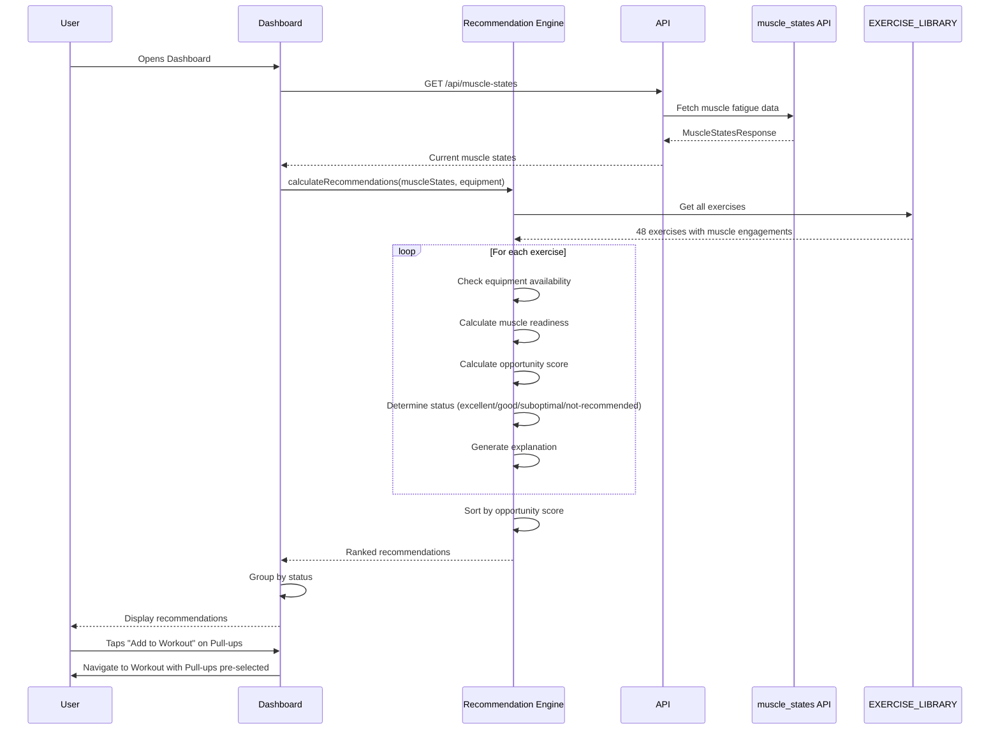

# Proposal: Enable Smart Exercise Recommendations

**Change ID:** `enable-smart-exercise-recommendations`
**Status:** Proposed
**Created:** 2025-10-25
**Author:** Development Team
**Priority:** 4 (Intelligence Layer - Foundation for AI Coach)

---

## Why

Users can now see which muscles are recovered (muscle heat map) and have smart workout continuation, but the system doesn't actively **recommend specific exercises** based on muscle readiness and equipment availability. This gap prevents FitForge from becoming the truly intelligent training assistant envisioned in the brainstorming session.

**User Pain Points:**
- "I know my lats are fresh, but which exercises should I do?"
- "The app shows my triceps are fatigued - what can I train instead?"
- "I want to work my fresh muscles but don't know the best exercise combinations"
- "I'm confused which exercises will work well together given my current fatigue state"
- "The heat map shows data but doesn't give me actionable guidance"

---

## Problem Statement

**Current Behavior:**
- Muscle fatigue heat map displays recovery status (✅ implemented)
- Users can see which muscles are ready vs fatigued
- Exercise library exists with muscle engagement data
- BUT: No intelligent exercise recommendations based on muscle state
- Users must manually choose exercises from the full library
- No guidance on "optimal muscle pairing" (avoiding fatigued limiting factors)

**Why This Matters:**
1. **Missed Training Efficiency** - Users might choose exercises where fatigued muscles limit performance
2. **Analysis Paralysis** - 48 exercises to choose from with no guidance
3. **Suboptimal Pairings** - Fresh triceps but user picks bench press where fatigued pecs limit tricep work
4. **Vision Gap** - Heat map shows data but doesn't answer "what should I DO about it?"
5. **Blocks Future Features** - Smart recommendations foundation needed for AI coach integration

---

## Proposed Solution

Implement a **Smart Exercise Recommendations System** that:

1. **Analyzes current muscle state** - Uses real-time fatigue data from muscle_states API
2. **Filters by equipment availability** - Only recommends exercises user can perform
3. **Calculates "opportunity scores"** - Ranks exercises by potential effectiveness given current state
4. **Detects limiting factors** - Identifies when fatigued muscles will restrict performance
5. **Provides category-based recommendations** - "Best exercises for Push/Pull/Legs right now"
6. **Shows exercise details** - Muscle engagement, equipment needed, difficulty
7. **Explains recommendations** - "Why this exercise?" context for each suggestion
8. **Enables quick workout building** - "Add recommended exercise" one-tap functionality

**Core Innovation:**
**Optimal Muscle Pairing Algorithm** - Don't just recommend fresh muscles, recommend exercises where NO limiting factors exist (all engaged muscles are recovered).

---

## User Experience

### Before (Current State)
```
User opens Dashboard → Sees muscle heat map
Lats: 10% fatigued (green, ready)
Biceps: 5% fatigued (green, ready)
Pecs: 85% fatigued (red, needs rest)
Triceps: 90% fatigued (red, needs rest)

User navigates to Workout → Must manually select from 48 exercises
No guidance on which exercises will work well
Might pick "Dumbbell Pullover" (Pecs 65%, Lats 60%)
  → Pecs fail at rep 3, Lats don't get fully worked (inefficient)
```

### After (Proposed)
```
User opens Dashboard → Sees muscle heat map + Recommendations

RECOMMENDED FOR YOU RIGHT NOW:

PULL EXERCISES (7 ready)
1. ⭐ Pull-ups (Excellent opportunity)
   Lats 85%, Biceps 30%, Rhomboids 20%, Forearms 25%
   Status: ✅ All muscles ready
   Equipment: ✅ Pull-up Bar available
   Why: Primary muscles fresh, no limiting factors
   [Add to Workout]

2. ⭐ Dumbbell Row (Excellent opportunity)
   Lats 75%, Rhomboids 35%, Biceps 20%
   Status: ✅ All muscles ready
   Equipment: ✅ Dumbbells available
   [Add to Workout]

3. ⚠️ Dumbbell Pullover (Suboptimal)
   Pecs 65%, Lats 60%, Deltoids 50%, Triceps 25%
   Status: ⚠️ Pecs 85% fatigued (limiting factor)
   Why: Pecs will fail before Lats get fully worked
   Equipment: ✅ Dumbbells available
   [View Anyway]

PUSH EXERCISES (2 ready, 5 not recommended due to fatigue)
[Collapsed - expand to see limited options]

User taps "Add to Workout" → Exercise auto-added with progressive overload
```

---

## Success Criteria

1. **Recommendations display** - Shows exercises ranked by opportunity score
2. **Equipment filtering works** - Only shows exercises user can perform
3. **Limiting factor detection accurate** - Correctly identifies when fatigued muscles restrict performance
4. **Color coding clear** - ⭐ Excellent (all fresh), ✅ Good (mostly fresh), ⚠️ Suboptimal (limiting factors), ❌ Not recommended (primary muscles fatigued)
5. **Explanations provided** - "Why" text explains recommendation reasoning
6. **Quick add functional** - Can add recommended exercise to workout in one tap
7. **Category filtering** - Can filter by Push/Pull/Legs/Core
8. **Real-time updates** - Recommendations refresh after workout logged
9. **Responsive design** - Works on mobile, scrollable list

---

## Implementation Scope

### In Scope
- Dashboard component enhancement: recommendation section
- Algorithm: Calculate opportunity score per exercise
  - Formula: `opportunityScore = avgFreshness - maxLimitingFactor`
  - `avgFreshness = average recovery % of primary muscles (>50% engagement)`
  - `maxLimitingFactor = highest fatigue % of ANY engaged muscle`
- Equipment filtering logic (match exercise.equipment vs user.equipment)
- Recommendation ranking and sorting
- Visual indicators (⭐ ✅ ⚠️ ❌ status icons)
- "Why" explanation text generation
- "Add to Workout" quick action
- Category-based filtering (Push/Pull/Legs/Core toggle)
- Collapsible category sections for "not recommended" exercises

### Out of Scope
- AI-generated workout plans (Priority 5+, requires Claude Code integration)
- Baseline learning algorithm (Phase 4+, requires research)
- Personal muscle engagement calibration (future)
- Form/technique recommendations (moonshot)
- Video demonstrations of exercises (moonshot)
- Social recommendations ("exercises your friends are doing")
- Progression history charts for exercises (future analytics)
- Custom exercise creation (fixed library for V1)

---

## Dependencies

**Requires:**
- ✅ Muscle fatigue heat map (Priority 2 - implemented)
- ✅ Muscle states API (GET /api/muscle-states - exists)
- ✅ Exercise library with muscle engagement data (constants.ts - 48 exercises)
- ✅ Equipment tracking in user profile (exists)
- ✅ Workout logging system (exists)

**Enables:**
- Future AI coach integration (can leverage recommendation algorithm)
- Template optimization analysis (identify which templates recommend well)
- Historical analytics ("which recommendations did you follow vs ignore?")
- Quick-add interface improvements

**Blocks:**
- Nothing (standalone intelligence feature)

---

## Technical Design

### Opportunity Score Algorithm

```typescript
interface ExerciseRecommendation {
  exercise: Exercise;
  opportunityScore: number;
  primaryMuscles: { muscle: Muscle; recovery: number; engagement: number }[];
  limitingFactors: { muscle: Muscle; fatigue: number; engagement: number }[];
  status: 'excellent' | 'good' | 'suboptimal' | 'not-recommended';
  explanation: string;
  equipmentAvailable: boolean;
}

function calculateRecommendations(
  muscleStates: MuscleStatesResponse,
  equipment: EquipmentItem[],
  category?: ExerciseCategory
): ExerciseRecommendation[] {

  const exercises = category
    ? EXERCISE_LIBRARY.filter(ex => ex.category === category)
    : EXERCISE_LIBRARY;

  const recommendations: ExerciseRecommendation[] = [];

  for (const exercise of exercises) {
    // 1. Check equipment availability
    const equipmentAvailable = checkEquipmentAvailable(exercise.equipment, equipment);
    if (!equipmentAvailable) continue;

    // 2. Calculate muscle readiness
    const muscleReadiness = exercise.muscleEngagements.map(eng => {
      const state = muscleStates[eng.muscle];
      const recovery = state ? (100 - state.currentFatiguePercent) : 100;
      return { muscle: eng.muscle, recovery, engagement: eng.percentage };
    });

    // 3. Identify primary muscles (>50% engagement)
    const primaryMuscles = muscleReadiness.filter(m => m.engagement >= 50);

    // 4. Calculate average freshness of primary muscles
    const avgFreshness = primaryMuscles.length > 0
      ? primaryMuscles.reduce((sum, m) => sum + m.recovery, 0) / primaryMuscles.length
      : 0;

    // 5. Find limiting factors (most fatigued muscle)
    const maxFatigue = Math.max(...muscleReadiness.map(m => 100 - m.recovery));
    const limitingFactors = muscleReadiness.filter(m => (100 - m.recovery) > 66);

    // 6. Calculate opportunity score
    const opportunityScore = avgFreshness - (maxFatigue * 0.5);

    // 7. Determine status
    let status: 'excellent' | 'good' | 'suboptimal' | 'not-recommended';
    if (limitingFactors.length === 0 && avgFreshness >= 90) {
      status = 'excellent';
    } else if (limitingFactors.length === 0 && avgFreshness >= 70) {
      status = 'good';
    } else if (limitingFactors.length > 0 && avgFreshness >= 50) {
      status = 'suboptimal';
    } else {
      status = 'not-recommended';
    }

    // 8. Generate explanation
    const explanation = generateExplanation(status, primaryMuscles, limitingFactors);

    recommendations.push({
      exercise,
      opportunityScore,
      primaryMuscles,
      limitingFactors,
      status,
      explanation,
      equipmentAvailable
    });
  }

  // Sort by opportunity score (highest first)
  return recommendations.sort((a, b) => b.opportunityScore - a.opportunityScore);
}

function generateExplanation(
  status: string,
  primary: { muscle: Muscle; recovery: number }[],
  limiting: { muscle: Muscle; fatigue: number }[]
): string {
  if (status === 'excellent') {
    return `All muscles fully recovered - maximum training potential`;
  } else if (status === 'good') {
    return `Primary muscles ready - good training opportunity`;
  } else if (status === 'suboptimal') {
    const limitedMuscle = limiting[0].muscle;
    return `${limitedMuscle} is ${limiting[0].fatigue.toFixed(0)}% fatigued and may limit performance`;
  } else {
    return `Primary muscles need more recovery time`;
  }
}

function checkEquipmentAvailable(
  requiredEquipment: Equipment | Equipment[],
  userEquipment: EquipmentItem[]
): boolean {
  const required = Array.isArray(requiredEquipment) ? requiredEquipment : [requiredEquipment];
  return required.every(req =>
    userEquipment.some(ue => ue.type === req && ue.quantity > 0)
  );
}
```

### UI Component Structure

```typescript
// components/ExerciseRecommendations.tsx
interface ExerciseRecommendationsProps {
  muscleStates: MuscleStatesResponse;
  equipment: EquipmentItem[];
  category?: ExerciseCategory;
  onAddToWorkout: (exercise: Exercise) => void;
}

const ExerciseRecommendations: React.FC<ExerciseRecommendationsProps> = ({
  muscleStates,
  equipment,
  category,
  onAddToWorkout
}) => {
  const recommendations = useMemo(
    () => calculateRecommendations(muscleStates, equipment, category),
    [muscleStates, equipment, category]
  );

  const excellent = recommendations.filter(r => r.status === 'excellent');
  const good = recommendations.filter(r => r.status === 'good');
  const suboptimal = recommendations.filter(r => r.status === 'suboptimal');
  const notRecommended = recommendations.filter(r => r.status === 'not-recommended');

  return (
    <div className="exercise-recommendations">
      <h2>Recommended Exercises</h2>

      {excellent.length > 0 && (
        <RecommendationSection
          title="⭐ Excellent Opportunities"
          recommendations={excellent}
          onAdd={onAddToWorkout}
        />
      )}

      {good.length > 0 && (
        <RecommendationSection
          title="✅ Good Options"
          recommendations={good}
          onAdd={onAddToWorkout}
        />
      )}

      {suboptimal.length > 0 && (
        <CollapsibleSection title="⚠️ Suboptimal (Limiting Factors Detected)">
          <RecommendationSection
            recommendations={suboptimal}
            onAdd={onAddToWorkout}
          />
        </CollapsibleSection>
      )}

      {notRecommended.length > 0 && (
        <CollapsibleSection title="❌ Not Recommended (Needs Recovery)">
          <RecommendationSection
            recommendations={notRecommended}
            onAdd={onAddToWorkout}
          />
        </CollapsibleSection>
      )}
    </div>
  );
};
```

---

## Data Flow



---

## Risks & Mitigation

| Risk | Impact | Mitigation |
|------|--------|------------|
| Recommendation algorithm too conservative | Medium | Allow users to view "suboptimal" exercises, just warn them |
| Users confused by opportunity score | Low | Hide score, show status icons only (⭐ ✅ ⚠️ ❌) |
| Equipment filtering excludes too many exercises | Medium | Show "not available" exercises in collapsed section with note |
| Limiting factor detection false positives | Low | Use 66% fatigue threshold (conservative), clear explanation |
| Performance issues (48 exercises × calculation) | Low | Memoize recommendations, recalculate only on muscle state change |
| Overwhelming number of recommendations | Medium | Group by status, collapse "not recommended" by default |
| Users ignore recommendations | Low | Track usage analytics (future), iterate based on data |

---

## Alternatives Considered

### Alternative 1: Simple "Ready" Filter Only
- **Rejected:** Doesn't account for limiting factors
- Example: Shows bench press even if pecs are fatigued (triceps are ready)
- Misses core innovation of optimal muscle pairing

### Alternative 2: AI-Generated Workout Plans (GPT Integration)
- **Deferred:** Too complex for MVP, requires external API
- Start with rule-based algorithm, upgrade to AI in Phase 5+
- Current approach provides foundation for future AI integration

### Alternative 3: User Rates Exercises (Preference Learning)
- **Deferred:** Requires historical data and machine learning
- V1 = objective muscle state only, V2+ = incorporate user preferences

### Alternative 4: Only Recommend Exercises from Templates
- **Rejected:** Limits flexibility, user might not have right template
- Full exercise library gives more options

---

## Open Questions

1. **Should recommendations default to category-filtered or show all?**
   - Answer: Default to category-filtered (Push/Pull/Legs tabs), show "All" option

2. **What if NO exercises are recommended (all muscles fatigued)?**
   - Answer: Show rest day message: "All muscles need recovery. Take a rest day or do light mobility work."

3. **Should we weight muscle engagement % in the score?**
   - Answer: Yes - primary muscles (>50% engagement) are weighted heavily in avgFreshness calculation

4. **How many recommendations to show initially?**
   - Answer: Top 3 "excellent", Top 3 "good", collapse rest

5. **Should "Add to Workout" auto-populate progressive overload?**
   - Answer: Yes - if exercise was done before, show +3% suggestion (leverages Priority 1 feature)

6. **What if user has no equipment entered in profile?**
   - Answer: Show all exercises with warning "Equipment filter disabled - update profile to customize"

---

## Related Changes

- **Depends on:**
  - `enable-muscle-fatigue-heat-map` (Priority 2 - provides muscle state data)
  - `enable-smart-workout-continuation` (Priority 1 - provides progressive overload logic)
- **Enables:**
  - Future AI coach integration (recommendation algorithm is foundation)
  - Template optimization analysis
  - Quick-add interface improvements
- **Related to:**
  - `enable-failure-tracking-and-pr-detection` (Priority 3 - better data quality improves recommendations over time)

---

## Implementation Plan

### Phase 1: Core Algorithm (Week 1)
1. Create `utils/exerciseRecommendations.ts`
2. Implement `calculateRecommendations()` function
3. Implement opportunity score calculation
4. Implement limiting factor detection
5. Write unit tests for algorithm edge cases

### Phase 2: UI Components (Week 1-2)
1. Create `components/ExerciseRecommendations.tsx`
2. Create `components/RecommendationCard.tsx`
3. Implement status icons and color coding
4. Implement collapsible sections
5. Add "Add to Workout" quick action

### Phase 3: Integration (Week 2)
1. Integrate recommendations into Dashboard
2. Add category filtering tabs
3. Wire up "Add to Workout" to Workout component
4. Test real-time updates after workout logging
5. Mobile responsive design adjustments

### Phase 4: Polish & Testing (Week 2)
1. Add help text / tooltips for explanations
2. Performance optimization (memoization)
3. Edge case handling (no equipment, all fatigued, etc.)
4. User testing feedback iteration
5. Documentation updates

**Estimated Timeline:** 2 weeks for complete MVP

---

## Next Steps

1. Review and approve this proposal
2. Create `design.md` (detailed algorithm specification)
3. Write spec deltas for capabilities:
   - `exercise-recommendation-algorithm` (opportunity scoring, limiting factor detection)
   - `recommendation-ui-display` (status icons, grouping, explanations)
   - `quick-add-integration` (one-tap add to workout)
4. Create `tasks.md` with phased implementation steps
5. Validate with `openspec validate enable-smart-exercise-recommendations --strict`
6. Begin implementation

---

*This proposal advances FitForge toward the "intelligent muscle capacity learning system" vision from the brainstorming session (docs/brainstorming-session-results.md) by providing actionable, data-driven exercise guidance based on real-time muscle readiness.*
