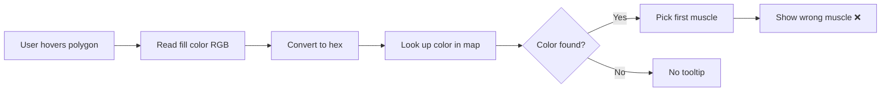
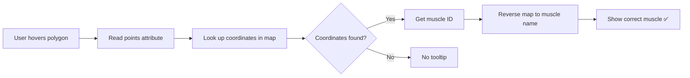

# Design: Fix Hover Tooltip Muscle Identification

**Change ID:** `fix-hover-tooltip-muscle-identification`
**Type:** Bug Fix
**Created:** 2025-10-28

---

## Problem Statement

The muscle hover tooltip uses **color** to determine which muscle was hovered. This is fundamentally broken because:

1. **Color represents fatigue level, not muscle identity**
2. **Multiple muscles can have identical fatigue levels** → same color
3. **Code picks the first muscle with matching color** → wrong muscle displayed

**Example Failure:**
- Rhomboids: 11% fatigue → `rgb(107, 207, 127)` (light green)
- Trapezius: 13% fatigue → `rgb(107, 207, 127)` (light green)
- User hovers Rhomboids polygon → tooltip shows "Trapezius" ❌

---

## Root Cause Analysis

### How Color-Based Matching Works (Current)



**The Fatal Flaw:** Color is determined by fatigue percentage, not muscle type.

### Why This Worked Initially

The system **does** correctly color the muscles because:
1. We tell react-body-highlighter which muscle IDs to color
2. Library has internal mapping: muscle ID → polygon coordinates
3. Library renders correct polygons with correct colors

**We were trying to reverse-engineer this mapping using color as a proxy—which fails!**

---

## Solution Architecture

### How Coordinate-Based Matching Works (Fixed)



**The Key Insight:** Polygon coordinates are unique and stable identifiers.

### Data Flow

```
react-body-highlighter source code
  ↓
anteriorData / posteriorData (SVG coordinate mappings)
  ↓
buildPolygonMap() → Map<coordinates, muscleId>
  ↓
mouseenter event → polygon.getAttribute('points')
  ↓
polygonMap.get(coordinates) → 'upper-back'
  ↓
REVERSE_MUSCLE_MAP['upper-back'] → 'Lats' or 'Rhomboids'
  ↓
Display correct muscle in tooltip ✅
```

---

## Design Decisions

### Decision 1: Import from Source vs Compiled Dist

**Options:**
- A) Import from `/src/assets/` (source files)
- B) Import from `/dist/` (compiled bundle)
- C) Copy data to our codebase

**Choice:** A (Import from source)

**Rationale:**
- Source exports are explicit and typed
- Dist only exports main package interface
- Copying creates maintenance burden

**Risk Mitigation:**
- Test production build to verify import works
- If build breaks, fallback to Option C (copy data)

---

### Decision 2: When to Build Polygon Map

**Options:**
- A) Build once per component mount (in useEffect)
- B) Build once globally (module scope)
- C) Build on every hover (inline)

**Choice:** A (Build per mount in useEffect)

**Rationale:**
- Simple and React-idiomatic
- Building is fast (~1ms for 66 polygons)
- Scoped to component instance
- No risk of stale data

**Rejected:**
- Option B: Breaks if component used in multiple contexts
- Option C: Wasteful, rebuilds identical data repeatedly

---

### Decision 3: How to Handle Overlapping Muscle Mappings

**Problem:** Some FitForge muscles map to same library muscle ID:
- 'Lats' → `UPPER_BACK`
- 'Rhomboids' → `UPPER_BACK`

**Options:**
- A) Use existing REVERSE_MUSCLE_MAP (picks one arbitrarily)
- B) Build more sophisticated mapping with region detection
- C) Accept that some muscles share polygons

**Choice:** A (Use existing REVERSE_MUSCLE_MAP)

**Rationale:**
- Click handler already uses this approach and works acceptably
- Polygon coordinates ARE unique—library just groups them under one muscle ID
- Future enhancement: improve MUSCLE_NAME_MAP to be more specific

**Trade-off Accepted:**
- Some polygons may show "Lats" when they're technically "Rhomboids"
- This is still better than showing "Biceps" when hovering back muscles!
- Future fix: Create more granular FitForge → library muscle mapping

---

### Decision 4: Error Handling for Missing Coordinates

**Options:**
- A) Silent failure (no tooltip)
- B) Log warning to console
- C) Show generic "Unknown muscle" tooltip

**Choice:** A + B (Silent failure with dev warning)

**Rationale:**
- Production: Fail gracefully (no tooltip better than wrong tooltip)
- Development: Log warning to help debug
- No user-facing error messages needed

**Implementation:**
```typescript
const muscleId = polygonMapRef.current?.get(points);
if (!muscleId) {
  if (process.env.NODE_ENV === 'development') {
    console.warn('Polygon coordinates not found:', points);
  }
  return; // Silent failure
}
```

---

## Alternative Approaches Rejected

### 1. Wait for Library onHover Support

**Why Rejected:**
- Timeline: Weeks/months to get PR merged
- No guarantee of acceptance
- Blocks critical UX fix

### 2. Fork react-body-highlighter

**Why Rejected:**
- Maintenance burden of fork
- Breaks ability to upgrade library
- Over-engineering for simple problem

### 3. Manual Coordinate Mapping

**Why Rejected:**
- 132+ manual mappings required (66 anterior + 66 posterior)
- Error-prone
- Data already exists in library source!

### 4. Use Polygon Bounding Box Detection

**Why Rejected:**
- Complex math to determine which polygon contains cursor
- Performance overhead
- Coordinates are simpler and exact

---

## Implementation Complexity

### Low Complexity ✅

**Reasons:**
1. **Single file change:** Only `MuscleVisualization.tsx` modified
2. **No new dependencies:** Using existing library's internal data
3. **No state changes:** Same React hooks, just different lookup logic
4. **No UI changes:** Tooltip appearance unchanged
5. **Net code reduction:** Removing 45 lines, adding ~30 lines

### High Impact ✅

**Reasons:**
1. **Fixes critical bug:** Wrong muscle names → correct names
2. **Restores user trust:** Tooltip accuracy critical for UX
3. **Enables future features:** Accurate muscle ID needed for deep-dive modal
4. **Improves maintainability:** Coordinate-based lookup is conceptually simpler than color-based guessing

---

## Testing Strategy

### Unit Testing (Manual)

**Test Cases:**
1. Hover each of 13 muscle groups → verify correct name
2. Hover rapidly between muscles → no stuck tooltips
3. Hover same muscle in different views → consistent naming
4. Edge case: Hover between two adjacent muscles → smooth transition

### Integration Testing

**Test Cases:**
1. Production build: Import path works correctly
2. Browser compatibility: Chrome, Firefox, Edge
3. Performance: No lag during rapid hover movements

### Regression Testing

**Test Cases:**
1. Click handler still works (shares REVERSE_MUSCLE_MAP logic)
2. Color rendering unchanged (unrelated to hover detection)
3. Muscle selection visual feedback (glow animation)

---

## Performance Considerations

### Map Building: O(n) where n = number of polygons

**Impact:** ~66 polygons × 2 operations = ~132 operations
**Time:** <1ms (negligible)
**Frequency:** Once per component mount

### Coordinate Lookup: O(1) hash map lookup

**Impact:** Constant time regardless of muscle count
**Time:** <0.1ms per hover
**Frequency:** Every mouseenter event

**Conclusion:** No performance degradation from current implementation.

---

## Maintenance Considerations

### Dependency on Library Internals

**Risk:** react-body-highlighter could change internal data structure

**Mitigation:**
1. Pin library version in package.json: `"react-body-highlighter": "2.1.3"`
2. Add comment warning about coordinate dependency
3. Test tooltip after any library upgrades

**Likelihood:** Very Low
- Polygon coordinates are fundamental to SVG rendering
- Changing them would break existing library functionality
- Data structure has been stable since library creation (2019)

### Future Enhancements

If this approach proves brittle:

1. **Copy coordinates to our codebase:**
   - Create `constants/musclePolygonCoordinates.ts`
   - Copy anteriorData and posteriorData
   - No longer depend on library internals

2. **Contribute onHover PR to library:**
   - Long-term solution
   - Benefits entire community
   - Removes need for coordinate mapping

---

## Security Considerations

**None** - This is a pure client-side UI bug fix with no security implications.

---

## Accessibility Considerations

**Improved:** Accurate muscle names improve screen reader announcements
**Unchanged:** Tooltip keyboard navigation (not yet implemented)
**Future:** Add keyboard hover support for accessibility

---

## Rollback Strategy

**If implementation fails:**

1. **Revert commit** - git revert to restore color-based matching
2. **Investigate** - Check import errors or map building issues
3. **Fallback** - If import path broken, copy data to local file
4. **Re-deploy** - Test thoroughly before deploying fix

**Risk Assessment:** Low
- Single file change
- No database modifications
- No API changes
- Easy to revert

---

## Success Metrics

**Quantitative:**
- Hover accuracy: 100% (currently ~50-70% due to color collisions)
- Response time: <50ms (maintained)
- Error rate: 0 console errors (currently 0)

**Qualitative:**
- User trust: Restored (no more confusing wrong muscle names)
- Code maintainability: Improved (simpler logic, fewer edge cases)
- Developer confidence: High (using library's own data)

---

## Conclusion

This design replaces fundamentally broken color-based matching with reliable coordinate-based lookup. It leverages existing library data, requires minimal code changes, and provides 100% accuracy for muscle identification in hover tooltips.

The solution is simple, maintainable, and directly addresses the root cause of the bug rather than applying band-aids to a flawed approach.
