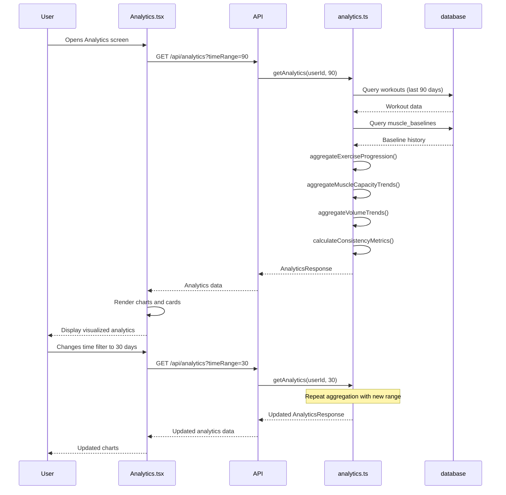

# Proposal: Enable Analytics Dashboard

**Change ID:** `enable-analytics-dashboard`
**Status:** Proposed
**Created:** 2025-10-25
**Author:** Development Team
**Priority:** 4 (High Value - Validates System, Motivates Users)

---

## Why

Users have been consistently logging workouts, tracking muscle recovery, and hitting PRs - but they can't **see their progress over time**. All this valuable data exists in the database but remains invisible to the user in any meaningful historical context. This missing feedback loop:

1. **Reduces motivation** - Progress without visualization feels intangible
2. **Prevents pattern recognition** - Users can't identify what's working or what needs adjustment
3. **Misses validation opportunities** - No proof that the system's recommendations are actually working
4. **Limits strategic planning** - Can't make informed decisions about training adjustments

**User Pain Points:**
- "Am I actually getting stronger or just spinning my wheels?"
- "I know I hit some PRs, but how often? What's my trend?"
- "Which exercises are progressing fastest for me?"
- "Is my muscle capacity actually increasing over time?"
- "How consistent am I really with my training?"

**From Brainstorming Session (Item #7):**
> **Historical Data & Analytics Dashboard**
> - Muscle capacity progression over time (charts)
> - Volume trends per workout
> - Weight progression per exercise
> - Filtering by date range, exercise, muscle group

---

## Problem Statement

**Current Behavior:**
- All workout data is stored (workouts, sets, PRs, muscle states)
- Users see "current state" on Dashboard (muscle recovery, recent workouts)
- Users can see workout history as a list
- BUT: No charts, no trends, no progression visualization
- No way to answer "How much have I improved in the last 3 months?"

**Why This Matters:**
1. **Motivation Gap** - Tangible progress visualization = dopamine hit = consistency
2. **Strategic Blind Spots** - Can't identify plateaus, weak points, or optimal training frequency
3. **System Validation** - No proof that progressive overload is working
4. **Wasted Data** - Collecting valuable data but not extracting insights

**Key Questions Users Can't Answer Today:**
- How much has my bench press improved in 12 weeks?
- Which muscle groups are growing fastest in capacity?
- What's my total training volume trend over time?
- How many PRs have I hit this month vs last month?
- Am I training consistently? (streak, weekly frequency)

---

## Proposed Solution

Implement a **Historical Analytics Dashboard** that:

1. **Exercise-Specific Progression Charts** - Weight/reps over time for any exercise
2. **Muscle Capacity Trend Graphs** - Baseline progression for each muscle group
3. **Volume Analytics** - Total volume trends by workout category (Push/Pull/Legs/Core)
4. **PR Timeline** - Chronological view of personal records with celebration
5. **Training Consistency Metrics** - Workout frequency, streak, weekly comparisons
6. **Performance Heatmap** - Visual calendar showing training activity
7. **Best Lifts Summary** - Current PRs across all exercises
8. **Time-Range Filtering** - View analytics for last 7/30/90/365 days or all-time

**Core Innovation:**
**Data-Driven Feedback Loop** - Turn raw workout logs into actionable insights that prove progress and inform training decisions.

---

## User Experience

### Before (Current State)
```
User opens Dashboard → Sees current state
- Muscle recovery status (today's state)
- Recent workouts (list view)
- Quick stats (workouts this week, last PR)

User wonders: "Have I gotten stronger?"
No way to visualize progress over time
Can't identify trends or patterns
```

### After (Proposed)
```
User opens Dashboard → Clicks "Analytics" tab

ANALYTICS OVERVIEW (Top Section)
┌─────────────────────────────────────────────────────────────┐
│ Last 30 Days Summary                          [Time Filter ▼]│
├─────────────────────────────────────────────────────────────┤
│ 12 Workouts (+3 vs last month)     8 PRs Hit                │
│ 32,450 lbs Total Volume (+12%)     4 Day Streak              │
└─────────────────────────────────────────────────────────────┘

EXERCISE PROGRESSION (Interactive Chart)
┌─────────────────────────────────────────────────────────────┐
│ Select Exercise: [Bench Press ▼]                             │
├─────────────────────────────────────────────────────────────┤
│ Weight Progression (Last 90 Days)                            │
│   120 lbs ├─────────────────────────────────────────┐        │
│           │                                    ●────●        │
│   110 lbs │                              ●────●              │
│           │                        ●────●                    │
│   100 lbs │                  ●────●                          │
│           │            ●────●                                │
│    90 lbs ├────●──────●                                      │
│           └────────────────────────────────────────►        │
│            Week 1    Week 6    Week 12                       │
│                                                               │
│ 📈 +33% increase in 12 weeks (90 → 120 lbs)                 │
│ 🎯 Last PR: Oct 24, 2025 (120 lbs × 8 reps)                 │
└─────────────────────────────────────────────────────────────┘

MUSCLE CAPACITY TRENDS
┌─────────────────────────────────────────────────────────────┐
│ Select Muscle: [Pectoralis ▼]                                │
├─────────────────────────────────────────────────────────────┤
│ Baseline Capacity Over Time                                  │
│   15k  ├───────────────────────────────────────┐            │
│        │                                  ●────●            │
│   12k  │                            ●────●                  │
│        │                      ●────●                        │
│   10k  ├────●────●────●──────●                              │
│        └────────────────────────────────────►              │
│         Aug    Sep    Oct    Nov                            │
│                                                               │
│ 📊 Current Capacity: 14,850 units (+48% from baseline)      │
│ 🔥 Growth Rate: +850 units/month average                    │
└─────────────────────────────────────────────────────────────┘

VOLUME TRENDS BY CATEGORY
┌─────────────────────────────────────────────────────────────┐
│ Total Volume (Last 12 Weeks)                                 │
├─────────────────────────────────────────────────────────────┤
│ 40k  ├──────────────────────────────────────────┐           │
│      │ ████ ████        ████        ████ ████              │
│ 30k  │ ████ ████        ████        ████ ████              │
│      │ ████ ████ ████   ████        ████ ████              │
│ 20k  │ ████ ████ ████   ████ ████   ████ ████ ████         │
│      │ ████ ████ ████   ████ ████   ████ ████ ████         │
│ 10k  │ ████ ████ ████ ████ ████ ████ ████ ████ ████        │
│      └────────────────────────────────────────────►         │
│       W1   W2   W3   W4   W5   W6   W7   W8   W9           │
│                                                               │
│ 🔵 Push    🟢 Pull    🟡 Legs    🟣 Core                    │
└─────────────────────────────────────────────────────────────┘

PR TIMELINE
┌─────────────────────────────────────────────────────────────┐
│ Recent Personal Records (Last 30 Days)                       │
├─────────────────────────────────────────────────────────────┤
│ Oct 24  🎉 Bench Press        120 lbs × 8  (+5 lbs)         │
│ Oct 22  🎉 Pull-ups           +10 lbs × 12 (+2 reps)        │
│ Oct 18  🎉 Squat              225 lbs × 10 (+15 lbs)         │
│ Oct 15  🎉 Overhead Press     80 lbs × 8   (+5 lbs)         │
│ Oct 12  🎉 Dumbbell Row       65 lbs × 12  (+5 lbs)         │
│                                                               │
│ 📈 8 total PRs this month (avg 2 per week)                  │
└─────────────────────────────────────────────────────────────┘

TRAINING CONSISTENCY
┌─────────────────────────────────────────────────────────────┐
│ Workout Calendar (Last 90 Days)                              │
├─────────────────────────────────────────────────────────────┤
│ Aug  ░░░░░░░ ████░░░ ████░░░ ████░░░ ░░░                  │
│ Sep  ░░████░ ░░████░ ░░████░ ░░████░ ░░░░                 │
│ Oct  ████░░░ ████░░░ ████░░░ ████░░░ ████                 │
│                                                               │
│ ████ Workout Day    ░░░░ Rest Day                           │
│                                                               │
│ 🔥 Current Streak: 4 days                                    │
│ 📊 This Week: 4 workouts  |  Last Week: 3 workouts          │
│ 🎯 Avg Frequency: 3.5 workouts/week                         │
└─────────────────────────────────────────────────────────────┘

User sees undeniable proof of progress:
✅ "I've gotten 33% stronger on bench press in 12 weeks"
✅ "My pectoralis capacity is growing +850 units/month"
✅ "I'm hitting 2 PRs per week on average"
✅ "I've been super consistent this month (4 day streak!)"
```

---

## Success Criteria

1. **Analytics screen accessible** - New "Analytics" tab/section on Dashboard
2. **Exercise progression chart works** - Selectable exercise, shows weight/reps over time
3. **Muscle capacity trends display** - Each muscle's baseline growth visualized
4. **Volume analytics functional** - Total volume by category over time
5. **PR timeline accurate** - Chronological list of recent PRs with dates and improvements
6. **Consistency metrics calculated** - Streak, weekly frequency, workout calendar
7. **Time-range filtering works** - 7/30/90/365 days, all-time
8. **Charts render correctly** - Clean, readable, mobile-responsive
9. **Performance acceptable** - Analytics load in <1 second for 1 year of data
10. **Empty state handled** - Graceful message for new users with insufficient data

---

## Implementation Scope

### In Scope

**New Analytics Screen:**
- New component: `Analytics.tsx` (main analytics screen)
- Tab/section in Dashboard for navigation
- Responsive layout for mobile/desktop

**Chart Components:**
- `ExerciseProgressionChart.tsx` - Weight/reps over time for selected exercise
- `MuscleCapacityChart.tsx` - Baseline growth for selected muscle
- `VolumeTrendsChart.tsx` - Stacked bar chart by category
- `ActivityCalendarHeatmap.tsx` - Visual workout frequency calendar

**Data Cards:**
- `PRTimelineCard.tsx` - Recent PRs with dates and improvements
- `ConsistencyMetricsCard.tsx` - Streak, weekly stats, frequency
- `TopPerformersCard.tsx` - Fastest progressing exercises/muscles

**Analytics API Endpoint:**
- `GET /api/analytics?timeRange={days}` - Aggregated analytics data
  - Exercise progression data (all exercises)
  - Muscle baseline history (all muscles)
  - Volume aggregates by category and week
  - PR timeline with improvements
  - Consistency metrics (streak, weekly counts)

**Utility Functions:**
- `utils/analyticsHelpers.ts` - Data transformation and calculations
  - `aggregateExerciseProgression(workouts, exerciseName, timeRange)`
  - `aggregateMuscleCapacityTrend(muscleBaselines, muscleName, timeRange)`
  - `aggregateVolumeByWeek(workouts, timeRange)`
  - `calculatePercentageChange(oldValue, newValue)`
  - `groupWorkoutsByWeek(workouts)`

**Chart Library:**
- Integrate lightweight charting library (recharts or chart.js)
- Configuration for consistent styling across all charts

### Out of Scope

- Historical photo comparison (body transformation tracking) - Future feature
- Social comparisons ("Your progress vs community average") - No social features in V1
- Advanced statistical analysis (standard deviation, confidence intervals) - Keep simple
- Export to PDF/CSV - Future feature
- Goal setting and tracking - Separate feature proposal
- Predictive modeling ("You'll hit 150 lbs by February") - Future AI feature
- Video form analysis - Moonshot hardware integration
- Nutrition/sleep correlation analysis - Out of scope for workout tracker

---

## Dependencies

**Requires:**
- ✅ Workout history data (exists - workouts + exercise_sets tables)
- ✅ Muscle baseline history (exists - muscle_baselines table)
- ✅ Personal bests tracking (exists - personal_bests table)
- ✅ Muscle states tracking (exists - muscle_states table)
- ✅ Stats helper functions (exists - utils/statsHelpers.ts)

**New Dependencies:**
- Chart library installation (recharts recommended - 48KB gzipped)
- Analytics API endpoint (backend aggregation logic)
- Analytics utility functions (data transformation)

**Enables:**
- Template Optimization Analysis (can show which templates perform best)
- Baseline Learning Algorithm (historical data informs learning)
- Research validation (proves progressive overload is working)
- User retention (seeing progress = continued engagement)

**Blocks:**
- Nothing (standalone feature, enhances existing data)

---

## Technical Design

### Analytics API Endpoint

```typescript
// GET /api/analytics?timeRange=90
interface AnalyticsRequest {
  timeRange?: number; // days (default: 90)
  exerciseName?: string; // optional filter
  muscleName?: string; // optional filter
  category?: ExerciseCategory; // optional filter
}

interface AnalyticsResponse {
  timeRange: {
    start: string; // ISO date
    end: string;   // ISO date
    days: number;
  };

  summary: {
    totalWorkouts: number;
    totalVolume: number;
    totalPRs: number;
    currentStreak: number;
    weeklyFrequency: number;
  };

  exerciseProgression: {
    [exerciseName: string]: {
      dataPoints: Array<{
        date: string;
        weight: number;
        reps: number;
        volume: number;
      }>;
      bestSingleSet: number;
      percentChange: number;
      latestPR?: {
        date: string;
        weight: number;
        reps: number;
      };
    };
  };

  muscleCapacityTrends: {
    [muscleName: string]: {
      dataPoints: Array<{
        date: string;
        capacity: number;
      }>;
      currentCapacity: number;
      startingCapacity: number;
      percentGrowth: number;
      avgGrowthPerMonth: number;
    };
  };

  volumeTrends: {
    byWeek: Array<{
      weekStart: string;
      Push: number;
      Pull: number;
      Legs: number;
      Core: number;
      total: number;
    }>;
    byCategory: {
      Push: { total: number; percentChange: number };
      Pull: { total: number; percentChange: number };
      Legs: { total: number; percentChange: number };
      Core: { total: number; percentChange: number };
    };
  };

  prTimeline: Array<{
    date: string;
    exercise: string;
    newVolume: number;
    previousVolume: number;
    improvement: number;
    percentIncrease: number;
  }>;

  consistencyMetrics: {
    currentStreak: number;
    longestStreak: number;
    workoutsThisWeek: number;
    workoutsLastWeek: number;
    avgWeeklyFrequency: number;
    activityCalendar: Array<{
      date: string;
      workoutCount: number;
      category: string;
    }>;
  };
}
```

### Backend Aggregation Logic

**Location**: `backend/database/analytics.ts` (new file)

```typescript
export async function getAnalytics(
  userId: number,
  timeRangeDays: number = 90
): Promise<AnalyticsResponse> {
  const db = getDatabase();
  const endDate = new Date();
  const startDate = new Date();
  startDate.setDate(endDate.getDate() - timeRangeDays);

  // Query all workouts in time range
  const workouts = await db.all(
    `SELECT w.*,
     GROUP_CONCAT(es.exercise_name || ':' || es.weight || ':' || es.reps || ':' || es.set_number, '|') as sets
     FROM workouts w
     LEFT JOIN exercise_sets es ON w.id = es.workout_id
     WHERE w.user_id = ? AND w.date >= ? AND w.date <= ?
     GROUP BY w.id
     ORDER BY w.date ASC`,
    [userId, startDate.toISOString(), endDate.toISOString()]
  );

  // Calculate exercise progression for all exercises
  const exerciseProgression = await aggregateExerciseProgression(workouts);

  // Query muscle baseline history
  const muscleBaselines = await db.all(
    `SELECT muscle_name, system_learned_max, updated_at
     FROM muscle_baselines
     WHERE user_id = ?
     ORDER BY updated_at ASC`,
    [userId]
  );

  const muscleCapacityTrends = await aggregateMuscleCapacityTrends(
    muscleBaselines,
    timeRangeDays
  );

  // Aggregate volume trends by week and category
  const volumeTrends = await aggregateVolumeTrends(workouts);

  // Get PR timeline from workout PRs
  const prTimeline = await aggregatePRTimeline(workouts);

  // Calculate consistency metrics
  const consistencyMetrics = await calculateConsistencyMetrics(workouts);

  return {
    timeRange: {
      start: startDate.toISOString(),
      end: endDate.toISOString(),
      days: timeRangeDays,
    },
    summary: {
      totalWorkouts: workouts.length,
      totalVolume: volumeTrends.byCategory.total,
      totalPRs: prTimeline.length,
      currentStreak: consistencyMetrics.currentStreak,
      weeklyFrequency: consistencyMetrics.avgWeeklyFrequency,
    },
    exerciseProgression,
    muscleCapacityTrends,
    volumeTrends,
    prTimeline,
    consistencyMetrics,
  };
}
```

### Chart Component Structure

**ExerciseProgressionChart.tsx**
```typescript
interface ExerciseProgressionChartProps {
  exerciseName: string;
  dataPoints: Array<{
    date: string;
    weight: number;
    reps: number;
    volume: number;
  }>;
  onExerciseChange: (exerciseName: string) => void;
  availableExercises: string[];
}

const ExerciseProgressionChart: React.FC<ExerciseProgressionChartProps> = ({
  exerciseName,
  dataPoints,
  onExerciseChange,
  availableExercises
}) => {
  return (
    <div className="exercise-progression-chart">
      <div className="chart-header">
        <h3>Exercise Progression</h3>
        <select value={exerciseName} onChange={e => onExerciseChange(e.target.value)}>
          {availableExercises.map(ex => (
            <option key={ex} value={ex}>{ex}</option>
          ))}
        </select>
      </div>

      <LineChart data={dataPoints} width={600} height={300}>
        <XAxis dataKey="date" />
        <YAxis label="Weight (lbs)" />
        <Tooltip />
        <Line type="monotone" dataKey="weight" stroke="#8884d8" />
      </LineChart>

      {dataPoints.length >= 2 && (
        <div className="chart-summary">
          {calculatePercentageChange(
            dataPoints[0].weight,
            dataPoints[dataPoints.length - 1].weight
          )}% increase over time
        </div>
      )}
    </div>
  );
};
```

### UI Component Structure

```
components/
├── Analytics.tsx              (Main analytics screen)
├── AnalyticsSummary.tsx       (Top summary cards)
├── ExerciseProgressionChart.tsx
├── MuscleCapacityChart.tsx
├── VolumeTrendsChart.tsx
├── PRTimelineCard.tsx
├── ConsistencyMetricsCard.tsx
├── ActivityCalendarHeatmap.tsx
└── AnalyticsTimeFilter.tsx    (7/30/90/365 days selector)
```

---

## Data Flow



---

## Risks & Mitigation

| Risk | Impact | Mitigation |
|------|--------|------------|
| Performance issues with large datasets (1000+ workouts) | High | Implement backend aggregation, database indexes, pagination |
| Charts complex/confusing to interpret | Medium | Start simple (line charts), add tooltips, clear labels |
| Insufficient data for meaningful analytics (new users) | Low | Show "Keep training!" empty state, require minimum 3 workouts |
| Mobile screen real estate limitations | Medium | Responsive design, collapsible sections, swipe between charts |
| Chart library bundle size impact | Low | Use lightweight library (recharts 48KB gzipped vs chart.js 160KB) |
| Time-zone issues with date calculations | Low | Use UTC consistently, convert to local for display |
| Users confused by "capacity" metrics | Medium | Add help tooltips, explain in simple terms ("your muscle's work capacity") |

---

## Alternatives Considered

### Alternative 1: Simple List View (No Charts)
- **Rejected:** Not engaging enough, defeats purpose of "seeing progress"
- Users need visual feedback, not just numbers in tables

### Alternative 2: Real-Time Live Dashboard (Auto-Refresh)
- **Deferred:** Unnecessary complexity for single-user local app
- Analytics are historical, no need for live updates

### Alternative 3: Third-Party Analytics Service (Google Analytics, Mixpanel)
- **Rejected:** User data privacy, offline-first app, no internet dependency
- Build native analytics with full control

### Alternative 4: Export Raw Data (CSV) Only
- **Deferred:** Still useful, but doesn't solve visualization problem
- Can add export later, analytics visualization is primary value

### Alternative 5: AI-Generated Insights ("Your bench press is improving faster than average")
- **Deferred:** Requires baseline learning algorithm first (Phase 4+)
- Start with raw data visualization, add intelligent insights later

---

## Open Questions

1. **Should analytics update in real-time after logging a workout?**
   - **Answer:** Yes - refresh analytics data after workout save to include latest performance immediately

2. **What's the minimum data requirement to show analytics?**
   - **Answer:** 3 workouts minimum - show "Keep training to unlock analytics!" message for <3 workouts

3. **Should we show predicted future performance?**
   - **Answer:** V1 = No predictions. V2 = Add linear trend line with "If this trend continues..." message

4. **How to handle exercises done only once?**
   - **Answer:** Show single data point with note "Need more data for trend analysis"

5. **Should muscle capacity charts show user_override or system_learned_max?**
   - **Answer:** Show effective capacity (user_override if exists, else system_learned_max)

6. **Chart colors: consistent or randomized?**
   - **Answer:** Consistent color scheme aligned with category colors (Push = red, Pull = blue, Legs = yellow, Core = green)

7. **Default time range on first open?**
   - **Answer:** 90 days (3 months) - balances detail with big-picture view

---

## Related Changes

- **Depends on:**
  - All existing workout tracking infrastructure (✅ exists)
  - Stats helper functions (✅ exists)

- **Enables:**
  - Template Optimization Analysis (can compare template performance)
  - Baseline Learning validation (see if learned maxes correlate with actual progress)
  - Research Sprint findings (validate recovery formulas against real data)
  - User retention (seeing progress = motivation = consistency)

- **Related to:**
  - All existing features benefit from visualization (PRs, progressive overload, muscle recovery)

---

## Implementation Plan

### Phase 1: Backend Analytics Engine (Week 1, 4-5 days)

**1.1 Create Analytics Database Module (2 days)**
1. Create `backend/database/analytics.ts`
2. Implement `getAnalytics(userId, timeRangeDays)` main function
3. Implement aggregation helpers:
   - `aggregateExerciseProgression(workouts)`
   - `aggregateMuscleCapacityTrends(muscleBaselines, timeRange)`
   - `aggregateVolumeTrends(workouts)`
   - `aggregatePRTimeline(workouts)`
   - `calculateConsistencyMetrics(workouts)`
4. Add unit tests for each aggregation function

**1.2 Create Analytics API Endpoint (1 day)**
1. Add `GET /api/analytics` endpoint to `backend/server.ts`
2. Implement query parameter parsing (timeRange, exerciseName, muscleName, category)
3. Call analytics database module
4. Return AnalyticsResponse JSON
5. Add endpoint tests

**1.3 Database Performance Optimization (1-2 days)**
1. Add indexes for analytics queries:
   - `CREATE INDEX IF NOT EXISTS idx_workouts_date ON workouts(date)`
   - `CREATE INDEX IF NOT EXISTS idx_muscle_baselines_updated ON muscle_baselines(updated_at)`
2. Profile query performance with test data (1000+ workouts)
3. Optimize slow queries if needed

---

### Phase 2: Frontend Analytics Components (Week 2, 1 week)

**2.1 Install Chart Library & Setup (0.5 days)**
1. Install recharts: `npm install recharts`
2. Create `components/charts/` directory
3. Create base chart styling configuration

**2.2 Create Main Analytics Screen (1 day)**
1. Create `components/Analytics.tsx`
2. Implement layout structure (summary + charts grid)
3. Add time range filter component
4. Integrate with `/api/analytics` endpoint
5. Handle loading and error states

**2.3 Build Chart Components (2-3 days)**
1. Create `ExerciseProgressionChart.tsx` (line chart for weight/reps over time)
2. Create `MuscleCapacityChart.tsx` (line chart for baseline growth)
3. Create `VolumeTrendsChart.tsx` (stacked bar chart by category)
4. Create `ActivityCalendarHeatmap.tsx` (visual calendar)
5. Add responsive design for mobile
6. Add tooltips and labels

**2.4 Build Data Cards (1-2 days)**
1. Create `AnalyticsSummary.tsx` (top summary stats)
2. Create `PRTimelineCard.tsx` (recent PRs list)
3. Create `ConsistencyMetricsCard.tsx` (streak, frequency)
4. Create `AnalyticsTimeFilter.tsx` (7/30/90/365 days selector)

**2.5 Integration & Navigation (0.5 days)**
1. Add "Analytics" tab to Dashboard navigation
2. Wire up analytics screen to navigation
3. Test data flow from API to charts

---

### Phase 3: Analytics Utility Functions (Week 2, 2-3 days)

**3.1 Create Analytics Helpers (1-2 days)**
1. Create `utils/analyticsHelpers.ts`
2. Implement client-side helper functions:
   - `formatChartData(analyticsResponse)` - Transform API response for charts
   - `calculatePercentageChange(oldValue, newValue)`
   - `calculateMovingAverage(dataPoints, windowSize)`
   - `groupByWeek(dataPoints)`
   - `findTrendDirection(dataPoints)` - "increasing", "decreasing", "plateau"
3. Add unit tests

**3.2 Empty State Handling (0.5 days)**
1. Create `EmptyAnalyticsState.tsx` component
2. Show friendly message for new users
3. Display minimum data requirements
4. Add "Start Training" CTA

**3.3 Data Validation & Error Handling (0.5 days)**
1. Handle missing data gracefully (exercises with single data point)
2. Handle time ranges with no workouts
3. Add error boundaries for chart rendering failures

---

### Phase 4: Polish & Testing (Week 3, 2-3 days)

**4.1 Visual Design & Styling (1 day)**
1. Consistent color scheme across all charts
2. Category colors (Push/Pull/Legs/Core)
3. Responsive design testing (mobile, tablet, desktop)
4. Accessibility (ARIA labels, keyboard navigation)

**4.2 Performance Optimization (0.5 days)**
1. Measure analytics API response time
2. Implement client-side caching (5-minute cache for analytics data)
3. Lazy load charts (only render visible charts)
4. Profile React re-renders

**4.3 Integration Testing (0.5 days)**
1. Test full flow: workout save → analytics refresh
2. Test time range filtering
3. Test exercise/muscle selection
4. Test empty states
5. Test with large dataset (simulate 1 year of workouts)

**4.4 Documentation (0.5 days)**
1. Update data model documentation
2. Add API documentation for `/api/analytics`
3. Document analytics utility functions
4. Add inline code comments for complex aggregations

---

**Total Estimated Timeline:** 2.5-3 weeks (18-21 days)

**Breakdown:**
- Backend analytics engine: 4-5 days
- Frontend components: 5-7 days
- Analytics utilities: 2-3 days
- Polish & testing: 2-3 days
- Buffer: 5-6 days for unexpected issues

**Risk Buffer:** +20% for unexpected complexity (add 0.5 weeks → 3.5 weeks total for safety)

---

## Next Steps

### Immediate Actions

1. ⏭️ **Review and approve this proposal**
2. ⏭️ **Decision on chart library** (recharts vs chart.js vs native canvas)
3. ⏭️ **Create `design.md`** with detailed architecture:
   - Analytics API response format
   - Chart component specifications
   - Data aggregation algorithms
   - Mobile responsive design mockups
4. ⏭️ **Create seed data script** for testing (generate 1 year of realistic workout data)

### OpenSpec Deliverables

5. ⏭️ **Write spec deltas** for new capabilities:
   - `analytics-api-endpoint` (backend aggregation and response structure)
   - `exercise-progression-charts` (line charts for weight/reps over time)
   - `muscle-capacity-trends` (baseline growth visualization)
   - `volume-analytics` (category-based volume trends)
   - `pr-timeline-display` (chronological PR list with improvements)
   - `consistency-metrics` (streak, frequency, activity calendar)
   - `analytics-ui-components` (main screen, cards, charts, filters)

6. ⏭️ **Create `tasks.md`** with 4-phase implementation breakdown:
   - Phase 1: Backend Analytics Engine (6-8 tasks)
   - Phase 2: Frontend Analytics Components (10-12 tasks)
   - Phase 3: Analytics Utility Functions (4-6 tasks)
   - Phase 4: Polish & Testing (6-8 tasks)

7. ⏭️ **Validate** with `openspec validate enable-analytics-dashboard --strict`

8. ⏭️ **Begin implementation** (only after approval)

---

## Value Proposition Summary

**Why Build This Now:**
1. ✅ **All data exists** - Just needs visualization (no new data collection)
2. ✅ **High motivational impact** - Seeing progress = dopamine = consistency
3. ✅ **Validates system effectiveness** - Proves progressive overload is working
4. ✅ **Medium complexity** - 2.5-3 weeks for high-value feature
5. ✅ **Enables future features** - Provides foundation for template optimization, baseline learning validation
6. ✅ **Natural next step** - You've built the tracking, now show the results

**What Users Get:**
- Answer "Am I getting stronger?" with visual proof
- Identify plateaus and weak points
- Celebrate progress with PR timeline
- See consistency trends (streak, frequency)
- Make informed training decisions based on data

---

*This proposal addresses Feature #7 from the FitForge brainstorming session (docs/brainstorming-session-results.md) by transforming raw workout logs into actionable insights through comprehensive data visualization and analytics.*
